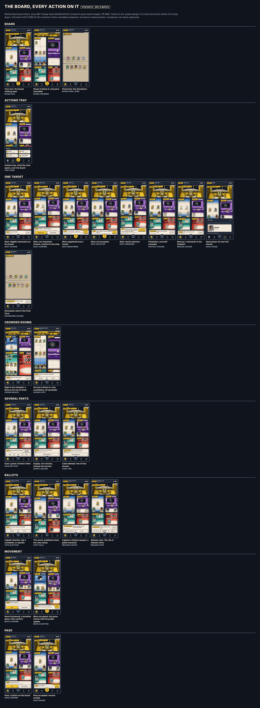

# Board motion: the board as the game

`mothership:dev-only` · issue [#87](https://github.com/Amirkianfar66/GameN/issues/87) · **a design proposal, not owner-approved**

A working prototype of a phone where the comic board is the game. Every action of the pinned release is chosen from a compact tray and played on the board: the players it names are picked by tapping their characters in their rooms, and the choice, its progress, its confirmation and the server's answer stay in a strip above navigation. Moving is pressing a room's name; Pass is the middle of navigation. The nine approved characters stand at hand-placed places in each room, like figures in a comic panel, and every one of them has the same eleven interaction states and its own small flourish when it moves. Beside the phone, a second board draws what every other screen sees at the same moment, from public facts only.

Designed on `94a49ce0` (`codex/v1-pass-board-targets`, [PR #86](https://github.com/Amirkianfar66/GameN/pull/86), unmerged): protocol 2, engine `full-game-1.1.0`, ruleset `in-person-v1-pass-2026-10-08`. Drawn with tokens 0.4.0 and the three bundles of `design-0.2.0`, loaded whole by the reviewed loader, plus three proposed prop layers (below). Everything shown is a **labeled synthetic fixture**: it is not the game, not Firebase and not multiplayer acceptance, and nothing here talks to a server. The stand-in server answers as the fixture panel says.

The design, the handoff and the checks: [board-motion-handoff.md](../../docs/design/board-motion-handoff.md), [board-motion-coverage.md](../../docs/design/board-motion-coverage.md) (generated), [board-motion-verification.md](../../docs/design/board-motion-verification.md).



## Open it

```sh
npm run dev:review --workspace @mothership/design-tokens   # serves design/ on http://127.0.0.1:4320
```

| | |
| --- | --- |
| The phone, the other screens, and the prototype controls | `http://127.0.0.1:4320/board-motion/` |
| One scenario | `http://127.0.0.1:4320/board-motion/?scenario=crowd.vote` |
| A phone size | `&w=320&h=568` |
| Reduced motion, long names | `&motion=reduced`, `&names=long` |
| The phone alone, full screen (how the captures are made) | `&chrome=0`; simulated safe areas `&safe=1` |
| Hold every animation at a moment (how the storyboards are made) | `&play=move&t=450` |
| Nine characters in eleven states | `http://127.0.0.1:4320/board-motion/vocabulary.html` |
| The contact sheets | `http://127.0.0.1:4320/board-motion/contact.html?set=key` (`all`, `matrix`, `motion`, `secrecy`) |

The controls on the right are the prototype's own, not the design: pick a scenario, choose how the stand-in server answers the next command (accept, reject, lose the answer, slow), deliver public facts to every screen (a move, a health change, a new Captain, the next turn or round, a replay of the last snapshot, a reconnect), and switch reduced motion or long names. On the phone, everything works: Actions, every action, every character, room tags, Pass, Card, Menu, Escape.

## What is in it

| Path | What it is |
| --- | --- |
| `index.html`, `js/app.js` | The phone: the controller (the release's steps, one command at a time), drawing, the board's fit, the observer, the fixture panel and `?play=&t=` holds |
| `js/board.js` | The comic board from public facts; private cues passed in by the viewer's own action only |
| `js/layout.js` | Stations from public occupancy, in seat order. Pure: the checks run it in Node |
| `js/director.js` | Public cues from the difference between two drawn views: moves, status changes, turn, phase, round |
| `js/copy.js` | The release's words (`COPY`, compared with the built `en`; `SHELL`, found verbatim), and the new words (`PROPOSED`) |
| `js/fixtures.js` | 65 synthetic scenarios, the nine characters' public flourishes, and the public facts the panel delivers |
| `js/vocabulary.js`, `vocabulary.html` | Nine characters in eleven states |
| `css/board.css` | Tokens only, art only behind the bundle marks, private cues only on the own board, roles only inside the card, nothing repeats |
| `contract/stations.json` | Each room's picture crop and its formations for one to five; the crowd of six to nine |
| `contract/cues.json` | Every cue: trigger, audience, facts, anchor, timing, cancellation, settled state, reduced motion, asset |
| `contract/coverage.json` | Every action and command; the eleven states; every fact and its source; the components and the release hooks; the gaps |
| `assets/` | The three prop layers, their stylesheet and manifest. Written by `design/tools/board-motion-assets.mjs` |
| `contact.html` | Lays out the captures as contact sheets |
| `review/` | Written by `design/tools/board-motion-capture.mjs`: `states/` (every scenario at 390 x 844), `matrix/`, `motion/` (storyboard frames), `secrecy/` (the phone beside the other screens), `vocabulary.png`, five contact sheets, `index.json`, `report.json` |

## The prop layers

The Command Room's chart table, Room B's laboratory counter and the Hospital bed are lifted, element for element, from the approved room sources in `design/source/board/` and printed in the rooms' colors by their reviewed export recipes, so that a character can stand behind them. Nothing is drawn that the approved source does not draw. They are a versioned proposal (`board-motion-0.1.0`), outside the reviewed manifest `design-0.2.0`, which is unchanged; adopting them is Integration's (DSN-D30). Rights as for the rest of the artwork: original, no license granted, use inside the Mothership project only (DSN-D06).

```sh
npm run assets:board-motion --workspace @mothership/design-tokens           # write them
node design/tools/board-motion-assets.mjs --check                          # compare
```

## Checks

```sh
npm run check:board-motion --workspace @mothership/design-tokens     # no browser; needs npm run build
npm run capture:board-motion --workspace @mothership/design-tokens   # screenshots and measurements; needs a browser
npm run flows:board-motion --workspace @mothership/design-tokens     # presses the controls; needs a browser
npm run test --workspace @mothership/design-tokens                   # includes the tests that make the check fail on purpose
```
