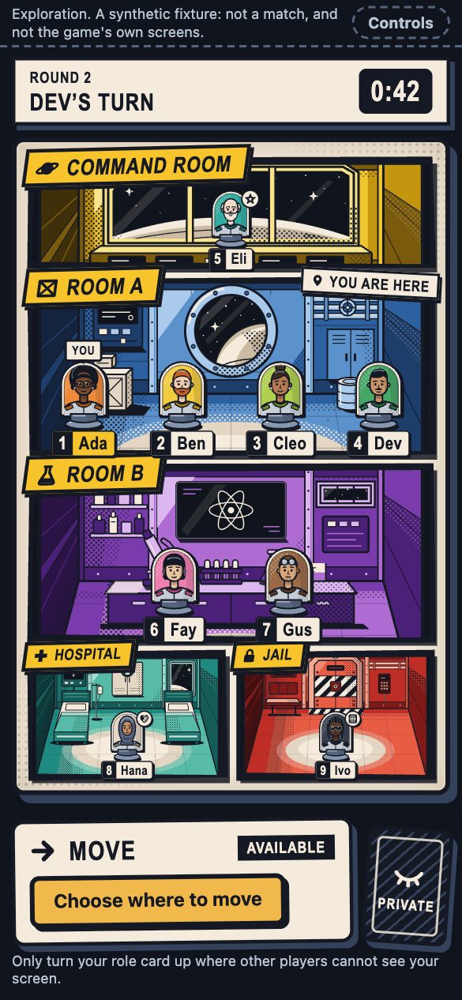
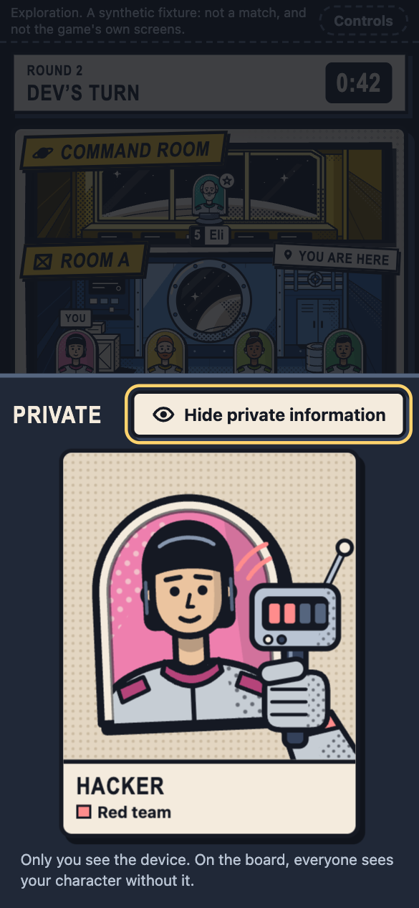
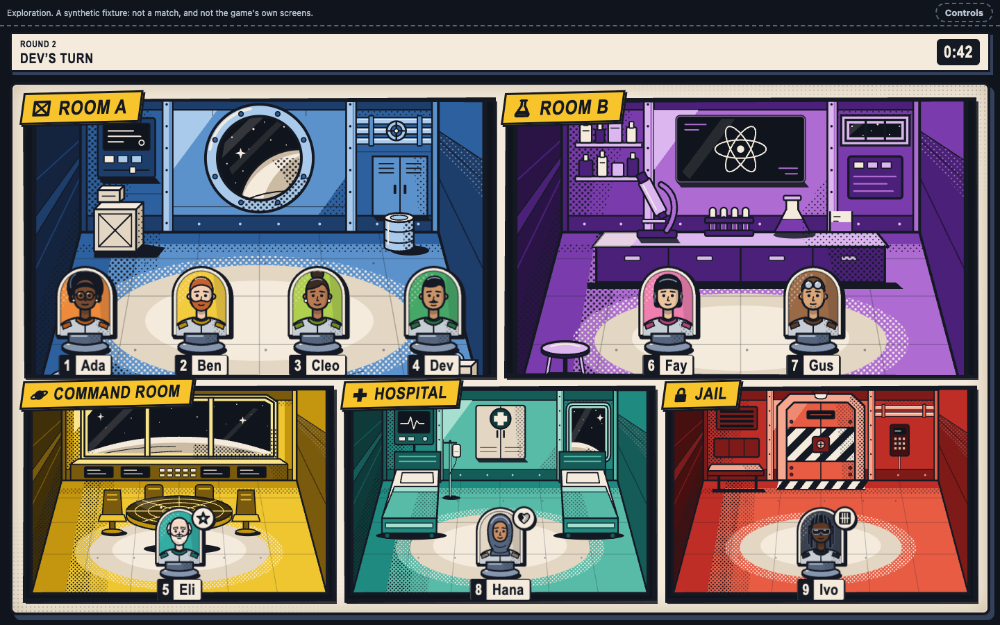
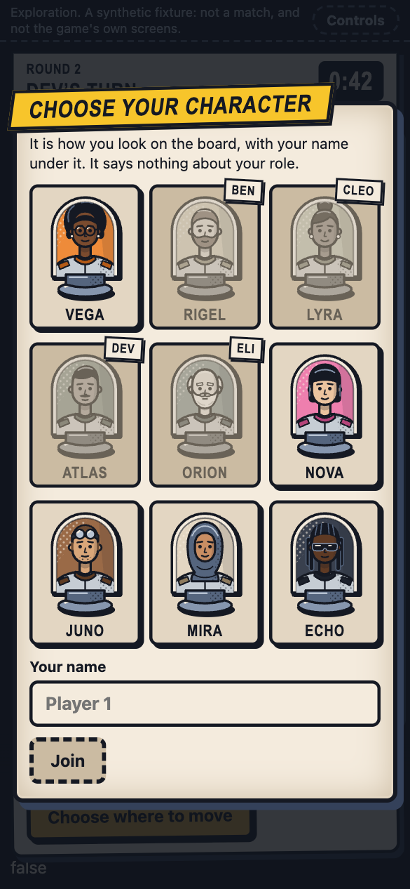
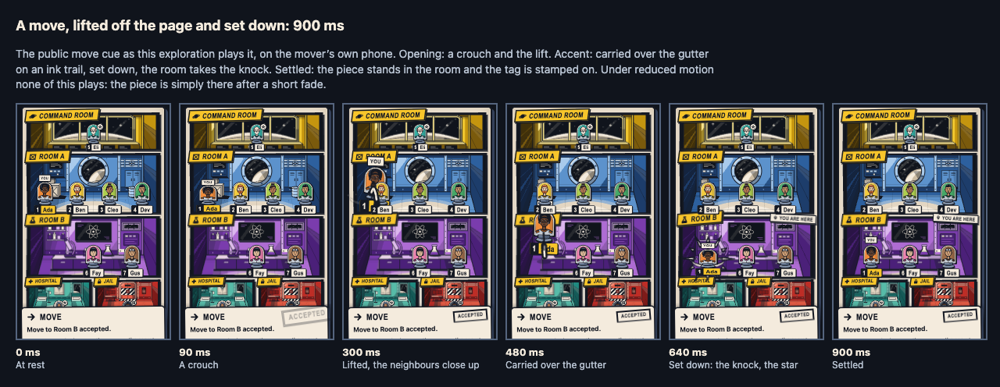
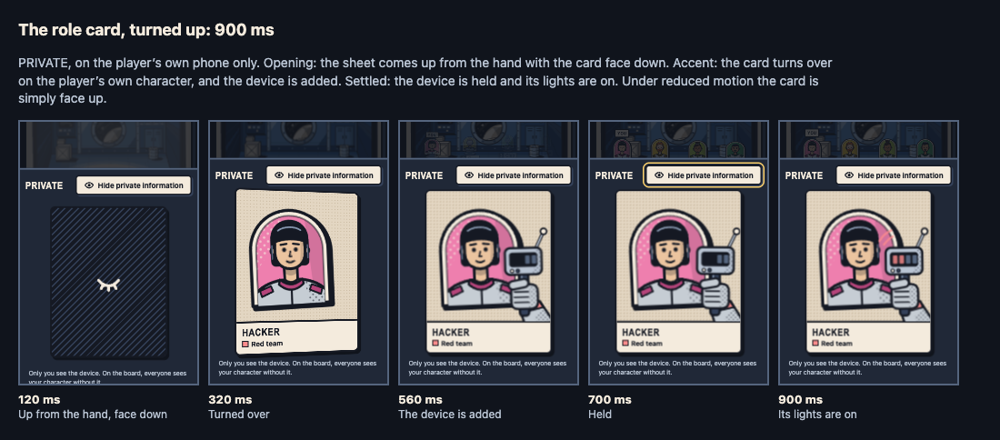
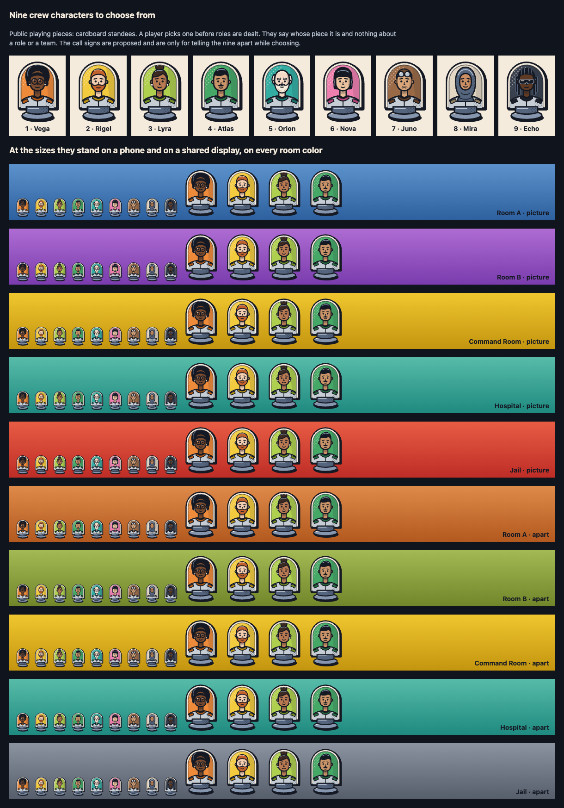
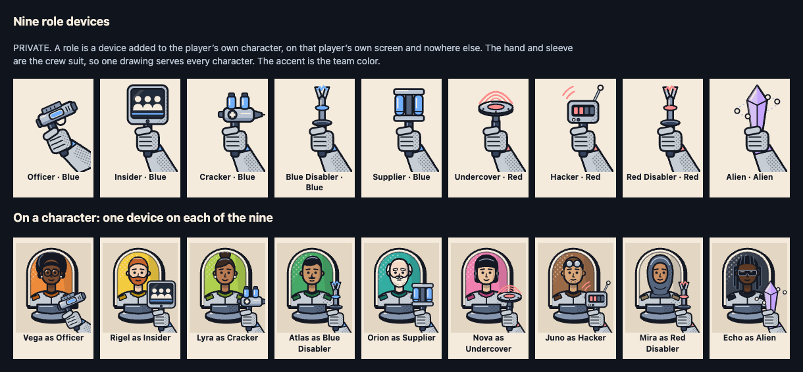
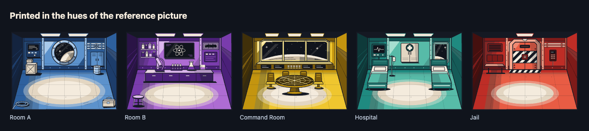
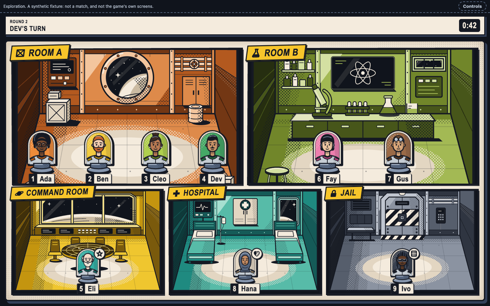

# Comic board

`mothership:dev-only`

**Approved by the game owner as the design direction on 7 October 2026.** The owner's words, and exactly what they cover, are in [docs/design/owner-decisions.md](../../../docs/design/owner-decisions.md).

**Built as an exploration.** It is a page to look at and play with, on a synthetic fixture. It is not an asset, a contract, a reference stylesheet or a shell, and it is not the game: no token, recipe, manifest entry or contract file was changed for it. Adopting it into those is the next piece of work, listed under [What adopting it takes](#what-adopting-it-takes).

| A player's phone | The role card, private | The shared display |
| --- | --- | --- |
|  |  |  |

## Open it

Start the review server (`npm run dev:review --workspace @mothership/design-tokens`), then:

| | |
| --- | --- |
| A player's phone | `http://127.0.0.1:4320/explorations/comic-board/` |
| The shared display | `http://127.0.0.1:4320/explorations/comic-board/?surface=table` |
| The five room drawings | `http://127.0.0.1:4320/explorations/comic-board/art-sheet.html` |
| The nine crew characters | `http://127.0.0.1:4320/explorations/comic-board/crew-sheet.html` |
| The nine role devices | `http://127.0.0.1:4320/explorations/comic-board/device-sheet.html` |
| Storyboards | `http://127.0.0.1:4320/explorations/comic-board/storyboard.html?kind=move`, `?kind=card` |

A phone starts at "Choose your character". `?skip` goes straight to the board; `?skip&peek=<role>&crew=<1-9>` turns one role card up on one character; `?still=<ms>` and `&peekstill=<ms>` hold one moment of a move or of the card being turned up; `?motion=reduced` is the reduced-motion alternative; `?set=apart` prints the rooms in the second color set.

`Controls`, top right, changes the room colors, reduces motion, switches the phone to the Captain's, deals a chosen role, starts the next round, makes another player move, makes the server refuse a move and drops the connection. All of that is fixture.

## What it is

1. **Choose a character.** Nine crew characters. A player picks one and types a name. A character someone has taken is still drawn and named, and is not offered. This comes before any role is dealt.
2. **The board is a page of a comic book.** Five panels, one room each, with a slanted caption and an icon. On a phone the whole page is on one screen, above the hand. Each player's piece is their character, a cardboard standee in a plastic stand, with a tag under it: the seat number and the name.
3. **A role card is dealt, face down.** After the pieces are set down a card lands in the hand. Its back is the same whatever is on its face.
4. **Pick a room, then move.** Press a room on the page, or its name on the Move card. The room comes up off the page and the others step back. Confirm. The piece is lifted off the page, carried over the gutters and set down in the other room, which takes the knock.
5. **Turn the role card up.** It shows the player's own character, and the role's device is added to it. Only on that player's phone.

Motion while nothing happens: stars drift behind the glass, lamps blink, the Hospital's trace runs, a turned-up character breathes and blinks. Under reduced motion nothing repeats and nothing travels.

## What is taken from the rules and the contracts

- A player may choose only **Room A, Room B, and the Command Room as Captain**, once a round. Nobody moves to the Hospital or the Jail by choice, so those two panels are never offered. Source: `rules/overlays/movement-decision.json` and `self.movementDestinations` in protocol 2, both on `codex/v1-connected-merge-candidate` at `71dfd02`. Neither is in this branch's base.
- The page offers exactly the rooms the seat's own view lists. It never works a destination out from the picture: no door, corridor or arrow joins two panels.
- A move is confirmed before it is sent, and the piece moves when the public fact arrives, the same on every screen.
- The words on the Move card are Frontend's (`packages/presentation/src/copy/en.ts` at the same commit). Words this page adds are marked PROPOSED in `board.js`.
- A cue is 900 ms at most, the longest beat the tokens allow; a piece is in the air for the 450 ms of a public move.
- The nine roles and their teams are those of the nine-player mode. Each device says what the role has, as `rules/sources/v2.1-decisions.json` and the overlays state it, and nothing about an outcome.

## The characters are public and say nothing about a role

- A character is chosen by the player before any role is dealt. Nothing in the page, the drawings or the data ties a character to a role or a team.
- All nine wear the same crew suit. None has a rank, a badge, a tool or a weapon.
- Their field colors are orange, yellow, lime, green, teal, pink, brown, cream and charcoal: kept away from blue, red and violet, the three team accents, so that a piece is not read as a team and does not clash with a faction revealed later.
- Health, the Jail and the Captain are the existing badges, on the piece.
- The call signs (Vega, Rigel, Lyra, Atlas, Orion, Nova, Juno, Mira, Echo) are proposed, only to tell the nine apart while choosing.

## The role card is private

- A role is shown as **a device added to the player's own character**: a sidearm with one cell (Officer), a slate with three marks that are alike (Insider), an injector with two vials (Cracker), a prod with one charge ring (Blue Disabler, Red Disabler), a carrier with two cells (Supplier), an emitter under a dome (Undercover), a scanner with four slots (Hacker), a stone with four nodes (Alien). Each is held in the gloved hand of the crew suit, so one drawing serves every character.
- The team accent appears only here: the device's lights, the cuff, and the swatch beside the team's word.
- **Nothing of it is public.** No piece, no cue and no shared display shows a device or is shaped by one. The page holds one role, the viewer's own; it never knows anybody else's.
- **Nothing is fetched because of the role.** All nine devices and all nine characters are asked for at the start, whatever is dealt. Seen in desktop Chrome: 9 device files and 9 character files at load, 0 requests when the card is turned up, 0 after a different role is dealt.
- The page going to the background turns the card face down. That is best-effort privacy, not screenshot protection.
- Only the Officer has summary lines: the ones already proposed in `design/contract/copy.en.proposed.json`, with their rule sources. The other eight show a name and a team and wait for copy.

## The rooms

Four new drawings (`art/`): Command Room, Hospital, Jail and Room B. Room A is `design/source/board/board-room-a.svg`, unchanged. All five are drawn in the neutral steel palette; the page swaps the five steel values for a room's color family (`rooms.js`).

Two sets of families are in the page. `picture` follows the owner's reference and is what was approved. `apart` (terracotta, olive, gold, teal, iron) stays away from the three team hues:

## What adopting it takes

None of this is done here. Each is a reviewed change of its own.

| What | Whose |
| --- | --- |
| A player's name and chosen character as public facts of a seat, and the lobby step that sets them before roles are dealt. No contract carries either today | Codex, with Frontend ([DSN-REQ-6](../../../docs/design/integration-requests.md#dsn-req-6)) |
| The starting-room choice of approved decision V1-01, between the character and the role deal. This page skips it: the fixture puts the viewer in Room A | Designer, then Frontend |
| A token revision: the room color families, the nine character fields, skin and hair, the caption yellow. 29 colors in the characters, the 25 of the approved room families and the caption yellow are not tokens | Designer proposes; Codex updates the lock ([DSN-REQ-2](../../../docs/design/integration-requests.md#dsn-req-2)) |
| The drawings as sources with recipes: five rooms and nine characters in the public bundle, nine devices in the role bundle, each bundle still one stylesheet loaded whole | Designer |
| The contract: the piece, the tag, the hand, the role card and their states; the move and card cues with their storyboards; copy for the eight roles that have none | Designer, with Frontend for wording |
| A rule for motion that repeats. The reference stylesheets refuse it today; this page has some, all of it off under reduced motion | Designer, with Frontend |
| The runtime | Frontend. This page is plain script written to be looked at, not a component to take |

## Cautions that stand

The owner approved the look as shown. These are the Designer's cautions about it, kept on record for the reviewer and for Game Balance:

1. **Room colors and team colors.** The approved set prints rooms in red, blue and violet. Those are also the Red team, the Blue team and the Alien, and the art direction rules faction-coded location lighting out of the public board. A room can be read as "theirs". The second set exists for that reason.
2. **Room names.** The reference calls the rooms Medical Room, Lockdown Room, Laboratory and Crew Meeting Room. The page uses the rules' names: Hospital, Jail, Room A, Room B. Captions are live text, so a rename costs no art; it is a rules and contract change.
3. **The caption yellow** is close to the amber that means "press this" in the rest of the design. Here an offered room keeps its yellow and the others lose it.
4. **A private card is still seen over a shoulder.** The device is large and its accent is the team color. It is behind a deliberate turn of the card, and the name on it is no larger than a heading.

## Provenance and rights

Original vector artwork: 4 rooms, 9 characters and 9 devices, drawn for this repository as hand-laid SVG by the Visual and Motion Designer workstream (a Claude Code session, model `claude-opus-5-5`, working for the game owner) on 7 October 2026. No third-party artwork, font, stock asset, photograph, traced image or generated raster image is in it. The owner's reference picture was looked at for its direction (a comic page of rooms in color, slanted yellow captions) and is not in the repository; nothing was traced or copied from it, and every room was drawn from scratch in the frame of `board-room-a.svg`. The shapes were laid out with throwaway scripts; the SVG files are the editable sources.

No license is granted. The repository carries none; any use outside the Mothership project needs the owner's decision (DSN-D06).

## What was checked, and what was not

- `check:assets` holds this directory apart: every file carries the development-only mark, every drawing uses only the drawing vocabulary, and nothing reviewed reaches into it. Six mutations in two tests show those refusals.
- `node design/explorations/comic-board/try.mjs` walks the page in a browser: choosing, the deal, a move, a refused move, a lost connection, the Captain's choices, other players' moves, every role card, reduced motion and the shared display. In Google Chrome 155: 43 things looked for, 0 not found. It looks for a role in the public markup and for requests made when the card is turned up, and it was shown able to fail on both. [verification.md](../../../docs/design/verification.md#the-comic-board-exploration) lists what it looks for.
- The storyboard frames above are the page itself, held at those moments.
- **Not checked:** any phone or shared display, any other browser, a screen reader, motion comfort, frame time, how the pieces read from across a table, and whether people can tell the nine apart or mistake a room's color for a team. The walk is run by hand. The review pictures in `review/` come from `render.mjs`; no check reads them.

Nothing here shows that multiplayer behavior is correct or that the game is balanced.
