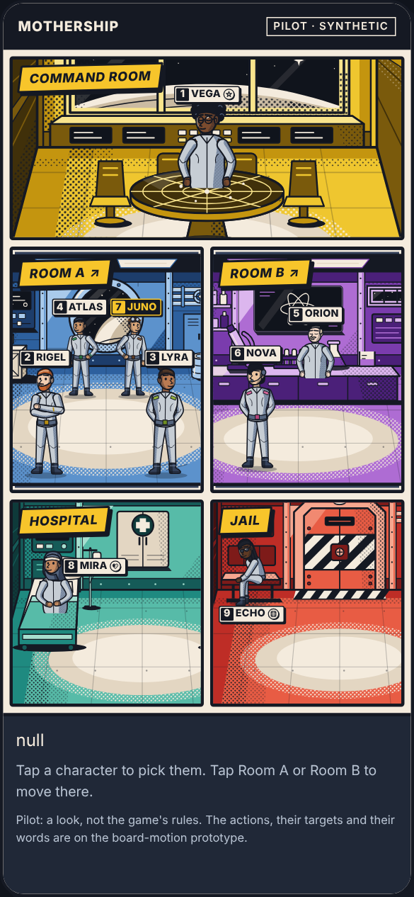
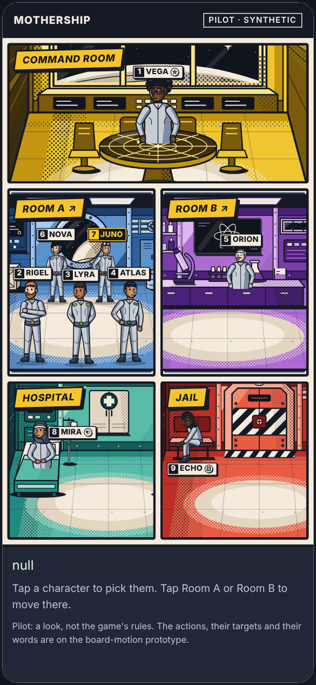
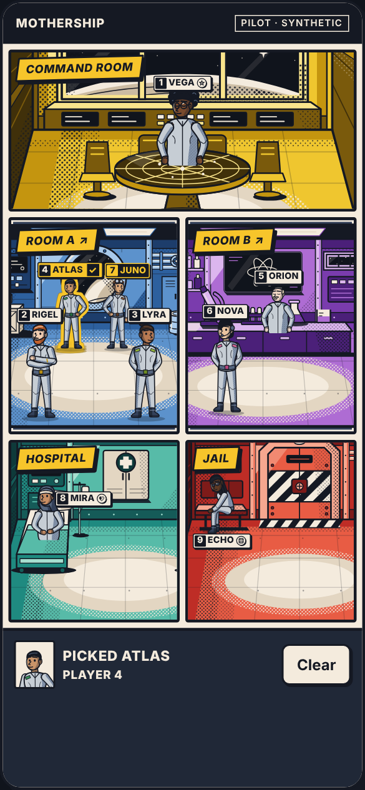
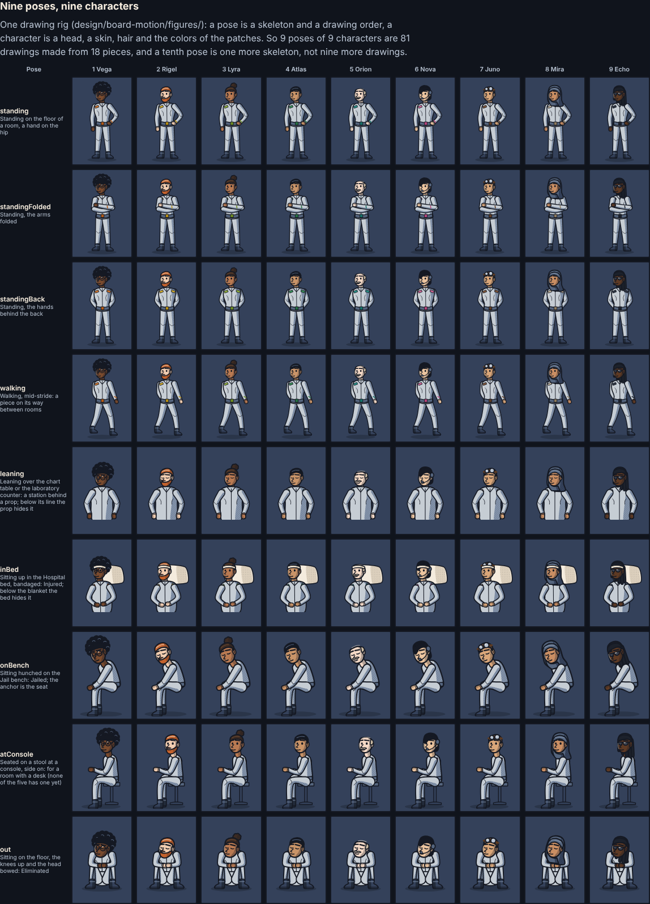
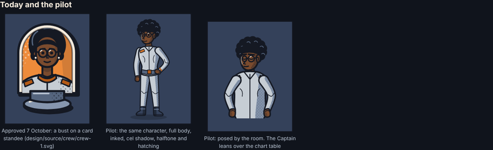
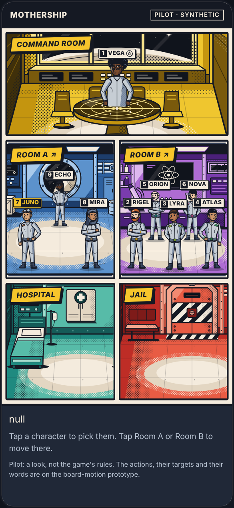
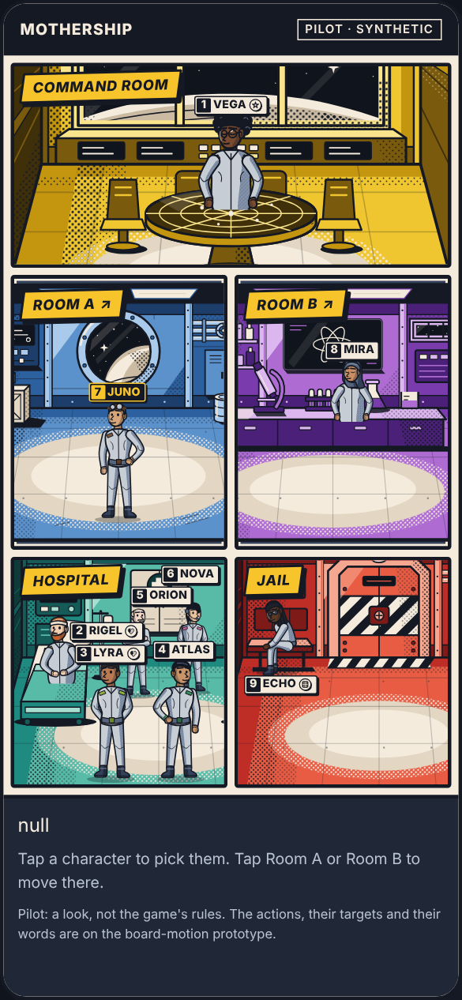
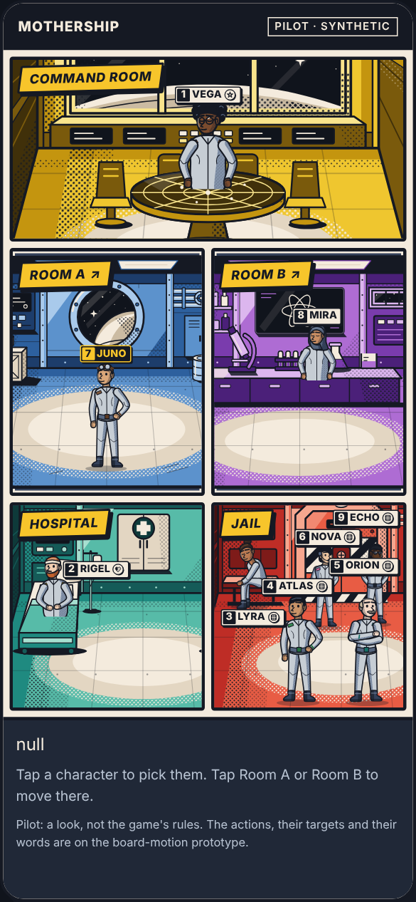

# Comic crew pilot

`mothership:dev-only`

**A pilot for the game owner's question of 9 October 2026:** *"is it possible to make character in game like this image something more feel comicbook?"*, asked with a reference page: the Captain leaning over a round chart table, people at work in two rooms, a patient sitting up in a Hospital bed, a prisoner on the Jail bench.

**The answer was yes, and this is the working pilot of it**: the nine approved characters as full-body comic figures, posed by the room they are in, on the approved rooms, on a phone. It is an exploration. It is not an asset, a contract, a token, a shell or the game, and nothing reviewed reads it.

**The owner then said "lets try full body comic"** ([owner-decisions.md](../../../docs/design/owner-decisions.md#9-october-2026-full-body-comic-characters)). The figures are now the board-motion prototype's: its drawing rig and figure files are in `design/board-motion/figures/` and `design/board-motion/assets/figures/`, every piece of that prototype is a posed figure, and this page reads its figures from there. The approved standees (7 October) are unchanged in the reviewed kit and the runtime; adopting the figures is DSN-D32.

| The board on a phone | Five in one room | A character picked |
| --- | --- | --- |
|  |  |  |

## Open it

Start the review server (`npm run dev:review --workspace @mothership/design-tokens`), then open `http://127.0.0.1:4320/explorations/comic-figures/`.

Tap a character to pick them: an outline, the plate and the tray say who, and Confirm stamps the plate. Tap **Room A** or **Room B** to move the viewer (Juno, Player 7) there: the piece is lifted off, set down in the other room, and the others in both rooms step to their new places. `?scenario=spread|full|fullB|fullH|fullJ|crowded` chooses the public state, `?motion=reduced` the reduced-motion alternative (also taken from the system setting), `?tags=off` hides the plates, `?hits=show` draws every press area. The fixture panel beside the phone does the same. Everything is synthetic.

## What it is

| File | What it holds |
| --- | --- |
| `design/board-motion/figures/` (no longer here) | The comic drawing rig, moved when the owner said to try it: every shape inked; a cel shadow on the side away from the light (upper left), in the palette's next darker tone or an ink tint, with halftone dots and diagonal hatching inside the shadow only; a limb drawn as one outline from joint to joint; a second layer for what lies over a prop. The nine approved characters in their own colors (`color.crew`), all in the same crew suit, nothing of a role or a team on anyone. Nine poses: three standing stances, walking, leaning over a table or counter, sitting up in a bed, sitting hunched on a bench, seated at a console, and sitting on the floor (Eliminated) |
| `design/board-motion/assets/figures/` | The figures this page draws: 81 figures and 18 layers over a prop, written by `design/tools/board-motion-assets.mjs`, every one inside the drawing vocabulary and the crew palette |
| `scene.js` | Where each character stands in each room of this page, and which pose it takes, from public facts only (below); the boxes and anchors are the figures' own geometry |
| `index.html`, `pilot.css`, `pilot.js` | The phone page. Tokens only, room art only from the public bundle and the board-motion prop layers |
| `render.mjs` | The review pictures in `review/`, and the pilot's own check (below) |

A pose is a skeleton and a drawing order; a character is a head, a skin, hair and two patch colors. So 9 poses of 9 characters are 81 drawings made from 18 pieces, and a tenth pose is one more skeleton, not nine more drawings.

## Poses come from public facts only

| Where | The station | The pose | Who takes it |
| --- | --- | --- | --- |
| Command Room | Behind the chart table | Leaning over it, hands on the table | The Captain |
| Room B | Behind the laboratory counter | Leaning, hands on the counter | The first in the room by seat number, while four or fewer are there; five stand in two rows, so nobody is hidden |
| Hospital | The left bed | Sitting up, bandaged | The first Injured in the room by seat number |
| Jail | The bench | Sitting hunched | The first Jailed in the room by seat number |
| Any room | A standing station | One of three stances, by seat number; facing into the room | Everyone else, by seat number |

Who is where, the seat numbers, Captain, Injured and Jailed are public. No pose, stance, station or direction depends on a role, a team, an action chosen or a target; the bandage is drawn only for a public Injured; nothing is fetched because of a role. A character keeps its stance wherever it goes, so it is recognized by its stance as well as its face. The pick (the outline, the plate's color and its check) is the viewer's own and is drawn only on the viewer's board, as on the board-motion prototype. There is no sound.

| Five in Room B | Five in the Hospital | Five in the Jail |
| --- | --- | --- |
|  |  |  |

## Motion

| | Full motion | Reduced motion |
| --- | --- | --- |
| While nothing happens | Everyone breathes, out of step, as on the approved comic board. This is a loop: the pinned tokens refuse motion that repeats (`motionPolicy.loops` is false, open decision DSN-D16), so it exists only in explorations | Nothing repeats |
| A pick | The figure pops (220 ms) and is outlined; Confirm stamps the plate (120 ms) | Outlined and stamped at once |
| A move | Lifted off (220 ms), set down in the other room with a squash and a puff of ink (450 ms); the others glide to their new places (450 ms) | A fade out and in (80 ms each); the others are simply in their new places |
| A refused move (the room the viewer is already in) | The room's caption shakes (220 ms), and the tray says why | The tray says why |

Every duration and easing is a design token (`motionMs`, `ease`), except the breathing loop's 3.4 s, which has none. Frames of a move, held at those moments by the page itself: `review/move-full-*.png` and `review/move-reduced-*.png`.

## What was checked

`render.mjs` opens the page in desktop Chromium (141) as a 390 x 844 phone and checks the board as drawn, in six public states: a round in play, five in Room A, five in Room B, five in the Hospital, five in the Jail, two each in the Hospital and the Jail. In every state, and after a move in full and in reduced motion:

- 9 press areas, the smallest 46 x 46 px; none overlaps another, and none lies under a room's move button;
- every plate is whole inside its panel, clear of the room's caption and of every other plate;
- the room moves are at least 44 px, and the phone does not scroll.

Result: 0 problems in all eight checks (`review/audit.json`). The check was shown able to fail: an overlapping plate, a plate under a caption, a press area 30 px high and two overlapping press areas were each made by hand on the page, and each was reported. `npm run check:assets` holds this directory apart as for every exploration (the development-only mark on every file, the drawing vocabulary in every SVG, a README, and nothing reviewed reaching in).

**Not checked:** any real phone, a phone narrower than 390 px, any other browser, a screen reader beyond the labels, large text, frame time with nine animated figures, and whether people can tell the nine apart at this size. At 390 px a standing figure's face is about 10 to 12 px high: the plates, the hair and the patch colors carry who is who, more than the face. Nothing here shows that multiplayer behavior is correct or that the game is balanced.

## What has been done since, and what adoption still takes

1. **The owner's decision** was given: "lets try full body comic". The bust card stays the private role card's picture.
2. **Done on the board-motion prototype**: walking and Eliminated poses added; the stations of `stations.json` say who takes the chart table, the counter, the bed and the bench, and the pose; every piece is a posed figure; all eight board poses of all nine characters are one stylesheet loaded before anything is drawn; the prototype's check, captures and flows were run again ([board-motion-verification.md](../../../docs/design/board-motion-verification.md)).
3. **Still to do**: Integration brings the figures into a reviewed export revision (DSN-D32), and settles with the owner whether a pose may say what a marker says (DSN-D33); Frontend draws them in the game ([board-motion-handoff.md](../../../docs/design/board-motion-handoff.md)) and measures nine figures' size and frame time on phones before choosing between vector at runtime and pre-rendered sprites.

## The other route: painted like the reference

The reference page is painted: soft light, texture, many small details. Matching that would take an illustrator or an image generator, a raster picture per character and pose, larger downloads, and redrawing whenever a pose is added. It also needs the owner's decision on rights (DSN-D06): today every picture in the kit is original vector drawn for this repository, with no third-party, traced or generated raster art. This pilot stays on the vector side: editable, recolorable, inside the drawing vocabulary, and one skeleton per new pose.

## Provenance and rights

Original vector drawings, generated from the rig now in `design/board-motion/figures/` by the Visual and Motion Designer workstream (a Claude Code session working for the game owner) on 9 October 2026, after the approved standees in `design/source/crew/`. The rooms and props are the approved ones, read from the public bundle and the board-motion proposal layers. No third-party artwork, font, stock asset, photograph, traced image or generated raster image is used. The owner's reference picture was looked at for its direction and is not in the repository; nothing was traced or copied from it. No license is granted; any use outside the Mothership project needs the owner's decision (DSN-D06).
