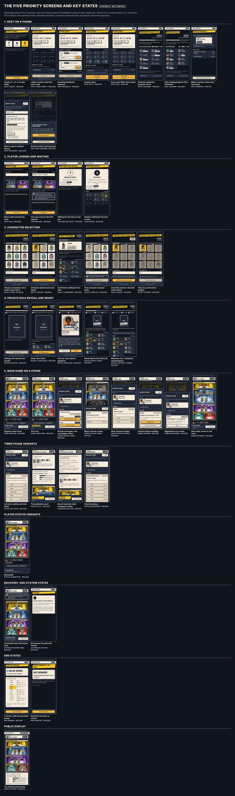

# V1 phone journey prototype

`mothership:dev-only` · issue [#76](https://github.com/Amirkianfar66/GameN/issues/76) · **a design proposal, not owner-approved**

A working, navigable prototype of the phone-first V1 journey: host, joining, character selection, the private role reveal and Ready, the game on a phone, and every supporting state the journey needs. 109 states, each drawn from a **labeled synthetic fixture** with the reviewed design system: tokens 0.4.0, the three art bundles of `design-0.2.0` loaded whole by the reviewed loader, the nine crew characters and the nine role devices as approved. It is not the game, not Firebase and not multiplayer acceptance; nothing here talks to a server.

The design, the reasoning and the handoff are in [docs/design/v1-phone-journey.md](../../docs/design/v1-phone-journey.md), [v1-phone-inventory.md](../../docs/design/v1-phone-inventory.md) and [v1-phone-handoff.md](../../docs/design/v1-phone-handoff.md).



## Open it

```sh
npm run dev:review --workspace @mothership/design-tokens   # serves design/ on http://127.0.0.1:4320
```

| | |
| --- | --- |
| The journey index: every state with its picture | `http://127.0.0.1:4320/v1-phone/` |
| One state | `http://127.0.0.1:4320/v1-phone/?state=game.waiting` |
| Reduced motion, long names | add `&motion=reduced`, `&names=long` |
| Hold every animation of one cue at a moment (how the storyboards are made) | `&t=450&only=.j-piece` |
| Captures without the reviewer's navigator | `&chrome=0` |

On a state, **◀ ▶** walk the journey in order, **Journey** returns to the index and **Notes** shows the state's data source, what the pinned release already does, and the gap. The navigator is the prototype's own and not part of the design.

The buttons work: pick a character and type a name, Confirm; Reveal, Hide, Ready; open the Private card, choose where to move (on the board or in the list), choose a target, confirm, see it registered; vote; end a match in two presses. A countdown runs on the device's clock and, at zero, only changes its words: as in the release, only the server ends a window.

## What is in it

| Path | What it is |
| --- | --- |
| `index.html`, `js/app.js` | The router, the reviewer's navigator, countdowns, the local flows (pick → confirm → sending → result) and `?t=` holds |
| `js/screens.js` | One function per view; the shared parts (masthead, caption, timer, dock, board, piece, private card, action card) |
| `js/fixtures.js` | The synthetic fixtures, one per state id, and the release's own words quoted with the file they come from (`RELEASE_COPY`, `ROLE_GUIDE`) |
| `js/h.js` | A DOM helper that sets text as text |
| `css/journey.css` | The journey's stylesheet: tokens only, art only behind the bundle marks, roles only inside `.j-private`, nothing repeats |
| `contract/journey.json` | The inventory: every screen and state, its surface and audience, its authorized data, the release's capability, the gap, the components; and the component registry |
| `contact.html` | Lays out the captures as contact sheets |
| `review/` | Written by `design/tools/v1-phone-capture.mjs`: `states/` (every state at 390 × 844), `matrix/` (320, 360, 430, short, 200% text, long names, keyboard, desktop, display), `motion/` (storyboard frames), four contact sheets, `index.json`, `report.json` |

## The fences it keeps

- **Development only.** Every file carries the mark; nothing in the reviewed kit reads this directory, and it is outside the kit's review inputs, so the reviewed renders and reports stay current.
- **Synthetic.** Names (Ada to Ivo), device tags, room code, match identifier, display identifier and the obviously fake recovery code are made up. The roles in the fixtures are drawn only on a seat's own private surface and in the end reveal.
- **Privacy, measured on every capture.** A public or host state has no role word, no device or team hook and no private container in its document; a private state keeps role hooks inside `.j-private`; the host and display request the public bundle only; no single picture is ever requested.
- **Words.** What the release already says is quoted verbatim and checked against its file; new words are proposals, listed in the handoff.

## Rebuild after an edit

```sh
npm run capture:v1-phone --workspace @mothership/design-tokens   # needs a Chromium-based browser (CHROME_PATH)
npm run docs:v1-phone --workspace @mothership/design-tokens
npm run check:v1-phone --workspace @mothership/design-tokens     # refuses captures or docs made before the edit
npm run flows:v1-phone --workspace @mothership/design-tokens     # presses the buttons: select, reveal, private card, move, end
```

Captures are of desktop Chromium laying out the prototype with that machine's fonts. They are not device measurements. What was run, with its results, is in [v1-phone-verification.md](../../docs/design/v1-phone-verification.md).
