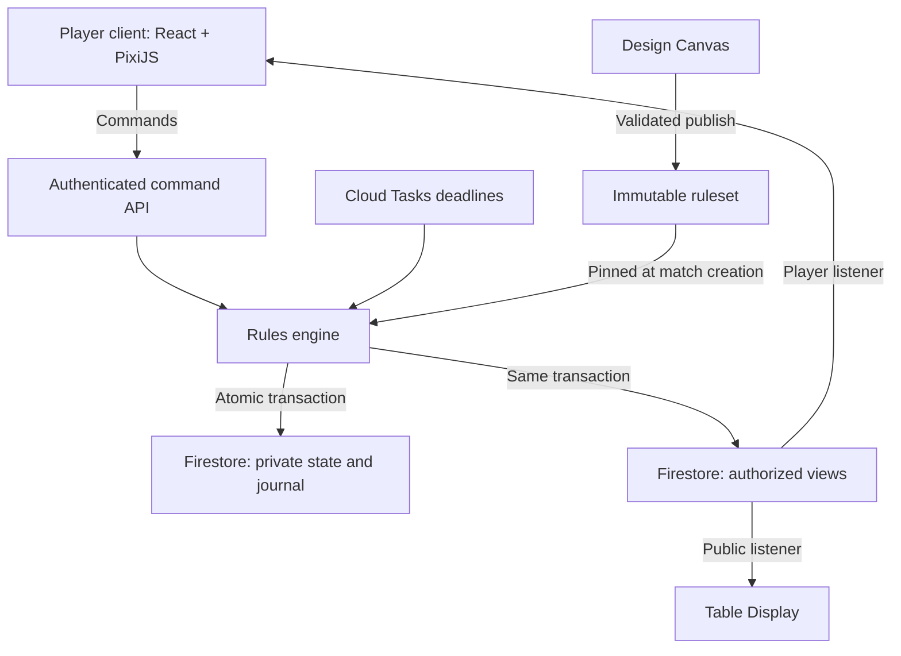
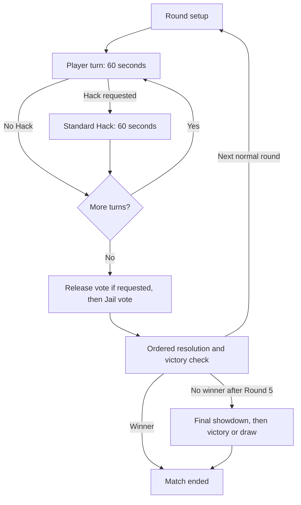

# Mothership — Production Architecture

**Version:** 1.0 · **Date:** 26 September 2026  
**Status:** Selected technical direction; implementation and performance validation pending.  
**Product:** A premium comic-book card and board game for 7–9 players.  
**Language:** English for the game, Design Canvas, content, and technical artifacts.

## 1. Architecture decision

Build a **browser-first, installable web game** using **React, TypeScript, PixiJS 8, GSAP, and Firebase**. Use a server-authoritative, deterministic rules engine deployed through second-generation Cloud Functions. Persist authoritative match state in Firestore and deliver explicitly filtered views to each audience.

The initial product is a hybrid tabletop experience: face-to-face discussion, a physical or shared digital board, and a private phone interface for each player. The same match service can support geographically separate players later, but remote voice communication is a separate product capability.

The production target is premium 2D presentation: original illustration, directed animation, responsive card interactions, strong sound design, reliable multiplayer, and a thoroughly tested rules engine. A technology choice alone does not establish AAA production quality; content production, device testing, and operational reliability are release requirements.

### Selected stack

| Responsibility | Selection | Boundary |
| --- | --- | --- |
| Player application | React + TypeScript + Vite | Lobby, readable cards, private information, controls, accessibility |
| Board and visual scenes | PixiJS 8, WebGL renderer | Tokens, layered board art, particles, comic transitions |
| Animation | GSAP timelines | Directed motion across DOM and Pixi scenes; one owner per animated property |
| Audio | Web Audio with an AudioManager | Music, ambience, cues, mixing, mute and reduced sensory settings |
| Identity | Firebase Authentication | Guest entry; account linking and secure seat recovery |
| Command API | Cloud Functions for Firebase, second generation | Authentication, authorization, validation, transactions |
| Rules | Independent TypeScript package | State transitions, action ordering, defenses, victory |
| Persistent match data | Cloud Firestore, Native mode | State, journal, receipts, audience views, immutable rulesets |
| Live delivery | Firestore listeners | One composed player view per phone; public view for the table |
| Phase deadlines | Cloud Tasks | Durable wake-ups with idempotent transition handlers |
| Presence | Firebase Realtime Database | Connection hints only; never an elimination or victory input |
| Web delivery | Firebase Hosting | Versioned application bundles and published static art |
| Asset storage | Cloud Storage | Source exports and asset processing inputs; controlled access |
| Quality tooling | Vitest, Firebase Emulator Suite, Playwright | Engine scenarios, access rules, browser journeys |
| Operations | Cloud Logging, Monitoring, Error Reporting | Redacted diagnostics, latency, failures and cost metrics |

PixiJS currently recommends WebGL for production because browser WebGPU behavior still varies. This project therefore pins WebGL as its initial renderer. [S1]

### Alternatives considered

| Option | Assessment for Mothership | Decision |
| --- | --- | --- |
| React + PixiJS | Fine control over illustrated scenes while retaining semantic web interfaces | Selected; we own scene management and the renderer bridge |
| Phaser | A capable integrated 2D framework with scenes, input, cameras and optional physics systems | Reconsider if the product grows many continuous gameplay scenes; those systems are not central to the current turn-based design [S13] |
| Unity | A candidate if a native-first or substantially 3D product becomes the main goal | Adds a separate engine/toolchain to the current TypeScript/Firebase workflow; not selected for this browser-first release |
| React and CSS alone | Suitable for readable cards and menus | Retained for these surfaces; illustrated board effects use PixiJS |

These are project-specific engineering judgments, not claims that one engine cannot produce a polished game.

## 2. Product surfaces

| Surface | Purpose | Information access |
| --- | --- | --- |
| Player | Private role sheet, action cards, targets, voting, Hack timing, Code entry | Public facts plus that player's authorized knowledge |
| Table Display | Illustrated board, numbered tokens, round and phase, public outcomes | Sanitized public facts only |
| Session Host | Lobby, seat admission, setup and session controls | Public facts; being host grants no access to other players' secrets |
| Design Canvas | Rules, roles, locations, dependencies, open questions, version publishing | Private authoring tool with separate editor authorization |

The existing Design Canvas remains a design application. Its node graph supplies structured authoring data. Production matches run an immutable, validated ruleset; moving a node in the editor does not change an active match.

A future fully digital board uses the same location model and projections. Physical tokens are manually kept in sync with the authoritative display; the first release does not assume computer vision or automatic token detection.

## 3. Runtime topology



Deploy the backend as a **modular monolith**: one rules system with focused command, deadline and maintenance handlers. Separate modules by responsibility, not by assigning every game mechanic its own service.

Smooth 60 fps presentation happens locally. Network traffic represents game commands and state changes, not animation frames or pointer positions. This workload supports a Firebase architecture without a continuously running room server. Revisit a Cloud Run room process only if measured latency or future synchronized interaction requires it.

## 4. Rules engine and version contract

The engine has no imports from Firebase, React, PixiJS, or the network. Conceptually:

```ts
evaluate(state, command, context) => {
  nextState,
  domainEvents,
  durableEffects,
  commandResult
}
```

`context` supplies trusted evaluation time and recorded random facts. Replaying the same version, initial state, commands, and recorded inputs must reproduce the result.

Use explicit phases and typed handlers for movement, action registration, voting, resolution, reveals, and victory. Model **health**, **Jail confinement**, **location**, **Captain status**, and **resources** as separate dimensions. Jail is not a fourth health state.

Eligibility is command-specific. An ordinary role action may require the actor's own turn, while the agreed movement window extends across the round before voting and Code submission extends across Round 5. A universal "only the current player may send commands" check would implement the game incorrectly.

Random role assignments, turn orders and Code facts are generated on the server using a cryptographically secure source and recorded for replay. A transaction retry must reuse the candidate random facts; it must not silently reroll a match. Clients never receive the hidden random seed or full role mapping.

Every match pins:

- `rulesetVersion` and content hash;
- `engineVersion`;
- `protocolVersion`;
- `assetManifestVersion`;
- player configuration and enabled Original Power pack.

Old engine handlers remain available until matches using them finish. Deploying a new rule version affects new matches. Presentation changes may roll out independently only when compatible with the pinned protocol and assets.

### Current game constraints the engine must preserve

| Area | Required behavior |
| --- | --- |
| Modes | 7: 4 Blue + 2 Red + Alien; 8: 4 Blue + 3 Red + Alien; 9: 5 Blue + 3 Red + Alien. These remain balance-test configurations. |
| Ordinary turn | 60 seconds shared between public speaking and eligible actions |
| Standard Hack | Request within that turn; a separate 60-second conversation follows the ordinary minute |
| Movement | Once per round before voting; voluntary departure only from Room A, Room B or Command Room |
| Captain | Exclusive Command Room entry; leaving does not remove the title; immunity depends on actually being inside |
| Shooting | Direct target selection, same-location and eligibility checks; no third-player faction identification |
| Officer | Nine-player Blue role, one ordinary shot total, available from Round 1; Supplier does not grant an extra ordinary shot |
| Protection | Undercover may target self; each player receives it at most once per match; activation at the next normal round |
| Registered actions | Once validly registered, survive later injury, Jail or elimination of the actor |
| Hacker Code | Hacker only, one attempt, available during Round 5; precise victory checkpoint remains to be formalized |
| Final showdown | If no winner after normal Round 5, gather all non-eliminated players; register special shots before resolution; resolve in Round 5 turn order, then victory or draw |

Final-showdown ammunition is a separate resource from ordinary weapons. This prevents the Officer's ordinary once-per-match counter from accidentally suppressing the special shot granted to every participant.

Optional Original Powers use typed effect handlers with explicit precedence. Archived identification-failure branches must not become active simply because an old power description still contains them.

## 5. Command processing and consistency

A client submits intent. It does not submit the damage result, authoritative role, remaining ammunition, winner, or server timestamp.

Example wire shape, not an implemented endpoint:

```json
{
  "matchId": "match-id",
  "commandId": "client-generated-unique-id",
  "phaseId": "round-2-turn-4",
  "protocolVersion": 1,
  "command": {
    "type": "REGISTER_SHOT",
    "targetPlayerId": "player-6"
  }
}
```

The API obtains identity from the verified Auth token and enforces App Check, seat ownership, match membership, request limits and payload schemas. App Check supplements authorization; it does not replace game validation. [S7]

Within one Firestore transaction:

1. Read authoritative match state and the caller's command receipt.
2. If this command already completed with the same payload, return its recorded result. Reusing the ID with a different payload is rejected.
3. Validate phase, trusted time, identity, resources and rule-specific legality.
4. Evaluate the engine against that state.
5. Write the new snapshot, journal entries, receipt, changed audience views, and durable outbox records atomically.

Firestore supplies serializable transactions; application code still handles contention retries and duplicate requests. [S2] Serialization is per match. There is no shared global match counter in the command path.

This produces one committed gameplay effect even if a request is delivered repeatedly. It is not a claim of exactly-once network delivery. After an uncertain connection failure, retry the same command ID or fetch its receipt.

Do not resolve gameplay through a chain of Firestore triggers. Trigger delivery may repeat and arrive out of order. [S3] An outbox trigger may safely schedule work because its handler is idempotent; it does not decide damage order.

### Officer example

The phone selects a visible target and submits `REGISTER_SHOT`. The server checks the Officer's ordinary-turn eligibility and reserves the one ordinary shot. The private response can say **Action registered**. Public shooting or damage animation waits for the permitted reveal stage. End-round resolution applies target defenses and damage, even if the Officer's status changed after registration. Only authorized resulting events drive the comic presentation.

## 6. Firestore structure and secret information

| Document or collection | Reader | Contents |
| --- | --- | --- |
| `matches/{id}/engine/current` | Server only | Full authoritative state, hidden queues, Code, resources, internal sequence |
| `matches/{id}/events/{seq}` | Server only | Replay journal; secret and public domain events |
| `matches/{id}/members/{uid}` | Restricted membership policy | Seat binding and permissions; server writes |
| `matches/{id}/playerViews/{uid}` | That authorized player only | Composed public facts plus information that player is entitled to know |
| `matches/{id}/views/public` | Members and explicitly admitted display sessions | Board, phase, public health, Captain, public reveals |
| `matches/{id}/publicEvents/{seq}` | Authorized public viewers | Sanitized presentation events only |
| `matches/{id}/receipts/{key}` | Server; caller through API | Deduplication and the caller's command result |
| `outbox/{effectId}` | Server only | Deadline scheduling and other durable external work |
| `rulesets/{version}` | According to publication policy | Immutable, validated rule configuration |

Firestore read authorization operates at document level; it cannot reveal selected fields while hiding others in the same document. [S4] Therefore public and private views are physically separate from full match state. Deny client writes to authoritative game documents and generated views. Server Admin SDK operations bypass Security Rules, so API authorization remains mandatory. [S3]

Each phone normally listens to one **composed** player-view document. Include the public facts it needs in that view to avoid momentary combinations of mismatched public and private snapshots. Public events carry a public view revision so the animation layer can wait for the corresponding facts.

Use audience-specific revisions and event sequences. A hidden action must not update unrelated viewers, expose gaps in a global sequence, or change a public `updatedAt` field. Public updates fan out to the relevant player views; the small room size makes this explicit write cost reasonable to measure.

Additional controls:

- Protection, weapons and private queues remain hidden according to the disclosure policy; do not assume that owning an effect implies knowing it.
- Targeting hints and error messages must not reveal secret defenses or other roles.
- All role art may be in the public asset bundle, but assignments are server secrets. Uniform asset fetching avoids announcing an assigned role through role-specific downloads.
- Cache application code and artwork for the PWA. Keep private match data out of persistent offline Firestore caches, service-worker caches, analytics payloads and client error attachments.
- A room code permits an admission attempt, not access to an existing seat. Seat recovery requires a verified identity or a dedicated one-time recovery mechanism, with old access revoked.
- A host who also plays has the same secret-information boundary as other players. Support access is a distinct, audited server privilege.

Screen privacy is best effort: hide private panels by default and when the app backgrounds. Software cannot prevent a participant from showing their own screen or repeating a spoken secret.

## 7. Deadlines, phases and reconnects

Store `phaseId`, `startedAt` and `endsAt` on the server. Countdown display is a local estimate that resynchronizes on reconnect or foregrounding. Do not write a countdown value to Firestore every second.

Cloud Tasks requests a phase transition at the deadline. It is a durable scheduler, not a hard-real-time clock; duplicate execution and delays must be handled. [S5] Each task checks the current phase identity and deadline and becomes a no-op if obsolete.

The API checks the deadline on every timed command even if the scheduled task is late. Use the trusted evaluation time in the successful transaction attempt as the acceptance boundary. A client-reported send time cannot reopen a phase. Task transitions and player commands serialize against the same match state.

Persist the scheduling intent in the transaction outbox. Enqueue with a stable effect ID and retry safely. A watchdog repairs abandoned outbox work. An authenticated `advanceIfExpired` request can also trigger a safe catch-up at countdown expiry or reconnect; only server time determines whether it succeeds.

If a transition runs late, the next player's full turn starts when the server actually opens that phase. Do not backdate the next 60-second window and silently take away play time.

### Phase structure



Elections and reveals are explicit phases at their ruleset-defined checkpoints. The diagram groups them rather than inventing new election timing.

The end-round resolution pipeline is fixed: **Jail vote → registered actions/attacks and defenses → Rescue → Round 3 Supplier distribution → elimination and permitted reveal handling → victory check → next-Captain flag**. A pending Protection grant activates at the next normal-round boundary, not retroactively in the registration round.

Realtime Database presence supplies a connection indicator because Firestore does not natively provide presence. [S6] Presence loss does not imply elimination or a gameplay forfeit.

On reconnect, load the latest authorized snapshot and reconcile pending receipts. Do not reshuffle roles, reset resource counters, or force the player through old cinematic sequences. A disconnected client can inspect its last known view with a stale-state label, but cannot queue authoritative offline gameplay.

## 8. Frontend and interaction design

### Ownership boundaries

- **React** owns page structure, menus, text, accessible controls, readable card faces and confirmation flows.
- **PixiJS** owns board art, neutral tokens, highlights, visual card-flight copies and illustrated scene effects.
- A **ViewModel adapter** turns an authorized snapshot into renderable data and legal interaction hints.
- A **SceneController** changes scenes and assets; React does not push per-frame positions through component state.
- An **AnimationDirector** consumes authorized presentation events. It never applies damage, consumes resources or changes phases.

Card interactions use a small local state machine: **Available → Selected → Targeting → Confirming → Submitting → Registered/Unavailable**. Ordinary application state stays in React initially; introduce an external UI store only when a measured coordination need appears. There is one authoritative engine state machine.

### Player interface

Portrait layout: compact phase/timer at the top, location context in the center, a reachable action hand at the bottom, and a private role drawer. Display actual card choices instead of a long form of role controls.

Tap-to-select and tap-to-target are the complete interaction path. Dragging adds physicality but is optional. A deliberate confirmation protects irreversible shot or Code submissions. Disabled actions have a clear reason based only on facts the player may know.

Immediate local feedback can lift a card, highlight a public target, or show a submission state. A hit, death, accepted vote or winner is displayed only after server confirmation.

### Public table and comic presentation

The table shows neutral numbered tokens, location boundaries, public status, Captain marker, turn order and timer. Secret factions do not color the live board before their authorized reveal.

Use an art direction with inked silhouettes, controlled halftone, illustrated environments and a restrained faction palette in private or revealed contexts. Keep body text readable and separate from artwork. Use short comic panels for significant public outcomes: impact, blocked attack, rescue, elimination and finale.

GSAP coordinates motion and sound cues through named timelines. [S8] Pin and verify the chosen Pixi/GSAP integration; direct property tweens are sufficient where a plugin version is incompatible. Never let two systems animate the same property simultaneously.

Animations may be skipped or reduced. They must not use up the next player's turn: play cosmetic transitions without blocking input, or introduce an explicit ruleset-approved presentation phase before starting the next timed phase. Avoid public sounds or effects for still-secret action registration.

## 9. Art, assets, audio and accessibility

Maintain a small design system for card dimensions, borders, ink weights, spacing, fonts, faction accents, public statuses, interaction feedback and audio cues. Produce one finished board region and a representative card set before expanding the illustration workload.

Asset pipeline:

1. Layered illustration sources with stable IDs and export conventions.
2. Device-sized exports and texture atlases; measure decoded texture memory, not only file size.
3. A versioned manifest grouping lobby, board, role art, comic effects and audio.
4. Hashed CDN filenames and preloading before a match starts.
5. Background loading for later scenes and optional effects. Pixi supports manifest bundles for this organization. [S9]

Use English strings outside illustrations so wording changes do not require repainting card art. Keep high-resolution print exports separate from phone textures. Bundle role art consistently, as described in the secrecy controls.

Initialize audio from the player's explicit entry gesture, then offer independent music and effects controls. Browser audio policies require user-activation-aware handling. [S10]

Support reduced motion, mute, high-contrast interaction markers, labels in addition to color, safe areas, larger text, keyboard focus and an accessible DOM view of actionable board information. Provide lower-effects presets and cap rendering resolution on weaker devices. Pause unnecessary rendering when the page is hidden or the scene is idle.

## 10. Infrastructure, release and recovery

Use separate Firebase projects for **development**, **staging**, and **production**, with independent Auth users, databases, storage, secrets and quotas. Local engine development is fast and cloud-independent; Firebase Emulator Suite covers service integration and Security Rules. [S11]

**Initial region proposal:** Firestore `eur3` with Functions in `europe-west1`, the documented compute mapping for that database location. [S12] Audience geography is not established, so validate latency from actual target networks before provisioning the production database. This is a candidate deployment region, not a claim that EU is the best region for every player.

Use a measured minimum warm-instance setting for the command path, bounded maximum instances, per-user/match rate limits, and budget alerts. Warm instances have idle costs. [S14] Keep transient function memory disposable; every accepted game outcome is in durable state.

CI release gates: type checking, engine scenarios, invariant tests, security tests, representative browser journeys, asset checks and dependency/license inventory. Deploy backend compatibility before the new client. Update service workers at safe boundaries and avoid forcing a new client build into an active match.

Keep Security Rules, indexes, environment configuration and deployment scripts in version control. Use least-privilege service identities, managed secrets, and short-lived CI credentials. Restrict task handlers to trusted task invocation.

Enable an appropriate Firestore recovery policy and practice restoration into an isolated environment. PITR and backups are recovery facilities, not substitutes for application access rules or a live failover plan. [S15] This initial design uses one compute region; database replication does not by itself make the command API multi-region. Define outage handling and session recovery before launch.

### Observability

Track command latency, failed commands by public error category, transaction retries, deadline lag, listener reconnects, match completion, crashes, memory and frame time. Attach opaque match IDs and versions to diagnostics. Exclude Code values, private role assignments, target queues and Hack content from routine logs and analytics.

Measure cost per completed match: document reads/writes, listener fan-out and reconnect reads, compute including warm capacity, task processing, stored journal retention and asset egress. No cost or concurrency promise is made before workload measurement.

## 11. Quality targets and release tests

The following are **initial acceptance targets**, not measured results or vendor guarantees:

| Area | Target and measurement context |
| --- | --- |
| Rendering | 60 fps during ordinary interactions on agreed midrange reference phones; a 30 fps lower-effects mode |
| Local input | Visible response within 100 ms for selection and targeting |
| Command acknowledgement | p95 below 750 ms on warmed staging infrastructure from the selected launch market under the agreed load |
| State delivery | p95 within 1 second of commit for connected foreground clients under the same test conditions |
| Startup | Initial compressed critical assets budget of 6 MB; remaining art/audio loaded separately |
| Correctness | No duplicate resource spend, phase advancement, damage or winner under tested retry/concurrency scenarios |
| Confidentiality | No unauthorized private reads and no public document changes caused solely by hidden actions |

Measure deadline lag separately. A visible countdown reaching zero is not proof the scheduled worker executed at that exact instant.

Required game-specific scenarios include:

- Every 7-, 8- and 9-player setup; Officer excluded from smaller modes.
- Two simultaneous attempts to spend the same one-shot resource.
- Officer early shot, Supplier interaction, and independent final-showdown special shot.
- Jail before attacks while previously registered attacks still resolve.
- Protection activation next round, self-grant, single lifetime receipt, and correct consumption.
- Injured Cracker self-rescue, elimination preventing revival, and Hospital eligibility once specified.
- One Hacker Code attempt and all relevant Round 5 timing boundaries.
- A final-showdown shooter eliminated before their registered shot's resolution.
- Turn/Hack deadline races, duplicate and obsolete tasks, and failed outbox enqueue.
- Refresh, reconnect, repeated commands, two tabs and secure seat recovery.
- Public projection noninterference when another player's hidden action changes.
- Deterministic journal replay with the pinned engine and ruleset.

Use property tests for invariants and scenario tests for agreed rules. Test real iOS Safari and Android Chrome devices in addition to browser automation. Validate actual Cloud Tasks behavior in staging; a local emulator does not establish production scheduling characteristics.

Load tests progress by concurrent rooms and include simultaneous turn-boundary bursts, reconnects and asset cold starts. Start with a measured 100-room run, then increase toward an explicit launch capacity target. Do not advertise 1,000 or 100,000 supported rooms based solely on managed-service marketing.

## 12. Design Canvas publishing and balance testing

The publishing pipeline is:

**Canvas draft → typed export → schema and reference validation → rule scenarios → immutable ruleset release → new-match selection.**

Node IDs map to known rule concepts and handler IDs. The editor can configure supported parameters and relationships. New semantic behavior requires an engine handler and tests; arbitrary node connections or user-authored executable code are not automatically trusted as rules.

The simulator uses the same engine with deterministic test inputs. It can find illegal states, precedence errors, unreachable outcomes and sensitivity to card distributions. Human playtests are still required to assess persuasion, deception, table behavior and actual faction balance.

Keep 7-, 8- and 9-player cohorts distinct and label every record with ruleset version. Capture win rates with sample counts and uncertainty, match duration, Code success, Protection use, and Officer timing/target faction/outcome. Publish sensitive balance analysis after a match; never stream it to the public table during play. Do not pool archived identification-rule sessions with current direct-shot sessions.

## 13. Rules and operating policies still requiring specification

The architecture can be selected now. These boundaries must become explicit before claiming the automated game is complete; this document does not promote prototype defaults to confirmed rules.

| Topic | Remaining specification |
| --- | --- |
| Hospital and Jail exits | Destination after rescue/release, and whether placement consumes voluntary movement |
| Captain routing | Confirm direct access from both rooms; define the no-eligible-candidate case when revisited |
| Cracker access | Formalize Hospital entry/rescue against same-location requirements and secret-role disclosure |
| Target movement | Define which location facts are locked at registration and which are rechecked at resolution |
| Resolution precedence | Specify deterministic ordering for competing effects within a shared normal-round resolution stage; do not infer it from network arrival |
| Code victory | Define the evaluation checkpoint if team health changes after a correct Round 5 submission |
| Voting/showdown timers | Define response windows, abstention and missing-target behavior; only ordinary turn/Hack durations are currently fixed |
| Disconnects and pauses | Decide whether an unanswered turn simply expires and who may pause/abort; presence itself is not authority |
| Private disclosure | Specify exactly which recipients know Protection and each private result; default to minimal disclosure until defined |

Standard Hack's spoken yes/no truth rule cannot be automatically verified for arbitrary natural-language questions. The application can enforce eligibility, access and conversation windows. Truthfulness and the disclosure embargo remain social rules unless a structured question system is explicitly adopted. Do not claim automatic policing of speech or add general private messaging through the back door.

## 14. Implementation sequence

| Stage | Concrete deliverable | Exit condition |
| --- | --- | --- |
| 1. Production vertical slice | Two real phones and a table display; authenticated seats; scripted Officer/Protection scenario; one finished card and board region; timer and reconnect | One real authoritative interaction with final-direction visuals; no secret leakage or duplicate effects |
| 2. Complete base game | Full 7/8/9 configurations, phases, roles, votes, resolution, Code and showdown | Agreed rule scenarios pass and a complete match runs without manual adjudication |
| 3. Reliability and access | Failure handling, seat recovery, load tests, Security Rules tests, monitoring and restore rehearsal | Measured launch capacity and accepted device matrix |
| 4. Content and balance | Full comic art/audio, optional power pack, ruleset publishing and comparative human playtests | Presentation targets met and balance findings reviewed per mode |

The first stage is deliberately narrow but uses the intended production backend, privacy model and art direction. It is a vertical slice of the final product. It does not require building the entire content library before validating the architecture.

### Proposed code boundaries

| Workspace | Responsibility |
| --- | --- |
| `apps/game` | React application and player/table/host routes |
| `services/game-api` | Firebase adapters, commands, deadline/outbox handlers |
| `packages/engine` | Pure rules engine and versioned handlers |
| `packages/contracts` | Validated command, projection and content schemas |
| `packages/presentation` | Pixi scenes, animation director, audio integration |
| `packages/content` | Rule configuration, English strings and asset manifests |
| `tools/simulator` | Engine scenarios, seeded simulations and balance exports |

The existing Design Canvas can remain in its current repository and deployment, connected through the validated export contract.

## 15. Evidence and source notes

Game behavior is based on the supplied v2.1 decision material and the current project overlays: `consolidated-decisions-2026-09-26.json`, `player-modes-officer.json`, `direct-shot-decision.json`, `movement-decision.json`, and `final-showdown-decision.json`. Later confirmed decisions override archived mechanics. This architecture is a design artifact, not evidence that the production game has already been built, deployed or benchmarked.

Official technical documentation checked on 26 September 2026:

- **S1:** [PixiJS renderers](https://pixijs.com/8.x/guides/components/renderers) — production renderer choice.
- **S2:** [Firestore transaction isolation](https://firebase.google.com/docs/firestore/transaction-data-contention) and [transactions](https://firebase.google.com/docs/firestore/manage-data/transactions) — atomic state updates and contention.
- **S3:** [Firestore triggers](https://firebase.google.com/docs/functions/firestore-events) — delivery behavior and Admin SDK access.
- **S4:** [Firestore field access](https://firebase.google.com/docs/firestore/security/rules-fields) — document-level read boundaries.
- **S5:** [Firebase task queue functions](https://firebase.google.com/docs/functions/task-functions) and [Cloud Tasks limitations](https://docs.cloud.google.com/tasks/docs/common-pitfalls) — scheduling, retries and duplicates.
- **S6:** [Firebase database comparison](https://firebase.google.com/docs/database/rtdb-vs-firestore) — native presence support.
- **S7:** [App Check enforcement for Functions](https://firebase.google.com/docs/app-check/cloud-functions).
- **S8:** [GSAP timelines](https://gsap.com/docs/v3/GSAP/Timeline/) and [PixiPlugin](https://gsap.com/docs/v3/Plugins/PixiPlugin/).
- **S9:** [PixiJS asset manifests](https://pixijs.com/8.x/guides/components/assets/manifest).
- **S10:** [Web Audio best practices](https://developer.mozilla.org/en-US/docs/Web/API/Web_Audio_API/Best_practices).
- **S11:** [Firebase Emulator Suite](https://firebase.google.com/docs/emulator-suite).
- **S12:** [Functions locations](https://firebase.google.com/docs/functions/locations) and [Firestore locations](https://firebase.google.com/docs/firestore/locations).
- **S13:** [Phaser documentation](https://docs.phaser.io/) and [scene concepts](https://docs.phaser.io/phaser/concepts/scenes).
- **S14:** [Manage Functions](https://firebase.google.com/docs/functions/manage-functions) and [Firebase pricing](https://firebase.google.com/pricing).
- **S15:** [Firestore PITR](https://firebase.google.com/docs/firestore/pitr) and [backups](https://docs.cloud.google.com/firestore/native/docs/backups).

The architecture, proposed budgets, integration boundaries and release criteria are engineering recommendations for this game, not performance guarantees from these sources.
