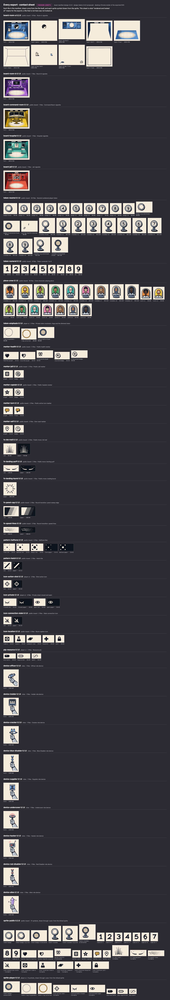

<!-- Generated by design/tools/write-docs.mjs from design/exports/asset-manifest.json, design/contract/planned-assets.json. Do not edit by hand: change the source and run `npm run build:docs --workspace @mothership/design-tokens`. -->

# Asset inventory

Asset manifest `design-0.2.0` · design tokens `0.4.0` (proposal) · base commit `333c9e8` · rule-source manifest `34e7c08cda13`…

Two kinds of thing are listed here and they are kept apart:

- **Finished**: an exported file exists, is listed in the manifest with its size, anchors and hash, and is drawn on the contact sheet below.
- **Not produced**: nothing exists. The entry says what it would be drawn from and what stands in for it today.

Finished means the artwork is complete for this slice. What has been looked at, and by whom, is the `humanArtReview` line below: the game owner approved the comic board, its characters and its devices as a direction; no illustrator or art director has reviewed anything, and nothing here has been seen on a phone or a shared display.

The two synthetic disclosure studies are neither. They are not assets, are in no bundle and are not in this manifest: see [the end of this page](#synthetic-studies-not-assets).

## Rights and provenance

|  |  |
| --- | --- |
| origin | Original vector artwork drawn for this repository as hand-written SVG. No third-party artwork, font, stock asset, photograph, traced image or generated raster image is included or was used as a source. |
| author | Visual and Motion Designer workstream, issue #4: a Claude Code session (model claude-opus-5-5) working for the game owner. |
| created | 2026-10-06 and 2026-10-07 |
| license | None granted. The repository carries no distribution license. |
| reuse | Use inside the Mothership project only. Any other use needs the game owner's decision (DSN-D06). |
| humanArtReview | The game owner looked at the five rooms, the nine characters and the nine role devices on a working page and approved the direction on 7 October 2026 (docs/design/owner-decisions.md). No illustrator or art director has reviewed any of it, and nothing has been seen on a phone or a shared display. |

The editable source of every export is the layered SVG named in its row. Exports are lifted out of the sources by `design/tools/build-exports.mjs`; no export is edited by hand.

## Bundles

A bundle is loaded as **one stylesheet**. Every picture in it is a custom property holding the picture itself, so nothing is fetched later and what a device draws can never show in what it asks for. The separate files are the same pictures for a renderer that wants textures; it takes all of a bundle or none.

| Bundle | Audience | Its stylesheet | Files | Load policy |
| --- | --- | --- | --- | --- |
| `public-board` | public | `public-board.art.1f47b9f920.css` 230.6 KB, 101 pictures | 102, 221.6 KB | The table display and every phone. Every device of this audience fetches this bundle's one stylesheet before the first match view, whatever the seat's role, state or turn. An individual file is never fetched because of something a view says: which files a device asks for must tell an observer nothing. Contains nothing that depends on a role, a faction or a private choice. |
| `player-ui` | player | `player-ui.art.fc4830756c.css` 5.9 KB, 12 pictures | 13, 7.5 KB | Every phone, identically. Every device of this audience fetches this bundle's one stylesheet before the first match view, whatever the seat's role, state or turn. An individual file is never fetched because of something a view says: which files a device asks for must tell an observer nothing. |
| `roles` | player | `roles.art.14e56b5e3e.css` 24.6 KB, 9 pictures | 9, 21.8 KB | UNIFORM. Every phone, identically, before roles are shown. Every device of this audience fetches this bundle's one stylesheet before the first match view, whatever the seat's role, state or turn. An individual file is never fetched because of something a view says: which files a device asks for must tell an observer nothing. Fetching one role's art by itself can disclose that role. |

The role bundle is expected to hold 9 roles and holds 9: Officer, Insider, Cracker, Blue Disabler, Supplier, Undercover, Hacker, Red Disabler, Alien.

The manifest's status: Second slice for issue #4: the comic board the game owner approved on 7 October 2026 (five rooms in color, nine characters, nine role devices), on top of the first slice. Not a complete V1 asset set: see docs/design/asset-inventory.md for what is not produced.

## Produced

| Asset | Status | Bundle | Variants | Size | Drawn from | Editable source |
| --- | --- | --- | --- | --- | --- | --- |
| `board-room-a` 0.2.0 Room A vignette | Finished | `public-board` | 9 | 30.4 KB | Shown for the location named Room A. Which seats stand in it comes from seats[].location. | `design/source/board/board-room-a.svg` |
| `board-room-b` 0.1.0 Room B vignette | Finished | `public-board` | 1 | 14.4 KB | Shown for the location named Room B. Which seats stand in it comes from seats[].location. | `design/source/board/board-room-b.svg` |
| `board-command-room` 0.1.0 Command Room vignette | Finished | `public-board` | 1 | 12.9 KB | Shown for the location named Command Room. Which seats stand in it comes from seats[].location. | `design/source/board/board-command-room.svg` |
| `board-hospital` 0.1.0 Hospital vignette | Finished | `public-board` | 1 | 12.7 KB | Shown for the location named Hospital. Which seats stand in it comes from seats[].location. | `design/source/board/board-hospital.svg` |
| `board-jail` 0.1.0 Jail vignette | Finished | `public-board` | 1 | 10.7 KB | Shown for the location named Jail. Which seats stand in it comes from seats[].location. | `design/source/board/board-jail.svg` |
| `token-neutral` 0.1.0 Neutral numbered player token | Finished | `public-board` | 25 | 32.4 KB | One per seat in seats[]. The numeral is the seat number. Health variants follow seats[].health. Nothing else may change it. | `design/source/token/numerals.svg` `design/source/token/token-neutral.svg` |
| `token-numeral` 0.1.0 Token numerals 1 to 9 | Finished | `public-board` | 9 | 2.9 KB | The seat number, 1 to 9. Never a count of anything else. | `design/source/token/numerals.svg` |
| `piece-crew` 0.1.0 Crew character playing piece | Finished | `public-board` | 18 | 72.7 KB | PROPOSED FACT, not in any contract yet (DSN-REQ-6): the character a seat's player chose before roles were dealt. Public, and the same on every screen. Never a role, a team, a health state or anything private. A seat with no character is drawn as token-neutral. | `design/source/crew/crew-1.svg` `design/source/crew/crew-2.svg` `design/source/crew/crew-3.svg` `design/source/crew/crew-4.svg` `design/source/crew/crew-5.svg` `design/source/crew/crew-6.svg` `design/source/crew/crew-7.svg` `design/source/crew/crew-8.svg` `design/source/crew/crew-9.svg` |
| `token-emphasis` 0.1.0 Private token emphasis: rings and the dimmed token | Finished | `player-ui` | 3 | 912 B | PRIVATE, and drawn by no reference rule yet. Meant for a target list the server supplies (DSN-D03): may be chosen, chosen on this device, not offered. Protocol 1 has no such list, and a ring would claim one. | `design/source/token/token-neutral.svg` |
| `marker-health` 0.1.0 Public health marker | Finished | `public-board` | 5 | 4.6 KB | seats[].health: Healthy, Injured or Eliminated. A separate fact from Jail and Captain. | `design/source/markers/markers.svg` |
| `marker-jail` 0.1.0 Public Jail marker | Finished | `public-board` | 2 | 1.1 KB | seats[].jailed is true. Jail is not a health state; a seat's location is a separate field. | `design/source/markers/markers.svg` |
| `marker-captain` 0.1.0 Public Captain marker | Finished | `public-board` | 2 | 1.2 KB | seats[].captain is true. It stays with the title when the Captain leaves Command Room and says nothing about immunity. A rank star, deliberately not a shield. | `design/source/markers/markers.svg` |
| `marker-turn` 0.1.0 Public active-turn marker | Finished | `public-board` | 2 | 1.2 KB | activeSeatId equals this seat. Public. Never drawn inside the private sheet. | `design/source/markers/markers.svg` |
| `marker-self` 0.1.0 Own-seat marker | Finished | `public-board` | 2 | 900 B | The seat equals the player view's audience.seatId. Drawn on that player's own phone only; the seat number itself is public. | `design/source/markers/markers.svg` |
| `fx-ink-trail` 0.1.0 Public move: ink trail | Finished | `public-board` | 2 | 912 B | A public-move cue, which needs a PUBLIC_MOVE event and a view that shows the seat in its new location. | `design/source/fx/fx.svg` |
| `fx-landing-puff` 0.1.0 Public move: landing puff | Finished | `public-board` | 2 | 778 B | A public-move cue, as fx-ink-trail. | `design/source/fx/fx.svg` |
| `fx-landing-burst` 0.1.0 Public move: landing burst | Finished | `public-board` | 1 | 791 B | A public-move cue, as fx-ink-trail. | `design/source/fx/fx.svg` |
| `fx-panel-cap` 0.1.0 Round transition: panel sweep edge | Finished | `public-board` | 2 | 1.3 KB | A round-transition cue, which needs a PHASE_CHANGED event and a view whose round number went up. | `design/source/fx/fx.svg` |
| `fx-speed-lines` 0.1.0 Round transition: speed lines | Finished | `public-board` | 2 | 648 B | A round-transition cue, as fx-panel-cap. | `design/source/fx/fx.svg` |
| `pattern-halftone` 0.1.0 Halftone tiles | Finished | `public-board` | 5 | 1.5 KB | Decoration. Shading only; it states nothing. | `design/source/fx/patterns.svg` |
| `pattern-hatch` 0.1.0 Hatch tile | Finished | `public-board` | 2 | 484 B | The pending band of an action card while its own command is being sent or checked, and the frame and banner edge that mark a stale view. It states nothing by itself. | `design/source/fx/patterns.svg` |
| `icon-action-shot` 0.1.0 Shot action icon | Finished | `player-ui` | 2 | 704 B | The Shot action card inside the private sheet. The same for every seat shown the card. | `design/source/cards/ui-icons.svg` |
| `icon-private` 0.1.0 Private sheet closed and open | Finished | `player-ui` | 4 | 1.3 KB | Whether the player has opened the private sheet on this device. Local state; closed by default. | `design/source/cards/ui-icons.svg` |
| `icon-connection-stale` 0.1.0 Stale connection icon | Finished | `public-board` | 2 | 634 B | The client's own connection status is stale: the view shown is the last known one. | `design/source/cards/ui-icons.svg` |
| `icon-location` 0.1.0 Room caption icon | Finished | `public-board` | 5 | 1.4 KB | Beside a location's name in its caption. One per location; decoration, because the name is always there as live text. | `design/source/board/room-icons.svg` |
| `pip-resource` 0.1.0 Resource pip | Finished | `player-ui` | 3 | 1.5 KB | PRIVATE. Drawn only from the player's own view: available from self.shotAvailable, registered while the seat's own command is listed in ownPendingCommandIds. Spent has no field in protocol 1 (DSN-D02). | `design/source/cards/ui-icons.svg` |
| `device-officer` 0.1.0 Officer role device | Finished | `roles` | 1 | 2.7 KB | PRIVATE. The player view's self.role is Officer. Drawn over the player's own character, only inside that seat's open private sheet. One ordinary shot: a sidearm with one cell. | `design/source/devices/device-officer.svg` |
| `device-insider` 0.1.0 Insider role device | Finished | `roles` | 1 | 2.3 KB | PRIVATE. The player view's self.role is Insider. Drawn over the player's own character, only inside that seat's open private sheet. Knows three roles as a set: a slate with three marks that are alike. | `design/source/devices/device-insider.svg` |
| `device-cracker` 0.1.0 Cracker role device | Finished | `roles` | 1 | 2.9 KB | PRIVATE. The player view's self.role is Cracker. Drawn over the player's own character, only inside that seat's open private sheet. Two rescues: an injector with two vials. | `design/source/devices/device-cracker.svg` |
| `device-blue-disabler` 0.1.0 Blue Disabler role device | Finished | `roles` | 1 | 2.3 KB | PRIVATE. The player view's self.role is Blue Disabler. Drawn over the player's own character, only inside that seat's open private sheet. One Disable: a prod with one charge ring. | `design/source/devices/device-blue-disabler.svg` |
| `device-supplier` 0.1.0 Supplier role device | Finished | `roles` | 1 | 2.4 KB | PRIVATE. The player view's self.role is Supplier. Drawn over the player's own character, only inside that seat's open private sheet. Two recipients: a carrier with two cells. | `design/source/devices/device-supplier.svg` |
| `device-undercover` 0.1.0 Undercover role device | Finished | `roles` | 1 | 2.3 KB | PRIVATE. The player view's self.role is Undercover. Drawn over the player's own character, only inside that seat's open private sheet. Protection: an emitter under a dome. | `design/source/devices/device-undercover.svg` |
| `device-hacker` 0.1.0 Hacker role device | Finished | `roles` | 1 | 2.6 KB | PRIVATE. The player view's self.role is Hacker. Drawn over the player's own character, only inside that seat's open private sheet. Scanning for four: a scanner with four slots. | `design/source/devices/device-hacker.svg` |
| `device-red-disabler` 0.1.0 Red Disabler role device | Finished | `roles` | 1 | 2.3 KB | PRIVATE. The player view's self.role is Red Disabler. Drawn over the player's own character, only inside that seat's open private sheet. One Disable: a prod with one charge ring. | `design/source/devices/device-red-disabler.svg` |
| `device-alien` 0.1.0 Alien role device | Finished | `roles` | 1 | 2.0 KB | PRIVATE. The player view's self.role is Alien. Drawn over the player's own character, only inside that seat's open private sheet. Holds the Code: a stone with four nodes. | `design/source/devices/device-alien.svg` |

### Sprites

| Sprite | Bundle | Symbols | Size |
| --- | --- | --- | --- |
| `sprite-public` 0.2.0 | `public-board` | token-badge, token-badge-injured, token-badge-eliminated, token-standee, token-standee-injured, token-standee-eliminated, numeral-1, numeral-2, numeral-3, numeral-4, numeral-5, numeral-6, numeral-7, numeral-8, numeral-9, marker-health-healthy, marker-health-injured, marker-health-eliminated, marker-jail, marker-captain, marker-turn, marker-self, fx-ink-trail (tintable), fx-landing-puff (tintable), fx-speed-lines (tintable), icon-connection-stale (tintable), icon-location-room-a (tintable), icon-location-room-b (tintable), icon-location-command-room (tintable), icon-location-hospital (tintable), icon-location-jail (tintable) | 15.1 KB |
| `sprite-player` 0.1.0 | `player-ui` | token-badge-unavailable, token-ring-targetable, token-ring-selected, icon-action-shot (tintable), icon-private-closed (tintable), icon-private-open (tintable), pip-available, pip-registered, pip-spent | 3.2 KB |

### Variants, sizes and anchors

Sizes are in the export's own units; every export is vector and scales freely. Anchors are in the same units, from the top left. The full list, with hashes and the surfaces each variant may be drawn on, is [`design/exports/asset-manifest.json`](../../design/exports/asset-manifest.json).

**`board-room-a`**

| Variant | Size | Bytes | May be drawn on | Anchors |
| --- | --- | --- | --- | --- |
| `full` | 1024 × 768 | 14717 | Table; Phone, public layer; Phone, private sheet | panelBox [20, 20, 984, 728] · captionTopLeft [34, 32] · captionMaxWidth 240 |
| `layer-space` | 1024 × 768 | 1963 | Table; Phone, public layer; Phone, private sheet | panelBox [20, 20, 984, 728] · captionTopLeft [34, 32] · captionMaxWidth 240 |
| `layer-backwall` | 1024 × 768 | 5863 | Table; Phone, public layer; Phone, private sheet | panelBox [20, 20, 984, 728] · captionTopLeft [34, 32] · captionMaxWidth 240 |
| `layer-shell` | 1024 × 768 | 1666 | Table; Phone, public layer; Phone, private sheet | panelBox [20, 20, 984, 728] · captionTopLeft [34, 32] · captionMaxWidth 240 |
| `layer-floor` | 1024 × 768 | 2352 | Table; Phone, public layer; Phone, private sheet | panelBox [20, 20, 984, 728] · captionTopLeft [34, 32] · captionMaxWidth 240 |
| `layer-edges` | 1024 × 768 | 354 | Table; Phone, public layer; Phone, private sheet | panelBox [20, 20, 984, 728] · captionTopLeft [34, 32] · captionMaxWidth 240 |
| `layer-props-back` | 1024 × 768 | 2465 | Table; Phone, public layer; Phone, private sheet | panelBox [20, 20, 984, 728] · captionTopLeft [34, 32] · captionMaxWidth 240 |
| `layer-props-front` | 1024 × 768 | 1551 | Table; Phone, public layer; Phone, private sheet | panelBox [20, 20, 984, 728] · captionTopLeft [34, 32] · captionMaxWidth 240 |
| `layer-frame` | 1024 × 768 | 247 | Table; Phone, public layer; Phone, private sheet | panelBox [20, 20, 984, 728] · captionTopLeft [34, 32] · captionMaxWidth 240 |

**`board-room-b`**

| Variant | Size | Bytes | May be drawn on | Anchors |
| --- | --- | --- | --- | --- |
| `full` | 1024 × 768 | 14722 | Table; Phone, public layer; Phone, private sheet | panelBox [20, 20, 984, 728] · captionTopLeft [34, 32] · captionMaxWidth 240 |

**`board-command-room`**

| Variant | Size | Bytes | May be drawn on | Anchors |
| --- | --- | --- | --- | --- |
| `full` | 1024 × 768 | 13247 | Table; Phone, public layer; Phone, private sheet | panelBox [20, 20, 984, 728] · captionTopLeft [34, 32] · captionMaxWidth 240 |

**`board-hospital`**

| Variant | Size | Bytes | May be drawn on | Anchors |
| --- | --- | --- | --- | --- |
| `full` | 1024 × 768 | 13026 | Table; Phone, public layer; Phone, private sheet | panelBox [20, 20, 984, 728] · captionTopLeft [34, 32] · captionMaxWidth 240 |

**`board-jail`**

| Variant | Size | Bytes | May be drawn on | Anchors |
| --- | --- | --- | --- | --- |
| `full` | 1024 × 768 | 10984 | Table; Phone, public layer; Phone, private sheet | panelBox [20, 20, 984, 728] · captionTopLeft [34, 32] · captionMaxWidth 240 |

**`token-neutral`**

| Variant | Size | Bytes | May be drawn on | Anchors |
| --- | --- | --- | --- | --- |
| `badge-blank` | 80 × 80 | 880 | Table; Phone, public layer; Phone, private sheet | faceCenter [38, 38] · faceRadius 21 · bodyDiameter 64 · numeralCenter [38, 38] · numeralScale 0.72 · ringRadius 35.5 |
| `badge-n1` | 80 × 80 | 1183 | Table; Phone, public layer; Phone, private sheet | faceCenter [38, 38] · faceRadius 21 · bodyDiameter 64 · ringRadius 35.5 |
| `badge-n2` | 80 × 80 | 1157 | Table; Phone, public layer; Phone, private sheet | faceCenter [38, 38] · faceRadius 21 · bodyDiameter 64 · ringRadius 35.5 |
| `badge-n3` | 80 × 80 | 1205 | Table; Phone, public layer; Phone, private sheet | faceCenter [38, 38] · faceRadius 21 · bodyDiameter 64 · ringRadius 35.5 |
| `badge-n4` | 80 × 80 | 1145 | Table; Phone, public layer; Phone, private sheet | faceCenter [38, 38] · faceRadius 21 · bodyDiameter 64 · ringRadius 35.5 |
| `badge-n5` | 80 × 80 | 1176 | Table; Phone, public layer; Phone, private sheet | faceCenter [38, 38] · faceRadius 21 · bodyDiameter 64 · ringRadius 35.5 |
| `badge-n6` | 80 × 80 | 1244 | Table; Phone, public layer; Phone, private sheet | faceCenter [38, 38] · faceRadius 21 · bodyDiameter 64 · ringRadius 35.5 |
| `badge-n7` | 80 × 80 | 1126 | Table; Phone, public layer; Phone, private sheet | faceCenter [38, 38] · faceRadius 21 · bodyDiameter 64 · ringRadius 35.5 |
| `badge-n8` | 80 × 80 | 1180 | Table; Phone, public layer; Phone, private sheet | faceCenter [38, 38] · faceRadius 21 · bodyDiameter 64 · ringRadius 35.5 |
| `badge-n9` | 80 × 80 | 1245 | Table; Phone, public layer; Phone, private sheet | faceCenter [38, 38] · faceRadius 21 · bodyDiameter 64 · ringRadius 35.5 |
| `badge-injured-blank` | 80 × 80 | 1295 | Table; Phone, public layer; Phone, private sheet | faceCenter [38, 38] · faceRadius 21 · bodyDiameter 64 · numeralCenter [38, 38] · numeralScale 0.72 |
| `badge-eliminated-blank` | 80 × 80 | 538 | Table; Phone, public layer; Phone, private sheet | faceCenter [38, 38] · faceRadius 21 · bodyDiameter 64 · numeralCenter [38, 38] · numeralScale 0.72 |
| `overlay-health-injured` | 80 × 80 | 505 | Table; Phone, public layer; Phone, private sheet | alignTo badge-blank |
| `standee-blank` | 96 × 120 | 1370 | Table; Phone, public layer; Phone, private sheet | origin [48, 104] · faceCenter [48, 44] · faceRadius 21 · bodyDiameter 64 · numeralCenter [48, 44] · numeralScale 0.72 |
| `standee-n1` | 96 × 120 | 1673 | Table; Phone, public layer; Phone, private sheet | origin [48, 104] · faceCenter [48, 44] · bodyDiameter 64 |
| `standee-n2` | 96 × 120 | 1647 | Table; Phone, public layer; Phone, private sheet | origin [48, 104] · faceCenter [48, 44] · bodyDiameter 64 |
| `standee-n3` | 96 × 120 | 1695 | Table; Phone, public layer; Phone, private sheet | origin [48, 104] · faceCenter [48, 44] · bodyDiameter 64 |
| `standee-n4` | 96 × 120 | 1635 | Table; Phone, public layer; Phone, private sheet | origin [48, 104] · faceCenter [48, 44] · bodyDiameter 64 |
| `standee-n5` | 96 × 120 | 1666 | Table; Phone, public layer; Phone, private sheet | origin [48, 104] · faceCenter [48, 44] · bodyDiameter 64 |
| `standee-n6` | 96 × 120 | 1734 | Table; Phone, public layer; Phone, private sheet | origin [48, 104] · faceCenter [48, 44] · bodyDiameter 64 |
| `standee-n7` | 96 × 120 | 1616 | Table; Phone, public layer; Phone, private sheet | origin [48, 104] · faceCenter [48, 44] · bodyDiameter 64 |
| `standee-n8` | 96 × 120 | 1670 | Table; Phone, public layer; Phone, private sheet | origin [48, 104] · faceCenter [48, 44] · bodyDiameter 64 |
| `standee-n9` | 96 × 120 | 1735 | Table; Phone, public layer; Phone, private sheet | origin [48, 104] · faceCenter [48, 44] · bodyDiameter 64 |
| `standee-injured-blank` | 96 × 120 | 1821 | Table; Phone, public layer; Phone, private sheet | origin [48, 104] · faceCenter [48, 44] · bodyDiameter 64 · numeralCenter [48, 44] · numeralScale 0.72 |
| `standee-eliminated-blank` | 96 × 120 | 1030 | Table; Phone, public layer; Phone, private sheet | origin [48, 104] · faceCenter [48, 44] · bodyDiameter 64 · numeralCenter [48, 44] · numeralScale 0.72 |

**`token-numeral`**

| Variant | Size | Bytes | May be drawn on | Anchors |
| --- | --- | --- | --- | --- |
| `n1` | 40 × 48 | 324 | Table; Phone, public layer; Phone, private sheet | center [20, 22.5] · bodyTop 4 · bodyBottom 41 |
| `n2` | 40 × 48 | 298 | Table; Phone, public layer; Phone, private sheet | center [20, 22.5] · bodyTop 4 · bodyBottom 41 |
| `n3` | 40 × 48 | 346 | Table; Phone, public layer; Phone, private sheet | center [20, 22.5] · bodyTop 4 · bodyBottom 41 |
| `n4` | 40 × 48 | 286 | Table; Phone, public layer; Phone, private sheet | center [20, 22.5] · bodyTop 4 · bodyBottom 41 |
| `n5` | 40 × 48 | 317 | Table; Phone, public layer; Phone, private sheet | center [20, 22.5] · bodyTop 4 · bodyBottom 41 |
| `n6` | 40 × 48 | 385 | Table; Phone, public layer; Phone, private sheet | center [20, 22.5] · bodyTop 4 · bodyBottom 41 |
| `n7` | 40 × 48 | 267 | Table; Phone, public layer; Phone, private sheet | center [20, 22.5] · bodyTop 4 · bodyBottom 41 |
| `n8` | 40 × 48 | 321 | Table; Phone, public layer; Phone, private sheet | center [20, 22.5] · bodyTop 4 · bodyBottom 41 |
| `n9` | 40 × 48 | 386 | Table; Phone, public layer; Phone, private sheet | center [20, 22.5] · bodyTop 4 · bodyBottom 41 |

**`piece-crew`**

| Variant | Size | Bytes | May be drawn on | Anchors |
| --- | --- | --- | --- | --- |
| `standee-c1` | 96 × 120 | 4812 | Table; Phone, public layer; Phone, private sheet | origin [48, 104] · tagTop [48, 116] |
| `standee-c2` | 96 × 120 | 4386 | Table; Phone, public layer; Phone, private sheet | origin [48, 104] · tagTop [48, 116] |
| `standee-c3` | 96 × 120 | 4520 | Table; Phone, public layer; Phone, private sheet | origin [48, 104] · tagTop [48, 116] |
| `standee-c4` | 96 × 120 | 4293 | Table; Phone, public layer; Phone, private sheet | origin [48, 104] · tagTop [48, 116] |
| `standee-c5` | 96 × 120 | 4811 | Table; Phone, public layer; Phone, private sheet | origin [48, 104] · tagTop [48, 116] |
| `standee-c6` | 96 × 120 | 4328 | Table; Phone, public layer; Phone, private sheet | origin [48, 104] · tagTop [48, 116] |
| `standee-c7` | 96 × 120 | 4733 | Table; Phone, public layer; Phone, private sheet | origin [48, 104] · tagTop [48, 116] |
| `standee-c8` | 96 × 120 | 4167 | Table; Phone, public layer; Phone, private sheet | origin [48, 104] · tagTop [48, 116] |
| `standee-c9` | 96 × 120 | 4503 | Table; Phone, public layer; Phone, private sheet | origin [48, 104] · tagTop [48, 116] |
| `card-c1` | 84 × 96 | 4068 | Table; Phone, public layer; Phone, private sheet | note The piece without its stand: for a list row, a target row, the character chooser and the player's own role card. · faceCenter [48, 38] |
| `card-c2` | 84 × 96 | 3642 | Table; Phone, public layer; Phone, private sheet | note The piece without its stand: for a list row, a target row, the character chooser and the player's own role card. · faceCenter [48, 38] |
| `card-c3` | 84 × 96 | 3776 | Table; Phone, public layer; Phone, private sheet | note The piece without its stand: for a list row, a target row, the character chooser and the player's own role card. · faceCenter [48, 38] |
| `card-c4` | 84 × 96 | 3549 | Table; Phone, public layer; Phone, private sheet | note The piece without its stand: for a list row, a target row, the character chooser and the player's own role card. · faceCenter [48, 38] |
| `card-c5` | 84 × 96 | 4067 | Table; Phone, public layer; Phone, private sheet | note The piece without its stand: for a list row, a target row, the character chooser and the player's own role card. · faceCenter [48, 38] |
| `card-c6` | 84 × 96 | 3584 | Table; Phone, public layer; Phone, private sheet | note The piece without its stand: for a list row, a target row, the character chooser and the player's own role card. · faceCenter [48, 38] |
| `card-c7` | 84 × 96 | 3989 | Table; Phone, public layer; Phone, private sheet | note The piece without its stand: for a list row, a target row, the character chooser and the player's own role card. · faceCenter [48, 38] |
| `card-c8` | 84 × 96 | 3423 | Table; Phone, public layer; Phone, private sheet | note The piece without its stand: for a list row, a target row, the character chooser and the player's own role card. · faceCenter [48, 38] |
| `card-c9` | 84 × 96 | 3759 | Table; Phone, public layer; Phone, private sheet | note The piece without its stand: for a list row, a target row, the character chooser and the player's own role card. · faceCenter [48, 38] |

**`token-emphasis`**

| Variant | Size | Bytes | May be drawn on | Anchors |
| --- | --- | --- | --- | --- |
| `ring-targetable` | 80 × 80 | 338 | Phone, private sheet | alignTo badge-blank |
| `ring-selected` | 80 × 80 | 284 | Phone, private sheet | alignTo badge-blank |
| `unavailable-blank` | 80 × 80 | 290 | Phone, private sheet | faceCenter [38, 38] · faceRadius 21 · bodyDiameter 64 · numeralCenter [38, 38] · numeralScale 0.72 |

**`marker-health`**

| Variant | Size | Bytes | May be drawn on | Anchors |
| --- | --- | --- | --- | --- |
| `healthy-glyph` | 32 × 32 | 442 | Table; Phone, public layer; Phone, private sheet | center [16, 16] |
| `injured-glyph` | 32 × 32 | 1358 | Table; Phone, public layer; Phone, private sheet | center [16, 16] |
| `eliminated-glyph` | 32 × 32 | 551 | Table; Phone, public layer; Phone, private sheet | center [16, 16] |
| `injured-badge` | 36 × 36 | 1594 | Table; Phone, public layer; Phone, private sheet | center [17, 17] |
| `eliminated-badge` | 36 × 36 | 787 | Table; Phone, public layer; Phone, private sheet | center [17, 17] |

**`marker-jail`**

| Variant | Size | Bytes | May be drawn on | Anchors |
| --- | --- | --- | --- | --- |
| `glyph` | 32 × 32 | 467 | Table; Phone, public layer; Phone, private sheet | center [16, 16] |
| `badge` | 36 × 36 | 703 | Table; Phone, public layer; Phone, private sheet | center [17, 17] |

**`marker-captain`**

| Variant | Size | Bytes | May be drawn on | Anchors |
| --- | --- | --- | --- | --- |
| `glyph` | 32 × 32 | 497 | Table; Phone, public layer; Phone, private sheet | center [16, 16] |
| `badge` | 36 × 36 | 733 | Table; Phone, public layer; Phone, private sheet | center [17, 17] |

**`marker-turn`**

| Variant | Size | Bytes | May be drawn on | Anchors |
| --- | --- | --- | --- | --- |
| `glyph` | 32 × 32 | 461 | Table; Phone, public layer | center [16, 16] · tail [9.5, 28] |
| `float` | 36 × 36 | 729 | Table; Phone, public layer | center [16, 16] · tail [9.5, 28] |

**`marker-self`**

| Variant | Size | Bytes | May be drawn on | Anchors |
| --- | --- | --- | --- | --- |
| `glyph` | 32 × 32 | 332 | Phone, public layer; Phone, private sheet | center [16, 16] · tip [16, 29] |
| `badge` | 36 × 36 | 568 | Phone, public layer; Phone, private sheet | center [17, 17] |

**`fx-ink-trail`**

| Variant | Size | Bytes | May be drawn on | Anchors |
| --- | --- | --- | --- | --- |
| `ink` | 96 × 80 | 456 | Table; Phone, public layer; Phone, private sheet | landing [48, 80] · alignTo Bottom center sits on the top center of the landing token. |
| `paper` | 96 × 80 | 456 | Table; Phone, public layer; Phone, private sheet | landing [48, 80] · alignTo Bottom center sits on the top center of the landing token. |

**`fx-landing-puff`**

| Variant | Size | Bytes | May be drawn on | Anchors |
| --- | --- | --- | --- | --- |
| `ink` | 120 × 36 | 389 | Table; Phone, public layer; Phone, private sheet | contact [60, 30] · alignTo The contact point sits on the token origin (floor contact). |
| `paper` | 120 × 36 | 389 | Table; Phone, public layer; Phone, private sheet | contact [60, 30] · alignTo The contact point sits on the token origin (floor contact). |

**`fx-landing-burst`**

| Variant | Size | Bytes | May be drawn on | Anchors |
| --- | --- | --- | --- | --- |
| `paper` | 100 × 100 | 791 | Table; Phone, public layer; Phone, private sheet | center [50, 50] · alignTo Its center sits a little above the piece's floor contact, behind the piece. |

**`fx-panel-cap`**

| Variant | Size | Bytes | May be drawn on | Anchors |
| --- | --- | --- | --- | --- |
| `ink` | 160 × 96 | 665 | Table; Phone, public layer; Phone, private sheet | solidUntilX 32 · slantRun 40 · alignTo The left edge continues a plain block of the same color. |
| `paper` | 160 × 96 | 665 | Table; Phone, public layer; Phone, private sheet | solidUntilX 32 · slantRun 40 · alignTo The left edge continues a plain block of the same color. |

**`fx-speed-lines`**

| Variant | Size | Bytes | May be drawn on | Anchors |
| --- | --- | --- | --- | --- |
| `ink` | 240 × 64 | 324 | Table; Phone, public layer; Phone, private sheet | leading [0, 32] |
| `paper` | 240 × 64 | 324 | Table; Phone, public layer; Phone, private sheet | leading [0, 32] |

**`pattern-halftone`**

| Variant | Size | Bytes | May be drawn on | Anchors |
| --- | --- | --- | --- | --- |
| `fine-ink` | 12 × 12 | 303 | Table; Phone, public layer; Phone, private sheet | tile [12, 12] |
| `medium-ink` | 12 × 12 | 305 | Table; Phone, public layer; Phone, private sheet | tile [12, 12] |
| `heavy-ink` | 12 × 12 | 294 | Table; Phone, public layer; Phone, private sheet | tile [12, 12] |
| `fine-paper` | 12 × 12 | 303 | Table; Phone, public layer; Phone, private sheet | tile [12, 12] |
| `medium-paper` | 12 × 12 | 305 | Table; Phone, public layer; Phone, private sheet | tile [12, 12] |

**`pattern-hatch`**

| Variant | Size | Bytes | May be drawn on | Anchors |
| --- | --- | --- | --- | --- |
| `ink` | 12 × 12 | 242 | Table; Phone, public layer; Phone, private sheet | tile [12, 12] |
| `paper` | 12 × 12 | 242 | Table; Phone, public layer; Phone, private sheet | tile [12, 12] |

**`icon-action-shot`**

| Variant | Size | Bytes | May be drawn on | Anchors |
| --- | --- | --- | --- | --- |
| `ink` | 32 × 32 | 352 | Phone, private sheet | center [16, 16] |
| `paper` | 32 × 32 | 352 | Phone, private sheet | center [16, 16] |

**`icon-private`**

| Variant | Size | Bytes | May be drawn on | Anchors |
| --- | --- | --- | --- | --- |
| `closed-ink` | 32 × 32 | 316 | Phone, public layer; Phone, private sheet | center [16, 16] |
| `closed-paper` | 32 × 32 | 316 | Phone, public layer; Phone, private sheet | center [16, 16] |
| `open-ink` | 32 × 32 | 351 | Phone, public layer; Phone, private sheet | center [16, 16] |
| `open-paper` | 32 × 32 | 351 | Phone, public layer; Phone, private sheet | center [16, 16] |

**`icon-connection-stale`**

| Variant | Size | Bytes | May be drawn on | Anchors |
| --- | --- | --- | --- | --- |
| `ink` | 32 × 32 | 317 | Table; Phone, public layer; Phone, private sheet | center [16, 16] |
| `paper` | 32 × 32 | 317 | Table; Phone, public layer; Phone, private sheet | center [16, 16] |

**`icon-location`**

| Variant | Size | Bytes | May be drawn on | Anchors |
| --- | --- | --- | --- | --- |
| `room-a` | 24 × 24 | 324 | Table; Phone, public layer; Phone, private sheet | center [12, 12] |
| `room-b` | 24 × 24 | 361 | Table; Phone, public layer; Phone, private sheet | center [12, 12] |
| `command-room` | 24 × 24 | 297 | Table; Phone, public layer; Phone, private sheet | center [12, 12] |
| `hospital` | 24 × 24 | 180 | Table; Phone, public layer; Phone, private sheet | center [12, 12] |
| `jail` | 24 × 24 | 276 | Table; Phone, public layer; Phone, private sheet | center [12, 12] |

**`pip-resource`**

| Variant | Size | Bytes | May be drawn on | Anchors |
| --- | --- | --- | --- | --- |
| `available` | 36 × 20 | 382 | Phone, private sheet | center [18, 10] |
| `registered` | 36 × 20 | 620 | Phone, private sheet | center [18, 10] |
| `spent` | 36 × 20 | 506 | Phone, private sheet | center [18, 10] |

**`device-officer`**

| Variant | Size | Bytes | May be drawn on | Anchors |
| --- | --- | --- | --- | --- |
| `held` | 120 × 140 | 2736 | Phone, private sheet | placement Over the lower right of the character's card: 74% of the picture's width, 9% past its right edge and 10% past its lower edge. · grip [78, 104] |

**`device-insider`**

| Variant | Size | Bytes | May be drawn on | Anchors |
| --- | --- | --- | --- | --- |
| `held` | 120 × 140 | 2375 | Phone, private sheet | placement Over the lower right of the character's card: 74% of the picture's width, 9% past its right edge and 10% past its lower edge. · grip [78, 104] |

**`device-cracker`**

| Variant | Size | Bytes | May be drawn on | Anchors |
| --- | --- | --- | --- | --- |
| `held` | 120 × 140 | 2977 | Phone, private sheet | placement Over the lower right of the character's card: 74% of the picture's width, 9% past its right edge and 10% past its lower edge. · grip [78, 104] |

**`device-blue-disabler`**

| Variant | Size | Bytes | May be drawn on | Anchors |
| --- | --- | --- | --- | --- |
| `held` | 120 × 140 | 2350 | Phone, private sheet | placement Over the lower right of the character's card: 74% of the picture's width, 9% past its right edge and 10% past its lower edge. · grip [78, 104] |

**`device-supplier`**

| Variant | Size | Bytes | May be drawn on | Anchors |
| --- | --- | --- | --- | --- |
| `held` | 120 × 140 | 2459 | Phone, private sheet | placement Over the lower right of the character's card: 74% of the picture's width, 9% past its right edge and 10% past its lower edge. · grip [78, 104] |

**`device-undercover`**

| Variant | Size | Bytes | May be drawn on | Anchors |
| --- | --- | --- | --- | --- |
| `held` | 120 × 140 | 2349 | Phone, private sheet | placement Over the lower right of the character's card: 74% of the picture's width, 9% past its right edge and 10% past its lower edge. · grip [78, 104] |

**`device-hacker`**

| Variant | Size | Bytes | May be drawn on | Anchors |
| --- | --- | --- | --- | --- |
| `held` | 120 × 140 | 2648 | Phone, private sheet | placement Over the lower right of the character's card: 74% of the picture's width, 9% past its right edge and 10% past its lower edge. · grip [78, 104] |

**`device-red-disabler`**

| Variant | Size | Bytes | May be drawn on | Anchors |
| --- | --- | --- | --- | --- |
| `held` | 120 × 140 | 2342 | Phone, private sheet | placement Over the lower right of the character's card: 74% of the picture's width, 9% past its right edge and 10% past its lower edge. · grip [78, 104] |

**`device-alien`**

| Variant | Size | Bytes | May be drawn on | Anchors |
| --- | --- | --- | --- | --- |
| `held` | 120 × 140 | 2065 | Phone, private sheet | placement Over the lower right of the character's card: 74% of the picture's width, 9% past its right edge and 10% past its lower edge. · grip [78, 104] |

## Not produced

What a complete in-person V1 still needs from Designer. None of it exists as an asset.

### Board vignettes

| Planned id | What | Needs | Until then |
| --- | --- | --- | --- |
| `board-final-zone` | Final Zone vignette | The showdown phase in the audience views. Protocol 1 has no such phase; the panel must not be drawn before it. It will need a color family of its own in the tokens. | Not drawn. |
| `board-room-layers` | Layer exports of Room B, the Command Room, the Hospital and the Jail | Frontend's renderer evaluation. The four are exported whole; their layers are groups in the sources and lift the way Room A's do. | The whole picture of each room. |

### Action cards and icons

| Planned id | What | Needs | Until then |
| --- | --- | --- | --- |
| `card-role-back` | Role card back and the hand | A place in the markup for a card that is dealt face down, the same whatever its face. Drawn in the approved exploration. Today the closed private dock stands for it. | The private dock, closed. |
| `icon-action-move` | Move | The server's own list of destinations for the seat. Protocol 1 carries none. | Frontend's functional placement in its connected prototype. |
| `icon-action-role` | Role actions (protect, rescue, disable, supply, scan) | Per-action availability and the server's own target lists. Protocol 1 carries none. | Not drawn. |
| `icon-action-hack` | Standard Hack request and conversation | The Hack phase and the seat's own Hack availability. Two separate states; no ordinary private chat. | Not drawn. |
| `icon-action-code` | Code entry | The seat's own Code attempt availability. Private. | Not drawn. |
| `card-ballot` | Vote and release ballot | The voting phases, the eligible sets and what a ballot discloses, none of which protocol 1 carries. | Not drawn. |

### Public markers and results

| Planned id | What | Needs | Until then |
| --- | --- | --- | --- |
| `marker-revealed-faction` | Revealed faction marker | A public revealed-faction fact per seat at its permitted reveal step. This is the one place a faction color may appear publicly, and it still needs its word. | Not drawn. No faction color on any public surface. |
| `panel-vote-tally` | Vote tally | A public tally fact. | Not drawn. |
| `cover-match-result` | Match result cover | A terminal public result, and the permitted end-of-match reveals. | Not drawn. |

### Setup and host

| Planned id | What | Needs | Until then |
| --- | --- | --- | --- |
| `layout-character-choice` | Choosing a character and typing a name | The lobby step and the public identity record of a seat (DSN-REQ-6). Drawn and playable in the approved exploration; no markup exists to style. The nine pictures are produced. | Frontend's development console. |
| `layout-lobby` | Lobby and seating | The lobby flow and its contracts. Not part of protocol 1. | Frontend's development console. |
| `layout-host` | Host session controls | The host's approved controls. Being host grants no extra visibility. | Frontend's development console. |

### Lettering, sound, print and scene

| Planned id | What | Needs | Until then |
| --- | --- | --- | --- |
| `lettering-masthead` | Masthead wordmark | Original vector lettering. Today the wordmark is live text in the system heading stack. | Live text. |
| `font-lettering` | Lettering typeface | The game owner's choice of a typeface and its license (DSN-D05). No font file is included. | The system condensed stack in the tokens. |
| `audio-table-move` | Table display: token lands | A sound source with rights, and a listening review. Public facts only; phones stay silent for secret actions. | Silence. |
| `audio-table-round` | Table display: page turn at a new round | As above. | Silence. |
| `print-token-sheet` | Printable token, marker and board sheet | A decision on the physical board option and its paper sizes. The sources are vector and print as they are. | The earlier A3 prototype under reference/. |
| `scene-geometry` | GLB geometry for the Three.js evaluation | Frontend's renderer evaluation and its measured budgets. The Room A layers carry a stack order and proposed depths meanwhile. | Layered 2D planes. |

## Synthetic studies: not assets

> SYNTHETIC STUDIES. Not assets, in no bundle, never connected to a match. No approved fact exists for what they draw.

Study manifest `studies-0.1.0`, in [`design/studies/`](../../design/studies/study-manifest.json). Gate: RULE-003 / D09. What fences them is described in [motion-storyboards.md](motion-storyboards.md#synthetic-studies).

| Study | Size | Drawn from | Editable source |
| --- | --- | --- | --- |
| `study-resolved-shot` 0.1.0 SYNTHETIC study: public resolved shot | 220 × 220, 914 B | NONE. No contract fact says that a shot was resolved, who shot, or what kind of attack it was. Gate: RULE-003 / D09, and an approved public attack-type fact. | `design/source/studies/studies.svg` |
| `study-blocked-outcome` 0.1.0 SYNTHETIC study: disclosed blocked outcome | 180 × 206, 1312 B | NONE. Whether anyone is told that an attack was blocked, and who, is undecided. Gate: RULE-003 / D09. | `design/source/studies/studies.svg` |
