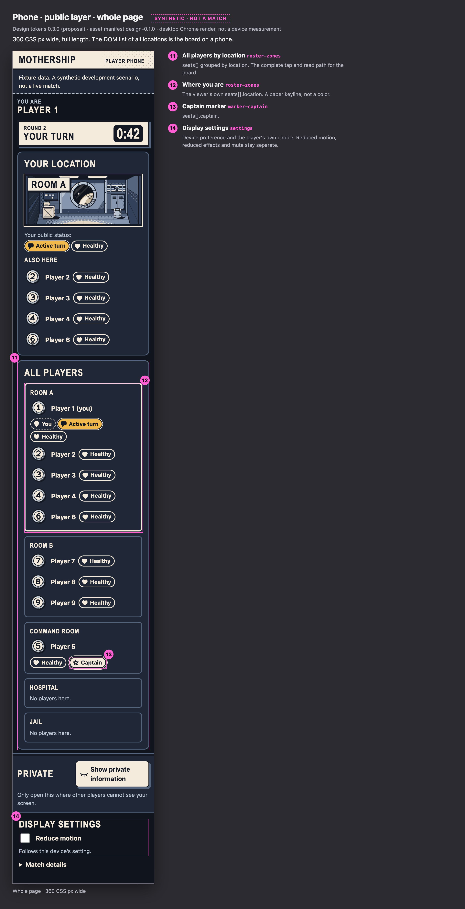
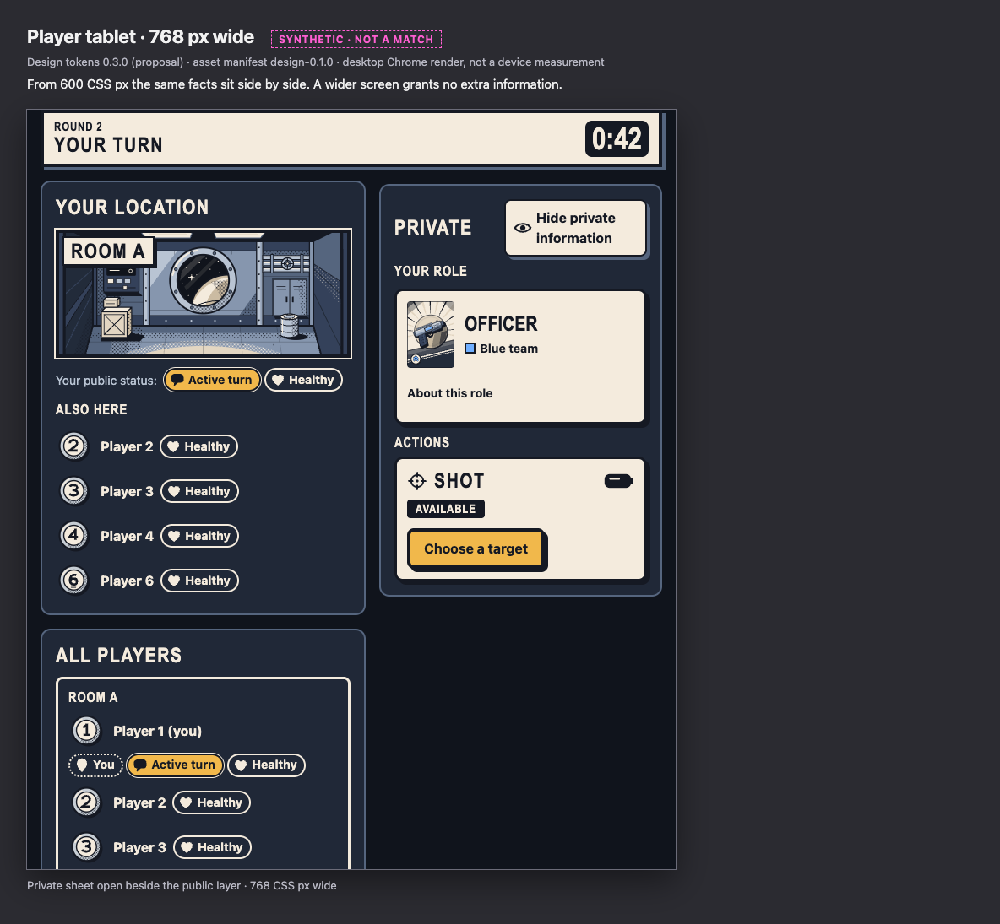
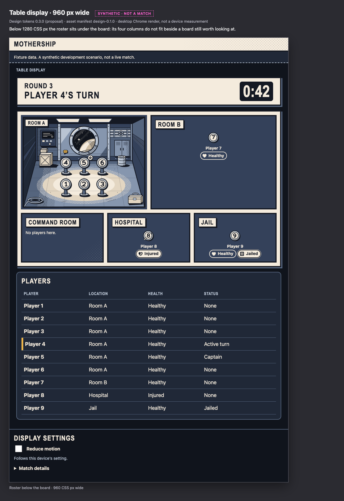

<!-- Generated by design/tools/write-docs.mjs from design/contract/layout-callouts.json. Do not edit by hand: change the source and run `npm run build:docs --workspace @mothership/design-tokens`. -->

# Annotated layouts

Each board is a shell at its own viewport size, drawn with the reference stylesheet. The markup follows what Frontend produces, rebuilt by hand in the Designer's review kit (`design/prototypes/js/kit.js`); it is not Frontend's code running, and it can drift from it. The numbers are placed from the elements themselves. Every state shown is synthetic: authored for looking at layout, the outcome of nothing.

The images are desktop Chrome renders on one machine. They are not device measurements. `component` is the id used in [component-states.md](component-states.md).

## Phone · public layer · private sheet closed

360 x 760 CSS px, first screenful. Every phone shows this same layer whatever its role.

Frames: First screenful, 360 CSS px wide.

| # | Part | Component | Drawn from |
| --- | --- | --- | --- |
| 1 | Header | `shell-header` | Static. Wordmark and surface name. |
| 2 | Data-source banner | `banner-data-source` | Client mode: fixture or emulator. Never shown for a live match. |
| 3 | Seat identity | `identity-title` | audience.seatId. A seat number is public. |
| 4 | Phase caption | `phase-strip` | round, phase.kind, activeSeatId. Cue anchor: phase. |
| 5 | Countdown | `phase-timer` | phase.endsAt with server time. A local estimate; never a cue anchor. |
| 6 | Room vignette strip (PROPOSED) | `location-art` | The viewer's own seats[].location, a public fact. Decoration: hidden from assistive technology; the caption says the name. |
| 7 | Room name caption | `location-caption` | The viewer's own seats[].location, as live text. |
| 8 | Own public status | `marker-health` | The viewer's own seats[] entry: health, jailed, captain; activeSeatId. |
| 9 | Also here | `seat-row` | seats[] with the same location. Cue anchors: seat-N/place, seat-N/health. |
| 10 | Private dock (PROPOSED position) | `private-dock` | None. Identical on every phone: no count, badge or highlight. |

## Phone · public layer · whole page

360 CSS px wide, full length. The DOM list of all locations is the board on a phone.

Frames: Whole page, 360 CSS px wide.

| # | Part | Component | Drawn from |
| --- | --- | --- | --- |
| 11 | All players by location | `roster-zones` | seats[] grouped by location. The complete tap and read path for the board. |
| 12 | Where you are | `roster-zones` | The viewer's own seats[].location. A paper keyline, not a color. |
| 13 | Captain marker | `marker-captain` | seats[].captain. |
| 14 | Display settings | `settings` | Device preference and the player's own choice. Reduced motion, reduced effects and mute stay separate. |

## Phone · private sheet open

360 x 760 CSS px. Everything inside the sheet is private to the seat. The phase caption and countdown stay in view above it.

Frames: Confirming a shot, 360 CSS px wide.

| # | Part | Component | Drawn from |
| --- | --- | --- | --- |
| 1 | Phase caption stays visible | `phase-strip` | As on the public layer. The open sheet stops below it. |
| 2 | Hide control | `private-dock` | Local: the sheet is open on this device. |
| 3 | Role card (PROPOSED structure) | `role-card` | self.role. The picture is in the role bundle every phone loads whole. Name no larger than the heading size. |
| 4 | Action card head | `action-card` | The card exists for every seat shown it. Icon and title never vary by role. |
| 5 | Resource pip (PROPOSED) | `resource-pip` | self.shotAvailable and ownPendingCommandIds, and nothing else. Not drawn while a command is unaccounted for. |
| 6 | Status word | `action-status` | The client's own command flow step. Cue anchor: registration. |
| 7 | Step line | `action-step` | Local choice plus approved copy. Focus rests here, never on a sending control. |
| 8 | Controls | `card-controls` | Local. One primary control; at least 44 CSS px; a new control is inert for a moment. |

## Phone · 320 px wide at 200% text

The narrowest phone with the browser's default text size doubled (32 px). Chips wrap, cards stack, nothing is clipped and nothing shrinks to fit a frame.

Frames: Public layer, 320 CSS px wide; Private sheet, choosing a target, 320 CSS px wide. Browser default text size 32 px.

## Phone · 320 x 568 at 200% text

The shortest common phone with the browser's default text size doubled (32 px). The phase caption scrolls with the page instead of holding the top edge, and the dock is its control and nothing else, so the page keeps most of the screen.

Frames: Public layer, first screenful, 320 CSS px wide; Private sheet open, 320 CSS px wide. Browser default text size 32 px.

## Player tablet · 768 px wide

From 600 CSS px the same facts sit side by side. A wider screen grants no extra information.

Frames: Private sheet open beside the public layer, 768 CSS px wide.

## Table display · 1280 x 720

The shared screen. Public facts only: no private sheet, no command control, no role-dependent asset.

Frames: Synthetic layout state B, 1280 CSS px wide.

| # | Part | Component | Drawn from |
| --- | --- | --- | --- |
| 1 | Phase caption | `phase-strip` | round, phase.kind, activeSeatId. Cue anchor: phase. |
| 2 | Countdown | `phase-timer` | phase.endsAt with server time. |
| 3 | Board page | `board-page` | One panel per location in seats[].location. Gutters are paper; no route is drawn. |
| 4 | Location panel with vignette | `board-panel` | board-room-a. Caption is live text. |
| 5 | Standee tokens | `seat-token` | seats[] in this location. Identical for every role. |
| 6 | Marker badge on a standee | `marker-captain` | seats[].captain. Its word is in the roster and in the document. |
| 7 | Panel without a vignette | `board-panel-fallback` | No vignette exists for this location yet: an inked panel, badge tokens and labeled chips. Every panel looks like this until the art has arrived. |
| 8 | Roster | `roster-table` | seats[] and activeSeatId, in words. Cue anchors: seat-N/place, seat-N/health. |

## Table display · every public health state

Healthy, Injured and Eliminated standing in Room A, with the active Captain among them. A standee's body follows the seat's public health; its badges repeat what the roster says in words.

Frames: Synthetic layout state C, 1280 CSS px wide.

## Table display · 960 px wide

Below 1280 CSS px the roster sits under the board: its four columns do not fit beside a board still worth looking at.

Frames: Roster below the board, 960 CSS px wide.

## Connection lost · last known state

The view is kept and marked stale by words, a taped banner and a hatched frame. Actions are paused; nothing is greyed out.

Frames: Phone, 360 CSS px wide; Table display, 1280 CSS px wide.

## Without art

What every device shows until its art has arrived, and for good if it never does: disc tokens with live numerals, chips with their words, plain panels. Nothing is hidden waiting for a picture.

Frames: Phone, 360 CSS px wide; Table display, 1280 CSS px wide.
