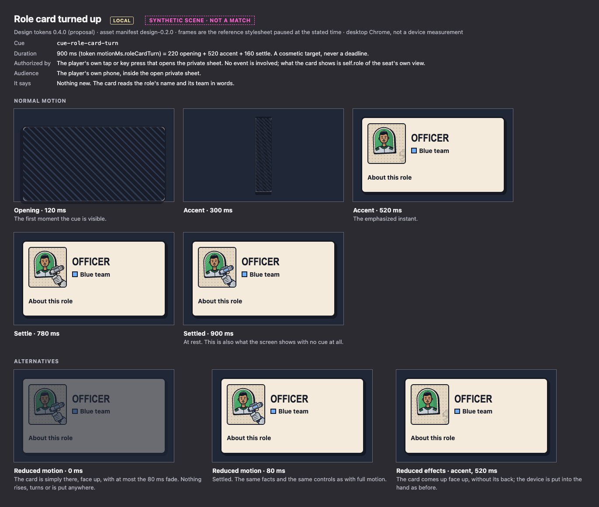

<!-- Generated by design/tools/write-docs.mjs from design/contract/motion-cues.json, design/contract/synthetic-studies.json. Do not edit by hand: change the source and run `npm run build:docs --workspace @mothership/design-tokens`. -->

# Motion storyboards

Design tokens `0.4.0` (proposal) · wire protocol 1. This page applies [motion-direction.md](motion-direction.md); it does not replace it.

A storyboard frame here is not a drawing. It is the reference stylesheet ([`design/prototypes/css/cues.css`](../../design/prototypes/css/cues.css)) started at a negative delay and paused, so each frame is exactly what a browser shows at that moment of the cue. The same stylesheet plays on the motion page (`design/prototypes/motion.html`).

Durations are token values. They are cosmetic targets, never deadlines, and none is measured on a device. The split into opening, accent and settle is this design's proposal. The public move and the role-card turn are the two the game owner approved on 7 October 2026 ([owner-decisions.md](owner-decisions.md)); their times are new tokens in 0.4.0 and no 0.2.0 total changed.

Every cue works without art. The layers that are pictures (the ink trail, the burst, the dust, the panel's halftone edge, the speed lines) exist only once the public bundle has loaded; `storyboards.html?art=none` shows each cue without them.

## What a cue is

- A cue is emphasis for a fact the audience's own view already states in words. It adds no fact.
- A cue changes nothing: not health, resources, turn ownership, a phase or a deadline. Nothing waits for it.
- A cue plays once, for exactly its duration, and is never queued. It is withdrawn early only when the fact it belongs to changes again, or when the screen stops showing a current match.
- A public cue never depends on anything private. An update that changes no public fact (the seat's own registration, a receipt, its pending commands, its private sheet opening or closing) does not withdraw, restart, renumber or delay a public cue.
- Its layers take no pointer events, hold no content and cannot take focus.
- No cue is played for a registration on any public surface, on any other seat's phone, or outside the open private sheet.
- No cue exists for a shot, a shooter, an attack type, a block, Protection or a cause of any kind.

## Cue freshness

**Agreed with Frontend for the windows and for what withdraws a cue; the carried move is new since.** The open items for the Designer in docs/frontend/slice-3-event-director.md on agent/frontend-motion-gallery at fccadf7, and findings R3 to R6 of the integration reviews of 6 October 2026. Frontend owns the director and the frame contract; this says what the drawing needs from them. Frontend agreed the two windows and the rules of withdrawal in its comments on PR #45 (6 October 2026) and PR #57 (7 October 2026), and says its director has them, with finding R6 fixed, in PR #30 at 24a5237. Designer has read those comments and that file's cue vocabulary, and has not run that code.

A public cue belongs to one public fact on the screen: the phase caption, the place of one seat, or the public health of one seat. A private cue belongs to the seat's own command. No cue belongs to a view as a whole: a seat's view also changes when only something private does.

|  | Proposed | Meaning |
| --- | --- | --- |
| Start window | 1000 ms | A treatment starts when its cue is issued. A renderer that first sees a cue more than startWithinMs after it was issued does not start it and shows the settled state. One window serves every kind; how long a treatment then runs is its own token duration, 120 to 900 ms. |
| Event lateness | 1000 ms | An event that arrives more than eventLatenessMs after the view that states its fact came on screen is not a cue. A piece that has stood in its new place for seconds and is then carried in reads as a second move. |
| Carried pieces for one view | at most 4 | Status rings are small and are not capped. Carried pieces are: when one view moves more than maxSeatDropsPerView seats, none is carried and the pieces are simply in their new places. A mass move belongs to a composed cue such as Final Zone entry, which is not designed yet. The number was set for a 450 ms drop and is kept for the 900 ms carry; it is a judgment and not a measurement. Where the cap lives: in the director, which issues no public-move cue for a view that moves more than that many seats, counting from the two views themselves so that the count does not depend on the order events arrive in. Frontend proposed that on PR #45 and Designer agrees; it is not implemented at 24a5237. |

Frontend's director uses a frame lifetime of 1000 ms and a lateness of 1000 ms (agreed). Frontend's comments on PR #45 and PR #57; PR #30 at 24a52371d959286c4c259ff3a2ab621d53f048e9. The values were 2000 and 5000 until then. The drawing needs only that no treatment starts later than the window and that one which has started finishes.

A cue is withdrawn when, and only when:

- Its treatment has run for its duration.
- Its start window passed before anything started it.
- The fact it belongs to changed again: a newer place or health of the same seat, a newer phase. The newer cue takes its place.
- The screen stopped showing a current match: the page is hidden, the feed is stale or unreadable, or a connecting or recovery screen is up. The settled state is shown at once and nothing is caught up afterwards.
- For a private cue only: the private sheet closed. It is never played later.

It is never withdrawn, restarted, renumbered or delayed because of:

- An update that changes no public fact. On a phone the public cues, their order, their numbers and their timing are the same whatever the seat does privately at that moment; otherwise an onlooker could see a registration in a public animation that stopped short.
- Its time in a frame running out while its treatment is running. A treatment that has started finishes.

A public fact the cue does not belong to should not cut it either: another seat's move leaves this seat's ring to finish. The motion direction allows a renderer to cancel on any new authoritative state, so this is a preference. Cutting on a private-only update is not allowed.

**Several at once.** Cues issued for one view start together. They are never played one after another: a sequence is a queue, and the later ones would be late for their facts.

**Kinds.** phase-change is drawn: a rule under the labels. public-move uses its origin: the piece is carried from where it stood, which the client measures from where it stands now and gives the cue as --cue-from-x and --cue-from-y (PROPOSED). Where it stood and where it stands are both public facts of the seat. The place it left is redrawn without it as soon as it has left the page; nothing else is drawn there, and no line, arrow or route is drawn between the two. A client that cannot measure the origin (the seat was not on this screen before) leaves the two properties unset and the piece hops where it stands; and it hops, whatever they say, in a list and on a panel whose picture has not arrived. The director's cue already names the room the seat was shown in (`from`), which a renderer needs in order to know there was an origin at all; Frontend offered on PR #45 to take `from` out of the vocabulary, and the carried move is the reason to keep it.

**Frontend's choices.** Frontend's own choices that the design accepts as they are: a cue can be missed and a fact cannot; a private cue is never played later; nothing is cued on a stale screen; a health change is a status change with no impact; a round sweep needs the round before it; public and private cues are numbered apart.

The two windows and the cap are judgments made on desktop Chrome storyboards. None is measured on a device or against a real event feed. Whether a 900 ms carry stays comfortable when several seats move in one view has not been tried with people. `check-shell.mjs` holds the one part of this that belongs to the reference stylesheet: a private-only update leaves a running public cue untouched.

## Cues

| Cue | Director kind | Audience | Duration | Opening / accent / settle |
| --- | --- | --- | --- | --- |
| [Select a card](#cue-selection) | none: local input | local | 120 ms (`motionMs.selection`) | 0 / 70 / 50 ms |
| [Command registered](#cue-registration) | `registration` | private | 120 ms (`motionMs.registrationStamp`) | 30 / 50 / 40 ms |
| [Public move: a piece is carried](#cue-public-move) | `public-move` | public | 900 ms (`motionMs.pieceMove`) | 120 / 450 / 330 ms |
| [Public status change](#cue-status-change) | `status-change` | public | 220 ms (`motionMs.cardTransition`) | 60 / 100 / 60 ms |
| [New turn](#cue-phase-change) | `phase-change` | public | 220 ms (`motionMs.cardTransition`) | 60 / 100 / 60 ms |
| [Round transition](#cue-round-transition) | `round-transition` | public | 700 ms (`motionMs.roundTransition`) | 180 / 220 / 300 ms |
| [Role card turned up](#cue-role-card-turn) | none: local input | local | 900 ms (`motionMs.roleCardTurn`) | 220 / 520 / 160 ms |

## Select a card

|  |  |
| --- | --- |
| Cue | `cue-selection` · interaction |
| Authorized by | The player's own tap or key press. No event and no server fact is involved. |
| Audience | The player's own phone, inside the open private sheet. |
| Lands on | `.ms-card` |
| Belongs to | The card the player picked up. Local to this device. |
| Duration | 120 ms: 0 opening, 70 accent, 50 settle |
| Easing | accent: `motionEasing.snap` · settle: `motionEasing.settle` |
| Frames shown | 0, 70, 120 ms |
| Layers | The card lifts 3 px up and left, off its shadow. Its ink shadow grows from 4 px to 7 px. A focus-colored outline snaps on around it. |
| It says | Nothing about eligibility or success. The card's own status word changes to “Choosing a target”. |
| Reduced motion | No lift. The outline and the status word appear at once. |
| Reduced effects | Unchanged: there is no side layer to remove. |
| Sound | None. |
| Without the cue | The status word and the target list alone. |

## Command registered

|  |  |
| --- | --- |
| Cue | `cue-registration` · director kind `registration` · interaction |
| Authorized by | An accepted receipt for this device's own command, or a COMMAND_REGISTERED event for a command the seat's own view lists as pending. One cue however many ways the device hears of it. |
| Audience | One seat, inside its open private sheet only. Withheld while the sheet is closed or the page is in the background. |
| Lands on | `data-cue-at="registration"` |
| Belongs to | The seat's own command. Private. |
| Duration | 120 ms: 30 opening, 50 accent, 40 settle |
| Easing | opening: `motionEasing.impact` · accent: `motionEasing.impact` · settle: `motionEasing.settle` |
| Frames shown | 22, 80, 120 ms |
| Layers | The status word comes down as a stamp: larger and turned further, then compressed as it lands, then at rest turned 4 degrees. A ring of halftone presses out around it as it lands and is gone by the end (drawn from tokens; the pattern-halftone tile once the public bundle has loaded). |
| It says | Nothing new. The card already reads “Registered” and “This is not a result.” |
| Reduced motion | The stamp is simply there, with at most the 80 ms fade. No scale, turn or press. |
| Reduced effects | The stamp lands without the halftone press. |
| Sound | None, and no vibration. The same neutral treatment for every kind of registered command. |
| Without the cue | The status word changes to “Registered”. |

Must not show:

- Any public effect
- An impact, burst or damage mark
- A different look for a different command or role

## Public move: a piece is carried

|  |  |
| --- | --- |
| Cue | `cue-public-move` · director kind `public-move` · game event |
| Authorized by | A PUBLIC_MOVE event for a view that shows the seat in its new location, where the view before showed it elsewhere. |
| Audience | Table display, and every phone's public layer. |
| Lands on | `data-cue-at="seat-N/place"` |
| The client sets | PROPOSED --cue-from-x and --cue-from-y on the seat's element: where the piece stood, measured from where it stands now. Unset where the client cannot measure it. They are read only where the seat is a piece on a room panel of the table display whose picture has arrived. |
| Belongs to | The place of one seat. |
| Duration | 900 ms: 120 opening, 450 accent, 330 settle |
| Easing | opening: `motionEasing.settle` · accent: `motionEasing.sweep` · settle: `motionEasing.settle` |
| Frames shown | 80, 230, 345, 650, 900 ms |
| Layers | Opening, 120 ms: the piece crouches where it stood and leaves the page. Accent, 450 ms (the time of a public move in the pinned tokens): it is in the air, larger because it is nearer, and is carried in a straight line over the gutters to its new place while its shadow crosses the page under it. Settle, 330 ms: it lands with a squash and comes to rest. On the table display the room it lands in takes the knock and its caption nods. Streaks above the piece as it comes down (fx-ink-trail), and a burst and dust where it lands (fx-landing-burst, fx-landing-puff). Pictures: absent until the public bundle has loaded. Its tag travels with it. Every other piece stays where it is. In a list, and on a panel that is still plain, nothing is carried: the row is a name and status words beside a token, and carrying it would drag those words across other seats' words. The piece hops where it now stands, with its shadow under it. In the table's roster, where a cell cannot travel, the location cell is underlined and the line clears. |
| It says | Nothing new. The seat is listed in its new location, and “Player N is now in <location>.” is spoken. |
| Reduced motion | The piece is in its new place at once, with at most the 80 ms fade. Nothing travels, nothing is knocked, and there is no shadow, trail, burst or dust. |
| Reduced effects | The piece is picked up, carried and set down, and the room takes the knock, without shadow, trail, burst or dust. |
| Sound | Proposed for the table display only, not produced: one soft paper tap as it lands. |
| Without the cue | The seat is listed in its new location. |
| A renderer may | A renderer that has both points may raise the arc with the distance, as the approved page does (0.42 of the distance, between 46 and 130 CSS px), lean the piece into its direction, draw the ink trail along the arc, and let the room the piece left close up only once the piece has gone. The reference stylesheet lifts the piece by 1.1 of its own height, draws the streaks above it, and has every other piece in its new place from the first frame. |

Must not show:

- A door, corridor, arrow, line or route between two rooms: the piece is carried over the page, and the picture never says which rooms connect
- A stop in between
- Anything at the place it left other than its absence
- A different carry for a different seat, character or role
- Being started by anything but the public fact: not by the player's own tap, and not by a registration

## Public status change

|  |  |
| --- | --- |
| Cue | `cue-status-change` · director kind `status-change` · game event |
| Authorized by | A PUBLIC_HEALTH_CHANGED event for a view that shows the seat's new health, where the view before showed another. |
| Audience | Table display, and every phone's public layer. |
| Lands on | `data-cue-at="seat-N/health"` |
| Belongs to | The public health of one seat. |
| Duration | 220 ms: 60 opening, 100 accent, 60 settle |
| Easing | opening: `motionEasing.impact` · accent: `motionEasing.impact` · settle: `motionEasing.settle` |
| Frames shown | 60, 160, 220 ms |
| Layers | The health marker itself is ringed in paper for a moment and the ring opens out and clears. The marker grows away from the name beside it and the ring stays inside the gap between them, so no word is covered. In the table's roster the health cell is underlined and the line clears. |
| It says | Nothing new. The marker reads its new word, and “Player N is now <health>.” is spoken. |
| Reduced motion | The marker shows its new word at once, with at most the 80 ms fade. |
| Reduced effects | A plain fade on the marker; no ring. |
| Sound | None proposed. A sound here would be heard as “something hit someone”. |
| Without the cue | The marker and the roster read the new word. |

Must not show:

- An impact, burst or lettering
- A line to or from any other seat
- Amber, or red
- A cause of any kind: the contract gives none

## New turn

|  |  |
| --- | --- |
| Cue | `cue-phase-change` · director kind `phase-change` · phase or finale |
| Authorized by | A PHASE_CHANGED event for a view whose phase changed while its round number did not. |
| Audience | Table display, and every phone's public layer. |
| Lands on | `data-cue-at="phase"` |
| Belongs to | The phase caption: the round and the phase on screen. |
| Duration | 220 ms: 60 opening, 100 accent, 60 settle |
| Easing | all: `motionEasing.sweep` |
| Frames shown | 60, 160, 220 ms |
| Layers | A rule is ruled under the round and phase labels from the left and clears. |
| It says | Nothing new. The caption reads the new turn, and it is spoken once. |
| Reduced motion | The labels change at once, with at most the 80 ms fade. |
| Reduced effects | The labels change with no rule. |
| Sound | None proposed. |
| Without the cue | The caption reads the new turn. |

Must not show:

- Anything on the countdown
- Covering or delaying a control

## Round transition

|  |  |
| --- | --- |
| Cue | `cue-round-transition` · director kind `round-transition` · phase or finale |
| Authorized by | A PHASE_CHANGED event for a view whose round number went up, on a device that showed the round before. |
| Audience | Table display, and every phone's public layer. |
| Lands on | `data-cue-at="phase"` |
| Belongs to | The phase caption: the round and the phase on screen. |
| Duration | 700 ms: 180 opening, 220 accent, 300 settle |
| Easing | opening: `motionEasing.sweep` · accent: `motionEasing.impact` · settle: `motionEasing.sweep` |
| Frames shown | 140, 380, 700 ms |
| Layers | An ink panel with a halftone edge sweeps across the labels from the left (fx-panel-cap) and leaves to the right. The round heading is struck in paper on the ink: larger, then down to size. Speed lines behind the heading as it is struck (fx-speed-lines). |
| It says | Nothing new. The heading reads the new round, and it is spoken once. |
| Reduced motion | The heading reads the new round at once, with at most the 80 ms fade. No sweep, strike or lines. |
| Reduced effects | The labels fade in with no ink panel and no lines. |
| Sound | Proposed for the table display only, not produced: one page-turn. |
| Without the cue | The heading reads the new round. |

Must not show:

- Covering the countdown or any control
- A full-screen takeover
- Delaying the next turn: the server's phase has already started

## Role card turned up

|  |  |
| --- | --- |
| Cue | `cue-role-card-turn` · interaction |
| Authorized by | The player's own tap or key press that opens the private sheet. No event is involved; what the card shows is self.role of the seat's own view. |
| Audience | The player's own phone, inside the open private sheet. |
| Lands on | `.ms-role-card` |
| Belongs to | The player's own role card. Local to this device. |
| Duration | 900 ms: 220 opening, 520 accent, 160 settle |
| Easing | opening: `motionEasing.settle` · accent: `motionEasing.sweep` · settle: `motionEasing.standard` |
| Frames shown | 120, 300, 520, 780, 900 ms |
| Layers | Opening, 220 ms: the card comes up from the lower edge, face down. Its back is the same for every role. Accent, 520 ms: it turns over, and the role's device is put into the hand of the player's own character, still without its color. Settle, 160 ms: the device's color comes on. |
| It says | Nothing new. The card reads the role's name and its team in words. |
| Reduced motion | The card is simply there, face up, with at most the 80 ms fade. Nothing rises, turns or is put anywhere. |
| Reduced effects | The card comes up face up, without its back; the device is put into the hand as before. |
| Sound | None, and no vibration. |
| Without the cue | The role card, face up. |

Must not show:

- Any effect, sound or vibration outside the open private sheet
- A different duration, order or motion for a different role or team: an onlooker must not be able to tell a role by how long a card takes to turn
- Being played again while the sheet stays open
- A public companion of any kind

## Not storyboarded in this slice

| Cue | Why not yet |
| --- | --- |
| Role card dealt (`cue-role-deal`) | 420 ms (motionMs.roleDeal): a card lands face down in the player's hand, the same card whatever is on its face. In the approved exploration; not a cue here, because today's markup has no hand. Depends on the lobby and deal flow. |
| Room picked on the board (`cue-room-pick`) | 200 ms (motionMs.roomPick): the room the player pressed comes up off the page and the others step back. Local input. In the approved exploration; not a cue here, because today's markup has no room to press: movement and the server's own list of destinations are in protocol 2. |
| Motion while nothing happens (`cue-ambient`) | Stars drifting behind the glass, lamps blinking, a turned-up character breathing. In the approved exploration, off under reduced motion. Not a cue and not in the reference stylesheets, which refuse motion that repeats: motionPolicy.loops is false in the pinned tokens (open decision DSN-D16). The parts that would move are groups of their own in the sources. |
| Open private card details (`cue-private-card-open`) | 220 ms layered reveal inside the private sheet. Specified in motion-direction.md; not storyboarded in this slice. No public companion effect or sound. |
| Final Zone entry (`cue-final-zone-entry`) | Up to 900 ms. Needs the showdown phase in the audience views, which protocol 1 does not carry. |
| Match result (`cue-match-result`) | Up to 900 ms entrance. Needs a terminal result in the public view, which protocol 1 does not carry. |

## Synthetic studies: not cues

> **No approved fact exists for what follows, and none of it is connected to anything.** The contracts carry no shot, shooter, attack type, block or Protection fact for any audience (RULE-003 / D09). The two treatments below are drawn so that they can be judged on paper while that decision is open.

What keeps them apart from the cues above:

- They are not in the cue list. [`design/contract/synthetic-studies.json`](../../design/contract/synthetic-studies.json) holds them; nothing that walks the cues can reach them.
- They are not assets. Their drawings are in `design/source/studies/`, are written to `design/studies/` with a manifest of their own (`studies-0.1.0`), and are in no bundle. The export build refuses a recipe that reads a study source.
- One review page shows them, `design/prototypes/studies.html`, with a stylesheet and a module that no other page may load. `check-assets.mjs` refuses any other file of the review kit that reaches them, and `check-shell.mjs` refuses a shell page that requests them.
- Every study file carries the mark `mothership:dev-only`, which Frontend's production-exclusion check looks for.
- No token exists for them. The duration is `motionMs.publicImpact` from the pinned 0.2.0 tokens, written as a number in their own stylesheet.

This is a fence against accident, checked by tools. It is not a technical impossibility: someone who sets out to copy a study into a shell can. The guard against that is review.

### Public resolved shot — SYNTHETIC STUDY

|  |  |
| --- | --- |
| Study | `study-resolved-shot` |
| Authorized by | NOTHING. No contract fact says that a shot was resolved, who shot, or what kind of attack it was. |
| Blocked by | RULE-003 / D09, and an approved public attack-type fact |
| Where it is drawn | Over the room as a whole, above the standees. Beside no token: no fact says who shot or who was shot. |
| Duration | 320 ms: 60 opening, 120 accent, 140 settle |
| Frames shown | opening at 40 ms, accent at 180 ms, settled at 320 ms |
| Layers | An ink burst over the room (the study file study-resolved-shot). Brief lettering as live text over the burst. |
| It says | Nothing: no fact is behind it. It is drawn here so the treatment can be judged on paper. |
| If it were ever approved | The lettering as a static label under reduced motion; no burst or mark under reduced effects. Not designed further while synthetic. |

Must not:

- Being connected to a match
- A trajectory
- A shooter
- A target reveal beyond a public health fact

### Disclosed blocked outcome — SYNTHETIC STUDY

|  |  |
| --- | --- |
| Study | `study-blocked-outcome` |
| Authorized by | NOTHING. Whether anyone is told that an attack was blocked, and who, is undecided. |
| Blocked by | RULE-003 / D09 |
| Where it is drawn | Over the room as a whole, above the standees. Beside no token: no fact says who was protected. |
| Duration | 320 ms: 60 opening, 120 accent, 140 settle |
| Frames shown | opening at 40 ms, accent at 180 ms, settled at 320 ms |
| Layers | A barrier mark over the room (the study file study-blocked-outcome). A label as live text. |
| It says | Nothing: no fact is behind it. |
| If it were ever approved | The lettering as a static label under reduced motion; no burst or mark under reduced effects. Not designed further while synthetic. |

Must not:

- Being connected to a match
- Naming who was protected, who protected them or who attacked
