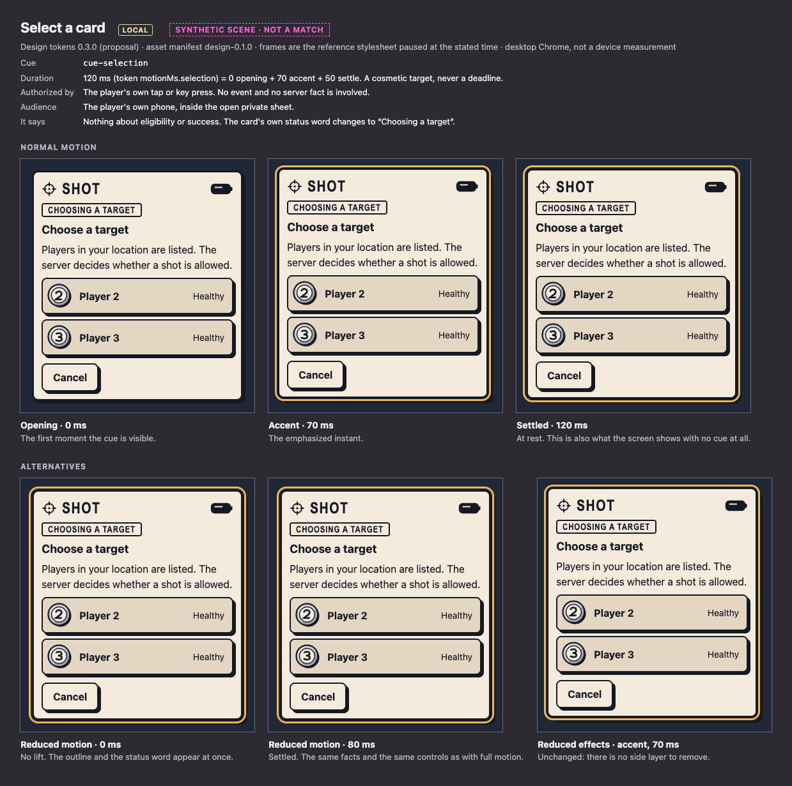
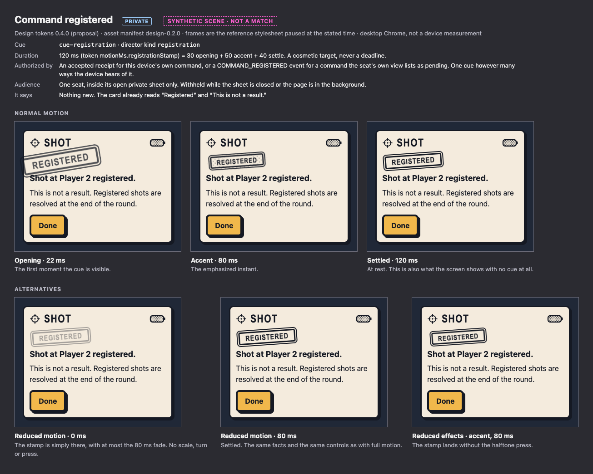
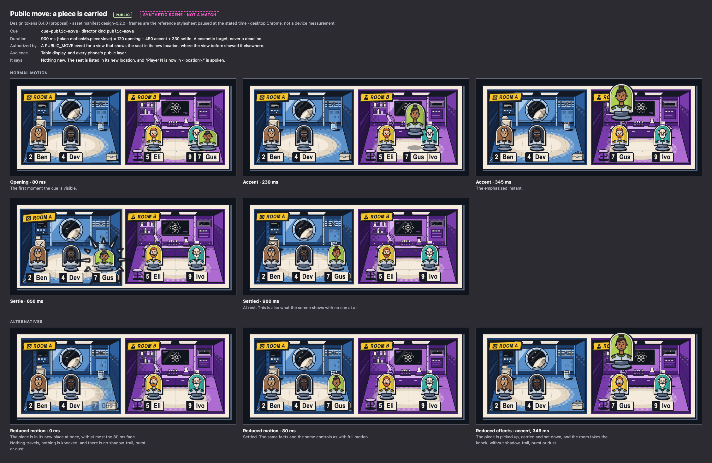
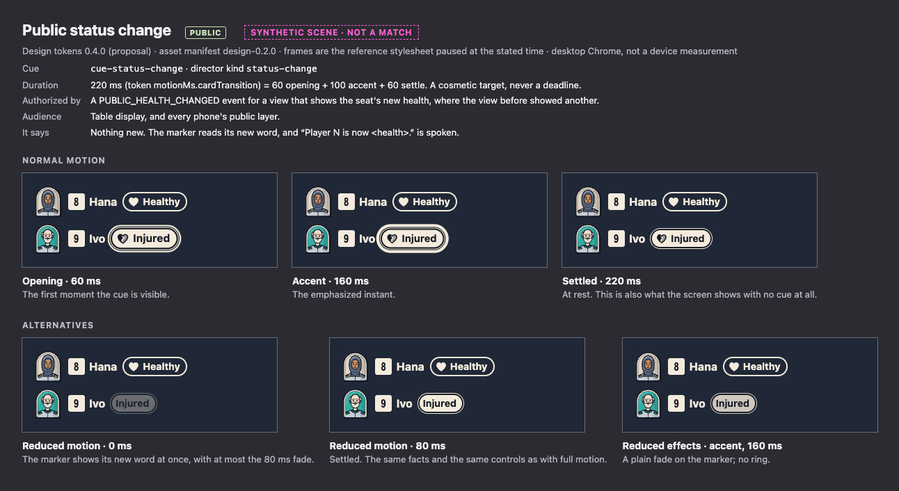
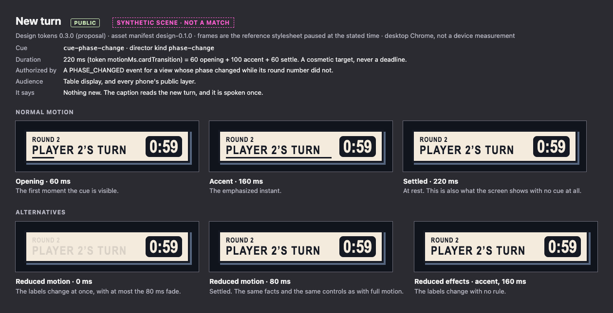
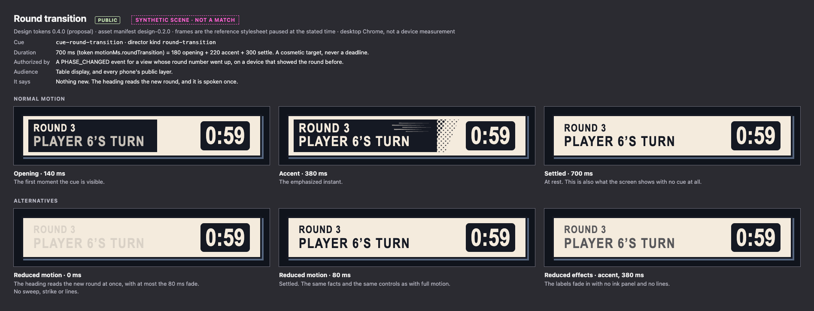
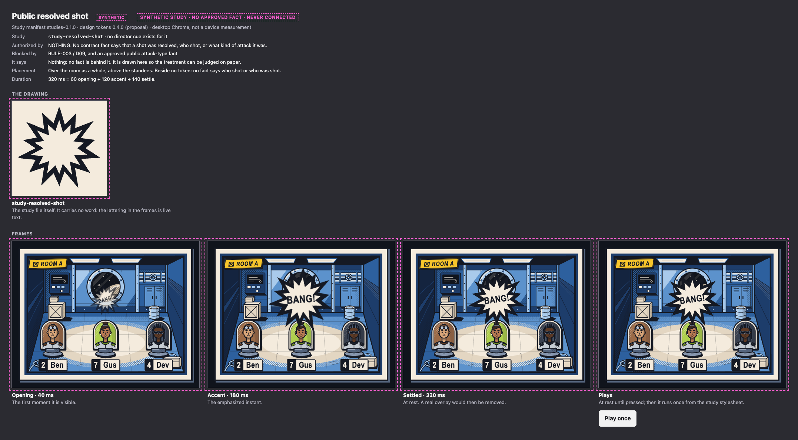
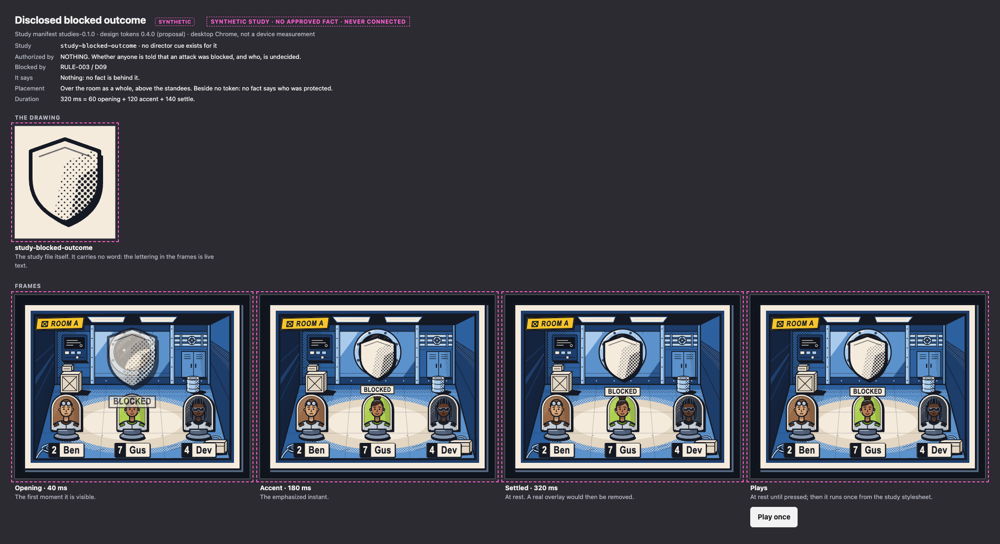

<!-- Generated by design/tools/write-docs.mjs from design/contract/motion-cues.json, design/contract/synthetic-studies.json. Do not edit by hand: change the source and run `npm run build:docs --workspace @mothership/design-tokens`. -->

# Motion storyboards

Design tokens `0.3.0` (proposal) · wire protocol 1. This page applies [motion-direction.md](motion-direction.md); it does not replace it.

A storyboard frame here is not a drawing. It is the reference stylesheet ([`design/prototypes/css/cues.css`](../../design/prototypes/css/cues.css)) started at a negative delay and paused, so each frame is exactly what a browser shows at that moment of the cue. The same stylesheet plays on the motion page (`design/prototypes/motion.html`).

Durations are the existing token values. They are cosmetic targets, never deadlines, and none is measured on a device. The split into opening, accent and settle is this design's proposal.

Every cue works without art. The layers that are pictures (the ink trail, the dust, the panel's halftone edge, the speed lines) exist only once the public bundle has loaded; `storyboards.html?art=none` shows each cue without them.

## What a cue is

- A cue is emphasis for a fact the audience's own view already states in words. It adds no fact.
- A cue changes nothing: not health, resources, turn ownership, a phase or a deadline. Nothing waits for it.
- A cue plays once, for exactly its duration, and is never queued. A newer view replaces it.
- Its layers take no pointer events, hold no content and cannot take focus.
- No cue is played for a registration on any public surface, on any other seat's phone, or outside the open private sheet.
- No cue exists for a shot, a shooter, an attack type, a block, Protection or a cause of any kind.

## Cues

| Cue | Director kind | Audience | Duration | Opening / accent / settle |
| --- | --- | --- | --- | --- |
| [Select a card](#cue-selection) | none: local input | local | 120 ms (`motionMs.selection`) | 0 / 70 / 50 ms |
| [Command registered](#cue-registration) | `registration` | private | 120 ms (`motionMs.registrationStamp`) | 30 / 50 / 40 ms |
| [Public token move](#cue-public-move) | `public-move` | public | 450 ms (`motionMs.publicMove`) | 110 / 220 / 120 ms |
| [Public status change](#cue-status-change) | `status-change` | public | 220 ms (`motionMs.cardTransition`) | 60 / 100 / 60 ms |
| [New turn](#cue-phase-change) | `phase-change` | public | 220 ms (`motionMs.cardTransition`) | 60 / 100 / 60 ms |
| [Round transition](#cue-round-transition) | `round-transition` | public | 700 ms (`motionMs.roundTransition`) | 180 / 220 / 300 ms |

## Select a card

|  |  |
| --- | --- |
| Cue | `cue-selection` · interaction |
| Authorized by | The player's own tap or key press. No event and no server fact is involved. |
| Audience | The player's own phone, inside the open private sheet. |
| Lands on | `.ms-card` |
| Duration | 120 ms: 0 opening, 70 accent, 50 settle |
| Easing | accent: `motionEasing.snap` · settle: `motionEasing.settle` |
| Frames shown | opening at 0 ms, accent at 70 ms, settled at 120 ms |
| Layers | The card lifts 3 px up and left, off its shadow. Its ink shadow grows from 4 px to 7 px. A focus-colored outline snaps on around it. |
| It says | Nothing about eligibility or success. The card's own status word changes to “Choosing a target”. |
| Reduced motion | No lift. The outline and the status word appear at once. |
| Reduced effects | Unchanged: there is no side layer to remove. |
| Sound | None. |
| Without the cue | The status word and the target list alone. |

## Command registered

|  |  |
| --- | --- |
| Cue | `cue-registration` · director kind `registration` · interaction |
| Authorized by | An accepted receipt for this device's own command, or a COMMAND_REGISTERED event for a command the seat's own view lists as pending. One cue however many ways the device hears of it. |
| Audience | One seat, inside its open private sheet only. Withheld while the sheet is closed or the page is in the background. |
| Lands on | `data-cue-at="registration"` |
| Duration | 120 ms: 30 opening, 50 accent, 40 settle |
| Easing | opening: `motionEasing.impact` · accent: `motionEasing.impact` · settle: `motionEasing.settle` |
| Frames shown | opening at 22 ms, accent at 80 ms, settled at 120 ms |
| Layers | The status word comes down as a stamp: larger and turned further, then compressed as it lands, then at rest turned 4 degrees. A ring of halftone presses out around it as it lands and is gone by the end (drawn from tokens; the pattern-halftone tile once the public bundle has loaded). |
| It says | Nothing new. The card already reads “Registered” and “This is not a result.” |
| Reduced motion | The stamp is simply there, with at most the 80 ms fade. No scale, turn or press. |
| Reduced effects | The stamp lands without the halftone press. |
| Sound | None, and no vibration. The same neutral treatment for every kind of registered command. |
| Without the cue | The status word changes to “Registered”. |

Must not show:

- Any public effect
- An impact, burst or damage mark
- A different look for a different command or role

## Public token move

|  |  |
| --- | --- |
| Cue | `cue-public-move` · director kind `public-move` · game event |
| Authorized by | A PUBLIC_MOVE event for a view that shows the seat in its new location, where the view before showed it elsewhere. |
| Audience | Table display, and every phone's public layer. |
| Lands on | `data-cue-at="seat-N/place"` |
| Duration | 450 ms: 110 opening, 220 accent, 120 settle |
| Easing | opening: `motionEasing.impact` · accent: `motionEasing.impact` · settle: `motionEasing.settle` |
| Frames shown | opening at 150 ms, accent at 330 ms, settled at 450 ms |
| Layers | The token drops into its new place from straight above, lands with a short squash and settles. An ink trail above it while it falls (fx-ink-trail). A picture: absent until the public bundle has loaded. A puff at the floor contact as it settles (fx-landing-puff). A picture: absent until the public bundle has loaded. In the table's roster, where a cell cannot travel, the location cell is underlined and the line clears. |
| It says | Nothing new. The seat is listed in its new location, and “Player N is now in <location>.” is spoken. |
| Reduced motion | The token is in its new place at once, with at most the 80 ms fade. No drop, trail or puff. |
| Reduced effects | The token drops and settles without trail or puff. |
| Sound | Proposed for the table display only, not produced: one soft paper tap as it lands. |
| Without the cue | The seat is listed in its new location. |

Must not show:

- A path, arrow or slide between two rooms: the picture never implies a route or which rooms connect
- A stop in between
- Anything at the place it left other than its absence

## Public status change

|  |  |
| --- | --- |
| Cue | `cue-status-change` · director kind `status-change` · game event |
| Authorized by | A PUBLIC_HEALTH_CHANGED event for a view that shows the seat's new health, where the view before showed another. |
| Audience | Table display, and every phone's public layer. |
| Lands on | `data-cue-at="seat-N/health"` |
| Duration | 220 ms: 60 opening, 100 accent, 60 settle |
| Easing | opening: `motionEasing.impact` · accent: `motionEasing.impact` · settle: `motionEasing.settle` |
| Frames shown | opening at 60 ms, accent at 160 ms, settled at 220 ms |
| Layers | The health marker itself is ringed in paper for a moment and the ring opens out and clears. The marker grows away from the name beside it and the ring stays inside the gap between them, so no word is covered. In the table's roster the health cell is underlined and the line clears. |
| It says | Nothing new. The marker reads its new word, and “Player N is now <health>.” is spoken. |
| Reduced motion | The marker shows its new word at once, with at most the 80 ms fade. |
| Reduced effects | A plain fade on the marker; no ring. |
| Sound | None proposed. A sound here would be heard as “something hit someone”. |
| Without the cue | The marker and the roster read the new word. |

Must not show:

- An impact, burst or lettering
- A line to or from any other seat
- Amber, or red
- A cause of any kind: the contract gives none

## New turn

|  |  |
| --- | --- |
| Cue | `cue-phase-change` · director kind `phase-change` · phase or finale |
| Authorized by | A PHASE_CHANGED event for a view whose phase changed while its round number did not. |
| Audience | Table display, and every phone's public layer. |
| Lands on | `data-cue-at="phase"` |
| Duration | 220 ms: 60 opening, 100 accent, 60 settle |
| Easing | all: `motionEasing.sweep` |
| Frames shown | opening at 60 ms, accent at 160 ms, settled at 220 ms |
| Layers | A rule is ruled under the round and phase labels from the left and clears. |
| It says | Nothing new. The caption reads the new turn, and it is spoken once. |
| Reduced motion | The labels change at once, with at most the 80 ms fade. |
| Reduced effects | The labels change with no rule. |
| Sound | None proposed. |
| Without the cue | The caption reads the new turn. |

Must not show:

- Anything on the countdown
- Covering or delaying a control

## Round transition

|  |  |
| --- | --- |
| Cue | `cue-round-transition` · director kind `round-transition` · phase or finale |
| Authorized by | A PHASE_CHANGED event for a view whose round number went up, on a device that showed the round before. |
| Audience | Table display, and every phone's public layer. |
| Lands on | `data-cue-at="phase"` |
| Duration | 700 ms: 180 opening, 220 accent, 300 settle |
| Easing | opening: `motionEasing.sweep` · accent: `motionEasing.impact` · settle: `motionEasing.sweep` |
| Frames shown | opening at 140 ms, accent at 380 ms, settled at 700 ms |
| Layers | An ink panel with a halftone edge sweeps across the labels from the left (fx-panel-cap) and leaves to the right. The round heading is struck in paper on the ink: larger, then down to size. Speed lines behind the heading as it is struck (fx-speed-lines). |
| It says | Nothing new. The heading reads the new round, and it is spoken once. |
| Reduced motion | The heading reads the new round at once, with at most the 80 ms fade. No sweep, strike or lines. |
| Reduced effects | The labels fade in with no ink panel and no lines. |
| Sound | Proposed for the table display only, not produced: one page-turn. |
| Without the cue | The heading reads the new round. |

Must not show:

- Covering the countdown or any control
- A full-screen takeover
- Delaying the next turn: the server's phase has already started

## Not storyboarded in this slice

| Cue | Why not yet |
| --- | --- |
| Open private card details (`cue-private-card-open`) | 220 ms layered reveal inside the private sheet. Specified in motion-direction.md; not storyboarded in this slice. No public companion effect or sound. |
| Final Zone entry (`cue-final-zone-entry`) | Up to 900 ms. Needs the showdown phase in the audience views, which protocol 1 does not carry. |
| Match result (`cue-match-result`) | Up to 900 ms entrance. Needs a terminal result in the public view, which protocol 1 does not carry. |

## Synthetic studies: not cues

> **No approved fact exists for what follows, and none of it is connected to anything.** The contracts carry no shot, shooter, attack type, block or Protection fact for any audience (RULE-003 / D09). The two treatments below are drawn so that they can be judged on paper while that decision is open.

What keeps them apart from the cues above:

- They are not in the cue list. [`design/contract/synthetic-studies.json`](../../design/contract/synthetic-studies.json) holds them; nothing that walks the cues can reach them.
- They are not assets. Their drawings are in `design/source/studies/`, are written to `design/studies/` with a manifest of their own (`studies-0.1.0`), and are in no bundle. The export build refuses a recipe that reads a study source.
- One review page shows them, `design/prototypes/studies.html`, with a stylesheet and a module that no other page may load. `check-assets.mjs` refuses any other file of the review kit that reaches them, and `check-shell.mjs` refuses a shell page that requests them.
- Every study file carries the mark `mothership:dev-only`, which Frontend's production-exclusion check looks for.
- No token exists for them. The duration is `motionMs.publicImpact` from the pinned 0.2.0 tokens, written as a number in their own stylesheet.

This is a fence against accident, checked by tools. It is not a technical impossibility: someone who sets out to copy a study into a shell can. The guard against that is review.

### Public resolved shot — SYNTHETIC STUDY

|  |  |
| --- | --- |
| Study | `study-resolved-shot` |
| Authorized by | NOTHING. No contract fact says that a shot was resolved, who shot, or what kind of attack it was. |
| Blocked by | RULE-003 / D09, and an approved public attack-type fact |
| Where it is drawn | Over the room as a whole, above the standees. Beside no token: no fact says who shot or who was shot. |
| Duration | 320 ms: 60 opening, 120 accent, 140 settle |
| Frames shown | opening at 40 ms, accent at 180 ms, settled at 320 ms |
| Layers | An ink burst over the room (the study file study-resolved-shot). Brief lettering as live text over the burst. |
| It says | Nothing: no fact is behind it. It is drawn here so the treatment can be judged on paper. |
| If it were ever approved | The lettering as a static label under reduced motion; no burst or mark under reduced effects. Not designed further while synthetic. |

Must not:

- Being connected to a match
- A trajectory
- A shooter
- A target reveal beyond a public health fact

### Disclosed blocked outcome — SYNTHETIC STUDY

|  |  |
| --- | --- |
| Study | `study-blocked-outcome` |
| Authorized by | NOTHING. Whether anyone is told that an attack was blocked, and who, is undecided. |
| Blocked by | RULE-003 / D09 |
| Where it is drawn | Over the room as a whole, above the standees. Beside no token: no fact says who was protected. |
| Duration | 320 ms: 60 opening, 120 accent, 140 settle |
| Frames shown | opening at 40 ms, accent at 180 ms, settled at 320 ms |
| Layers | A barrier mark over the room (the study file study-blocked-outcome). A label as live text. |
| It says | Nothing: no fact is behind it. |
| If it were ever approved | The lettering as a static label under reduced motion; no burst or mark under reduced effects. Not designed further while synthetic. |

Must not:

- Being connected to a match
- Naming who was protected, who protected them or who attacked
