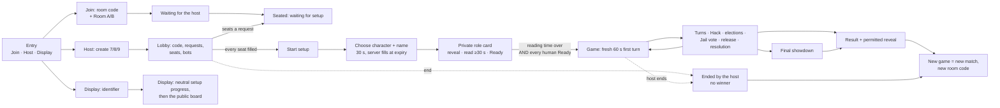
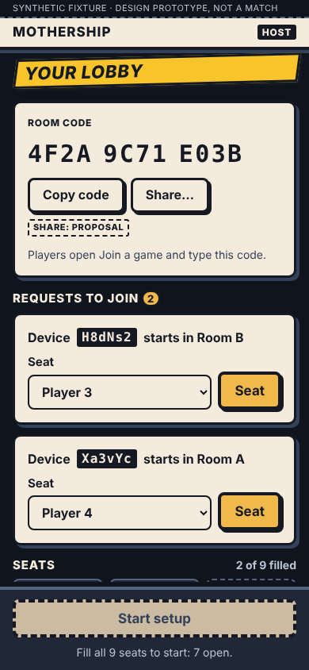
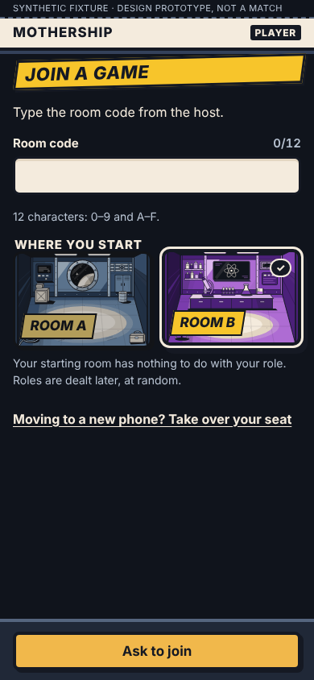
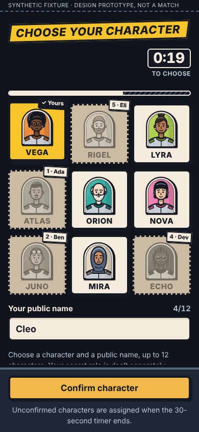
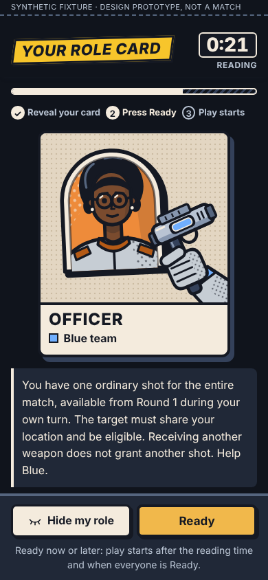
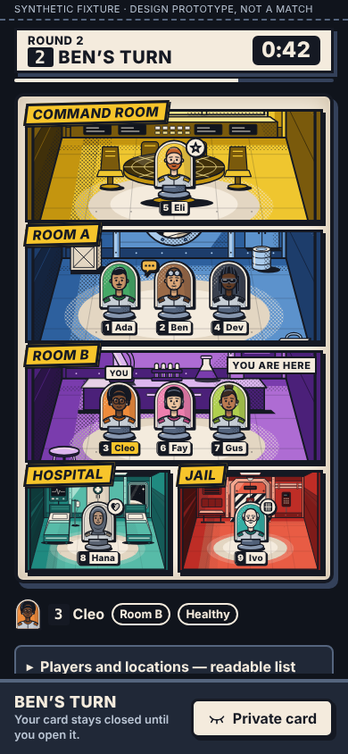

# The phone-first V1 journey

Issue [#76](https://github.com/Amirkianfar66/GameN/issues/76) · Visual and Motion Designer · **a design proposal, not owner-approved** · 8 October 2026

The owner asked for five screens, phones first: the host's screen, joining, choosing a character, the private role reveal, and the game itself; and for the missing screens to be found. This page is the journey those make together, drawn with the owner-approved comic artwork, characters and motion direction. Every state in it is a working page in the prototype ([design/v1-phone/](../../design/v1-phone/README.md)), drawn from a labeled synthetic fixture.

| Document | What it is |
| --- | --- |
| This page | The journey map, the five priority screens and the supporting states, and the reasoning |
| [v1-phone-inventory.md](v1-phone-inventory.md) | Every state, the authorized data it is drawn from, what the pinned release already does, and the gap. *Generated from the contract* |
| [v1-phone-handoff.md](v1-phone-handoff.md) | For Frontend: components (reused and new), assets, tokens, state mappings, layout rules, motion, copy, dependencies, and what goes to Integration |
| [v1-phone-verification.md](v1-phone-verification.md) | The checks actually run, their results, and what was not run |

## Provenance

| | |
| --- | --- |
| Design base | `87715a46dbd6a107e417bb6024d81c3fcb679049`, `codex/v1-start-sequence`, draft [PR #75](https://github.com/Amirkianfar66/GameN/pull/75). A staging candidate, **not merged**. This tree was read; nothing older was started from |
| Pins | Ruleset `in-person-v1-2026-10-06`, SHA-256 `6ca355ebf3553e24a16eae847f5b550b1d3da8bd0a2daf80f69ec94dd2809a90`; engine `full-game-1.0.1`; protocol 2; setup lifecycle `staged-start-1`; Original Powers off. Unchanged by this work |
| Design system | Tokens 0.4.0 (proposal), asset manifest `design-0.2.0`, crew catalog `crew-0.1.0`. No asset, token or contract file of the reviewed design system is changed: the prototype reads them |
| Runner | A Claude Code cloud session acting as Visual and Motion Designer, in its own checkout of the design base, on branch `claude/brave-cannon-lmhd0i`. The suggested `agent/designer-v1-phone` name was not used because this session is bound to its branch; the existing designer worktree (`agent/designer-comic-adoption`, `ecbc0d7`, already an ancestor of the design base) was not touched |
| Fixtures | Synthetic: made-up names (Ada … Ivo), device tags, codes and identifiers. No match, account, Firebase project or player secret is in any picture |

## Direction from the owner

Recorded in [owner-decisions.md](owner-decisions.md#8-october-2026-phones-first-for-v1): phones are the V1 priority, and desktop follows the same responsive design for now. The look is the comic board approved on 7 October 2026. The new layouts here are proposals until the owner looks at them.

## Principles the design keeps

1. **One comic page, from the first screen to the last.** Paper panels in ink, the slanted caption yellow, halftone, the approved rooms, the nine crew characters as pieces with their seat number and name, and role devices on the player's own character. Five unrelated mockups would have been easier; the brief asked for one journey.
2. **The primary action is in the thumb zone.** Each screen has one primary action, in a dock at the bottom (`action-dock`), at least 48 CSS px tall, padded for the home indicator. Less frequent tools fold away (`disclosure-row`).
3. **Public, then private, by a deliberate act.** Everything a neighbor may see is on the public layer. A role, what a seat knows, what it can do and its ballot exist only inside the private card, which opens on a press and closes when the page goes to the background. The closed card is identical on every phone.
4. **The server owns time and outcome.** A countdown is an estimate from server time; at zero it changes its words to “waiting for the server” and nothing else. A registration is never drawn as a result.
5. **Words and shapes, not color alone.** Every state reads in words and differs in shape (solid, dashed, double, lifted, stamped). Team colors appear only inside the private card and in the end reveal, where the rules make them public.

## Journey map



Three devices take three paths into one match. The host's phone creates and runs the lobby and never sees a role. A player's phone joins, waits, chooses, reads and plays. The shared display shows public facts only. A host who also plays uses a second Player tab or phone, as the release requires.

## 1. Host on a phone



Top to bottom: the room code, large and grouped for reading aloud (`room-code`); **requests to join first when there are any** (`admission-request`), each with the device tag the requester also sees, the room it starts in, the next free seat preselected and one Seat button; the seats (`seat-slots`), filled or open, bots labeled; then, folded, practice bots, the shared display and ending the lobby. The dock always holds **Start setup**, disabled with the reason (“Fill all 9 seats to start: 7 open”) until the roster is full, so the button never moves.

| State | Picture | Notes |
| --- | --- | --- |
| `host.create` | [png](../../design/v1-phone/review/states/host.create.png) | 7, 8 or 9 seats as three radio tiles |
| `host.lobby-empty` | [png](../../design/v1-phone/review/states/host.lobby-empty.png) | Copy code is Frontend-only; Share and a QR join link are labeled PROPOSAL |
| `host.share` | [png](../../design/v1-phone/review/states/host.share.png) | PROPOSAL: a join link puts a joining code in an address; Integration decides ([DSN-REQ-9](integration-requests.md#dsn-req-9)) |
| `host.requests` | [png](../../design/v1-phone/review/states/host.requests.png) | A new request drops in (`cue-request-arrives`); count badge on the heading |
| `host.request-unsettled` | [png](../../design/v1-phone/review/states/host.request-unsettled.png) | Lost answer: the same request again, or give it up; the seat cannot be changed meanwhile |
| `host.no-free-seat` | [png](../../design/v1-phone/review/states/host.no-free-seat.png) | The server accepts a request to a full lobby; only the host sees there is no seat |
| `host.bots` | [png](../../design/v1-phone/review/states/host.bots.png) | A stepper instead of a select; bots take free seats only |
| `host.full` | [png](../../design/v1-phone/review/states/host.full.png) | Start setup enabled, with what it does: locks the seats, 30 seconds to choose |
| `host.choosing` | [png](../../design/v1-phone/review/states/host.choosing.png) | Neutral progress: who has confirmed, their public character and name; no role |
| `host.reading` | [png](../../design/v1-phone/review/states/host.reading.png) | Who is Ready, who is reading; “Hosting gives no view of anyone’s role” |
| `host.running` | [png](../../design/v1-phone/review/states/host.running.png) | Round, phase, turn and timer from the public view (partial: Frontend subscribes; the host is already a display member) |
| `host.recovery` | [png](../../design/v1-phone/review/states/host.recovery.png) | Human seats only; the code grouped by four for reading aloud; still 43 characters ([DSN-REQ-10](integration-requests.md#dsn-req-10)) |
| `host.end-confirm` | [png](../../design/v1-phone/review/states/host.end-confirm.png) | Two presses; focus lands on “No, keep the match”; the destructive control is apart and hatched, never red |

Hierarchy is the point: the frequent tasks (share the code, seat people, start) are on the surface; recovery, the display and ending are one fold away and say their state in the fold (“Practice bots · 3 bots”).

## 2. Player joining and waiting



The room code field accepts the 12 characters as typed and groups them for the eye; **Room A or Room B** are two tiles with each room's approved art and caption, “Your starting room has nothing to do with your role” (V1-01). Go on the keyboard asks to join, so the button need not be in view while typing. Waiting shows the device tag the host sees, so the two can be matched by eye across the table.

| State | Picture | Notes |
| --- | --- | --- |
| `join.code` | [png](../../design/v1-phone/review/states/join.code.png) | Recovery entry under the form: “Moving to a new phone? Take over your seat” |
| `join.code-invalid` | [png](../../design/v1-phone/review/states/join.code-invalid.png) | The release's own format sentence |
| `join.refused` | [png](../../design/v1-phone/review/states/join.refused.png) | One sentence for the server's one answer (`FORBIDDEN`): no such room, a room that has started, or this device already in it. **The server does not tell these apart, and the phone does not pretend to** |
| `join.no-answer`, `join.busy` | [png](../../design/v1-phone/review/states/join.no-answer.png), [png](../../design/v1-phone/review/states/join.busy.png) | Send the same request again; wait the time the server names |
| `join.waiting-host` | [png](../../design/v1-phone/review/states/join.waiting-host.png) | A request left pending when the host starts without it is never closed today ([DSN-REQ-8](integration-requests.md#dsn-req-8)) |
| `join.seated` | [png](../../design/v1-phone/review/states/join.seated.png) | “You are seated · Player 3”, the seats filling, what comes next |
| `join.recover`, `join.recover-checking`, `join.recover-refused` | [png](../../design/v1-phone/review/states/join.recover.png) | The release's recovery flow, unchanged in behavior |

A full lobby is not a state: the server accepts the request and it waits; only the host sees that no seat is free.

## 3. Character selection



The nine approved characters in a 3 × 3 grid of cards, with the call signs; the countdown in the caption row (sticky while scrolling), a bar that empties under it; the public name with a counter that counts as the contract does (code points, 1 to 12); **Confirm character** in the dock with the release's line “Unconfirmed characters are assigned when the 30-second timer ends.” A character is public and says nothing about a role, and the screen says so.

| State | Picture | Notes |
| --- | --- | --- |
| `select.open` | [png](../../design/v1-phone/review/states/select.open.png) | Nothing selected; Confirm disabled |
| `select.picked` | [png](../../design/v1-phone/review/states/select.picked.png) | Selected: lifted, caption yellow, ink border, “✓ Yours” |
| `select.taken` | [png](../../design/v1-phone/review/states/select.taken.png) | Taken: still drawn and named, greyed, dashed, holder's number and name; not offered |
| `select.submitting` | [png](../../design/v1-phone/review/states/select.submitting.png) | Frozen while the request is out |
| `select.confirmed` | [png](../../design/v1-phone/review/states/select.confirmed.png) | The piece as everyone will see it, stamped Confirmed; the crew filling up. Confirming early shortens nothing |
| `select.conflict` | [png](../../design/v1-phone/review/states/select.conflict.png) | `CHARACTER_TAKEN`: the tile turns taken in place (`cue-choice-taken`), the name stays typed |
| `select.retry` | [png](../../design/v1-phone/review/states/select.retry.png) | Uncertain answer: the same choice again; the choice cannot be edited meanwhile |
| `select.expired` | [png](../../design/v1-phone/review/states/select.expired.png) | Local zero: the words change; only the server assigns |
| `select.assigned`, `select.name-taken`, `select.unsynced` | [png](../../design/v1-phone/review/states/select.assigned.png) | The server's own fallback name is `Player N`; bots are `Bot N` |

## 4. Private role reveal and Ready



Three steps are always in view (Reveal your card · Press Ready · Play starts). The card is dealt face down (`cue-role-deal`); its back is the same for every role, seat and state. **Reveal my role** turns it up (the approved 900 ms turn, the device added to the player's own character), with the role, the team word beside its swatch, and the release's reminder for that role. Ready unlocks once the card has been turned up for this deal, and may be pressed early; it never shortens the 30 seconds. After Ready the card goes face down with a READY stamp, and the screen shows who is still reading.

| State | Picture | Notes |
| --- | --- | --- |
| `reveal.dealing` | [png](../../design/v1-phone/review/states/reveal.dealing.png) | Delayed deal: face down, Reveal disabled, “Waiting for a fresh, authorized role.” |
| `reveal.concealed` | [png](../../design/v1-phone/review/states/reveal.concealed.png) | “Only reveal this where other players cannot see your screen.” |
| `reveal.revealed` | [png](../../design/v1-phone/review/states/reveal.revealed.png) | Large card in setup, where there are no actions to keep in reach (DSN-D19 is about the in-game sheet) |
| `reveal.ready-early` | [png](../../design/v1-phone/review/states/reveal.ready-early.png) | Ready before the minimum; the release's own sentence |
| `reveal.waiting-others` | [png](../../design/v1-phone/review/states/reveal.waiting-others.png) | Minimum over: “Waiting for: Player 6 · Fay, Player 8 · Hana.” |
| `reveal.everyone-ready` | [png](../../design/v1-phone/review/states/reveal.everyone-ready.png) | Everyone Ready, waiting for the minimum |
| `reveal.reconnecting` | [png](../../design/v1-phone/review/states/reveal.reconnecting.png) | Card forced face down; “The deal is unchanged and the server’s timer keeps running.” No pause, no redeal |
| `reveal.recovered` | [png](../../design/v1-phone/review/states/reveal.recovered.png) | A seat moved to this device: same role; Reveal and Ready again here |
| `reveal.backgrounded` | [png](../../design/v1-phone/review/states/reveal.backgrounded.png) | Hidden again on return from the background |
| `reveal.devices` | [png](../../design/v1-phone/review/states/reveal.devices.png) | Review sheet of all nine role cards and reminders; each is private to one seat |

**What the card does not carry:** no Code, no target, no teammate and no starting knowledge. The reminders for the Insider, the Hacker and the Alien say that knowledge arrives “when play starts”, in the release's own words.

## 5. The game on a phone



The **phase strip** is sticky at the top: round, phase, whose turn (number and name), the countdown and a thin bar. Under it, **the approved comic page fits the phone's width**: Command Room, Room A, Room B, then the Hospital and the Jail side by side; pieces in rows of at most five, each with its tag; the player's own piece flagged YOU, its tag in caption yellow, its room marked “You are here”; the active turn's marker on the piece. Then the player's own public status, and the **readable list**, which is complete at any text size. The dock says whose turn it is and holds **Private card**, the same neutral button on every phone.

| State | Picture | Notes |
| --- | --- | --- |
| `game.waiting` | [png](../../design/v1-phone/review/states/game.waiting.png) | “Your card stays closed until you open it.” |
| `game.own-turn` | [png](../../design/v1-phone/review/states/game.own-turn.png) | YOUR TURN in the dock; the Private card button stays neutral |
| `game.private-open` | [png](../../design/v1-phone/review/states/game.private-open.png) | Bottom sheet under the sticky strip: role thumbnail, About this role, what the seat knows, the one action card |
| `game.choose-room` | [png](../../design/v1-phone/review/states/game.choose-room.png) | The card sits low; the offered room is lifted on the board with **Move here**; the others step back. The list in the card stays complete (DSN-D18 → proposal) |
| `game.choose-target` | [png](../../design/v1-phone/review/states/game.choose-target.png) | Exactly the seats the server lists, 48 px rows with character, number, name and public status |
| `game.confirm` | [png](../../design/v1-phone/review/states/game.confirm.png) | “Not sent yet”; one primary control; the release's consequence sentence |
| `game.registered` | [png](../../design/v1-phone/review/states/game.registered.png) | REGISTERED stamp (120 ms); “This is not a result.” |
| `game.crowded` | [png](../../design/v1-phone/review/states/game.crowded.png) | Nine seats, seven in Room A: two rows, alternate tags dropped a line |

Also: `game.submitting`, `game.move-accepted` (the 900 ms carried move, played from the public fact), `game.rejected`, `game.not-available`, `game.checking`, `game.unknown` (cannot be put away), `game.withdrawn`, `game.knowledge`, `game.supply`, `game.supply-received`, `game.board-7`, `game.board-8`, `game.readable`, all in the [inventory](v1-phone-inventory.md#5-main-game-on-a-phone).

## Supporting states

| Group | States | What they establish |
| --- | --- | --- |
| Entry | `entry.choose`, `entry.signing-in`, `entry.signin-failed` | Three doors that map to `?as=player`, `?as=host`, `?as=display`; Join first, as the most common; the device identifier behind Details |
| Timed phases | `phase.election`, `phase.election-again`, `phase.jail-vote`, `phase.ballot-recorded`, `phase.tally`, `phase.release-choice`, `phase.release-vote`, `phase.hack`, `phase.resolution`, `phase.showdown` | One shell: the strip names the phase, a public vote panel says what is voted on and how many may vote, the ballot is cast in the private card, the count is published as numbers and bars. No “runoff” word: nothing in a view says it (G13). The Hack names no participants publicly. The round summary (partial) shows only public changes, in the sentences the release already speaks |
| Player status | `status.injured`, `status.hospital`, `status.jailed`, `status.captain`, `status.eliminated`, `status.watching` | Markers on the piece and words in the status line; Captain says nothing of immunity (DSN-D10); an eliminated player keeps watching and the Private card button goes |
| Recovery and system | `system.loading`, `system.reconnecting`, `system.clock`, `system.unresolved`, `system.access-unconfirmed`, `system.no-access`, `system.incompatible`, `system.seat-moved-in` | The release's own words in the comic frame. No offline play, automatic pause or redeal is promised |
| End | `end.winner`, `end.draw`, `end.aborted`, `end.next` | The result as a comic cover; the reveal table only when the finished view carries it; the host-ended match reveals nothing and names no winner; a new game is a new match |
| Public display | `display.admit`, `display.setup`, `display.board`, `display.result` | The same language, public facts only; the approved two-row page on a wide screen, the phone page on a narrow one |

## The fixed rules, and where the design keeps them

| Requirement | Where it is kept |
| --- | --- |
| Full 30 s selection; the server fills missing choices | `select.*` timer and dock line; `select.expired` only changes words; `select.assigned` shows the server's `Player N` |
| Role deal follows selection; one deal through refresh, disconnect, recovery | `reveal.dealing` waits for the own preview; `reveal.reconnecting`, `reveal.recovered`, `reveal.backgrounded` keep the same card |
| ≥ 30 s reading from the actual deal **and** every human Ready | The steps row, `reveal.ready-early` (“The match starts after the reading timer and everyone’s confirmation”), `reveal.waiting-others`, `reveal.everyone-ready` |
| Ready may be pressed early; bots cannot shorten either window | Ready is enabled from the first reveal; “Everyone gets the full 30 seconds, however quickly others confirm” |
| Fresh 60 s first turn; animation never blocks a deadline | No cue gates a control or a timer; reduced motion removes travel and keeps timing |
| Host and display never imply a role | Host and display load the public bundle only; no role word, device or team hook outside `.j-private` (measured on every capture) |
| Explicit Reveal/Hide; concealment on backgrounding | `reveal.*`, the private sheet's Hide, `reveal.backgrounded` |
| No private facts in hooks, URLs, screenshots, storage or global role effects | Role hooks only inside the opened private container; the prototype keeps nothing in storage; captures of private states are synthetic |
| Names, seat numbers and room names canonical | Every tag is number + name; Room A, Room B, Command Room, Hospital, Jail |

## Open it

```sh
npm run dev:review --workspace @mothership/design-tokens     # then open http://127.0.0.1:4320/v1-phone/
```

The index lists every state with its picture; open one, then walk the journey with ◀ ▶ and read **Notes** for its data source, what the release does, and the gap. Add `&motion=reduced` or `&names=long` to any state. Buttons follow the journey: pick a character, Confirm, Reveal, Ready, open the private card, choose a room on the board, confirm. A countdown runs locally and, at zero, only changes its words.
