# Board and card visual and interaction contract

**Version:** 0.4 · **Status:** proposal for review by Frontend, Codex Integration and the game owner. The look of the board, of the pieces and of the role card is the one the game owner approved on 7 October 2026 ([owner-decisions.md](owner-decisions.md)).
It applies [art-direction.md](art-direction.md) (0.2) and [motion-direction.md](motion-direction.md) (0.1), which stay as written, to the audience views of wire protocol 1 at the base commit. Where it refines the art direction, and where the owner's approval supersedes it, [section 9](#9-where-this-refines-the-art-direction) says so and why.

This is a milestone on the way to V1: the contract for an in-person game on private phones and a shared board, with its rooms, its pieces and its role cards drawn. It is not a complete V1.

Two public facts that the approved pieces need are in no contract yet: a seat's display name and the character its player chose ([integration-requests.md](integration-requests.md#dsn-req-6)). Wherever this document shows a character or a name, a seat without them is drawn as a numbered token and “Player N”, and [section 3.7](#37-before-a-seat-has-a-name-or-a-character) shows that.

No picture, layout or default in this document is a rule. A state is drawn only from a fact the audience's own view carries; where the views carry no such fact, the state is specified and waits.

## 1. The room this is designed for

Seven to nine people sit together and talk. That conversation is the game. Each holds a phone; one screen, or a printed board, is shared.

Four things follow, and every layout decision below comes from one of them.

1. **A phone is held where others can see it.** So a phone has two layers. The public layer is identical on every phone, whatever its role and whoever's turn it is. Everything private, including whether a seat has anything to do at all, is inside one sheet that is closed until the player opens it.
2. **The shared screen is read from across a table by everyone at once.** So the board is pictures and the roster beside it is words. Nothing on it is small text over art, and nothing on it moves unless a public fact changed.
3. **A turn is sixty seconds of talking and acting.** So the private sheet is one tap away from anywhere, hiding it is one tap away from anywhere inside it, and no animation is ever waited for.
4. **The table must stay calm during conversation.** So motion is a short accent and then stillness. Nothing loops, breathes or drifts.

## 2. What may be shown where

These hold on every surface. [verification.md](verification.md) says which of them a check holds and which rest on review.

- **The public layer never varies by role or by private state.** No count, badge, dot, highlight, sound or vibration tells an onlooker that a seat has an action, a resource or a decision. Nothing outside the private sheet is styled by what is inside it.
- **What a device asks the network for never varies either.** Art is loaded as whole bundles, before the first match view, the same on every phone. Nothing is fetched because of something a view says ([section 8](#8-assets-and-how-they-are-loaded)).
- **A public piece says whose it is and nothing else.** It is the character its player chose before roles were dealt, with the seat number and the player's name in its tag; or, for a seat without one, a numbered token. It never differs by role, faction, weapon, Code or Protection, and nothing private can choose or change it.
- **A role's device is private.** It is drawn only inside that seat's own private sheet, over that player's own character. No piece, cue, location or shared display shows one, and nobody sees another player's.
- **Faction color is private.** Blue, red and the Alien accent appear only inside a player's own private sheet, beside the word they stand for and on the role's device. No public asset contains one.
- **A room's color is the room's.** Each location is printed in its own color family. It goes with the room's name and never stands for a team, a role, a player or a state. Three of the approved families share a hue with the three team accents; that is the look the owner approved, it is measured in the tokens, and whether it misleads is open ([DSN-D13](README.md#open-decisions)).
- **Amber means two things and only two:** interaction focus, and the public active turn. Never danger, never an attack, never a result, never a faction. The caption yellow and the Command Room's gold are close to it and mean neither.
- **Public status is never red.** Injured and Eliminated are told apart by outline and by their word.
- **Health, Jail and Captain are three facts** with three markers. None implies another. The Captain marker is a rank star: it says nothing about immunity, and it is not a shield.
- **Registration is not an outcome.** A registered command gets a private stamp and the words “This is not a result.” Nothing public happens: no room lights, no token turns, no line is drawn, no sound plays.
- **A cue adds no fact.** It is emphasis for something the screen already says in words, on the audience that was already told.
- **No picture implies a route.** Every location is its own panel. No door, corridor, arrow or line is drawn, in a picture or in a cue. A piece that moves is lifted off the page, carried over it and set down, as a hand moves a piece on a board: it does not travel along the board. Destinations come from the authorized action view.
- **No slot is a capacity.** A floor has no marked places. Where pieces stand is a suggested reflow.
- **Words are never drawn.** Every word on screen is live English text, so wording changes repaint nothing.
- **Color is never the only difference.** Every state has words of its own, and most have an outline of their own as well.
- **Nothing waits for a picture.** The skin is complete without art; art is drawn over it once it has arrived.

## 3. Surfaces

Annotated boards, with every numbered part tied to its component and its source, are in [layouts.md](layouts.md).

### 3.1 Phone, public layer (320 to 599 CSS px)

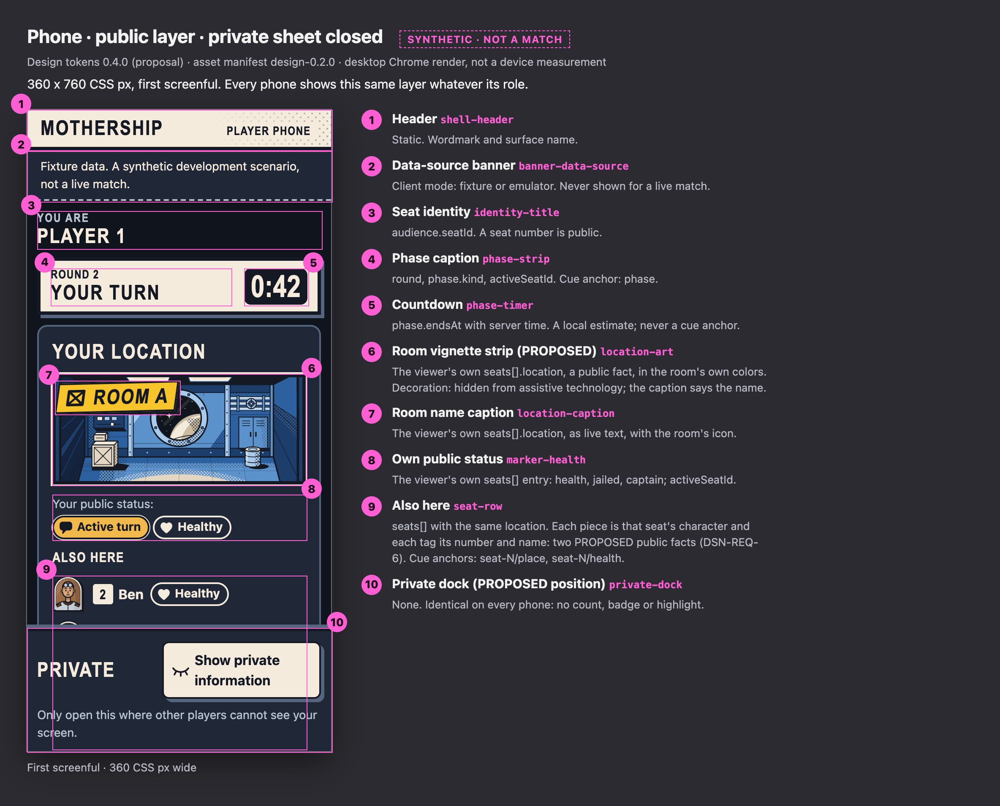

Top to bottom: header; data-source and connection banners; seat identity; the phase caption with its countdown; the player's location with the room's vignette strip, their own public status and who else is there; every location with its seats; display settings. The private dock rests at the bottom edge.

The list of all locations is the board on a phone. It is the complete read and tap path; nothing needs a drag, a pinch or the 3D scene.

### 3.2 Phone, private sheet

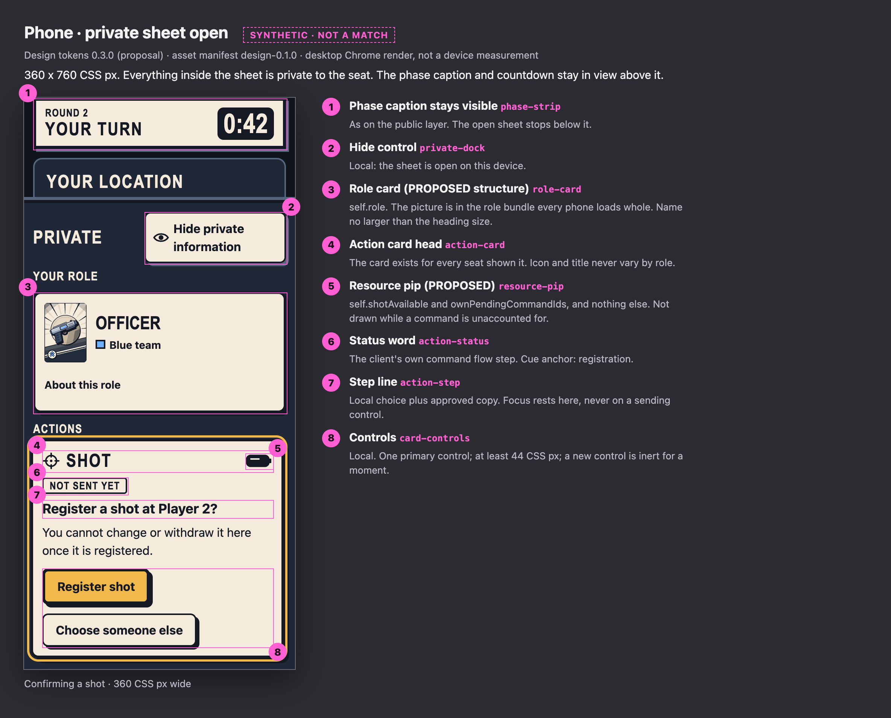

Opening the dock raises the sheet from the bottom edge. Where the screen is tall enough for the reader's text it stops below the phase caption, so the round, whose turn it is and the countdown stay in view while the player acts. The control that opened it stays where it was, now hides it, and stays pinned at the top of the sheet however far the cards are scrolled.

Inside, in this order: the role card, compact, with the role name no larger than a heading so it cannot be read across a table; then the action cards. The card's picture is the player's own character with the role's device added, held in the character's glove. It is a thumbnail by default: the role's summary and the picture at full size are behind “About this role”, so the actions are within reach without scrolling and a device in its team's color is not large on screen every time the sheet is opened. One card is expanded at a time.

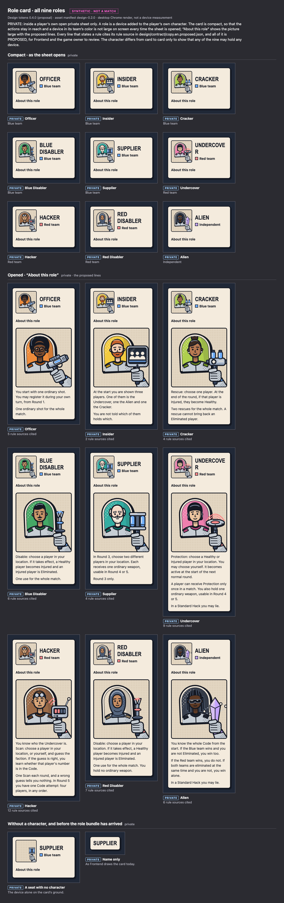

Closed, nothing private is in the document at all. The page going to the background closes it. That is best-effort privacy, not screenshot protection.

### 3.3 Narrow phones, short phones and large text

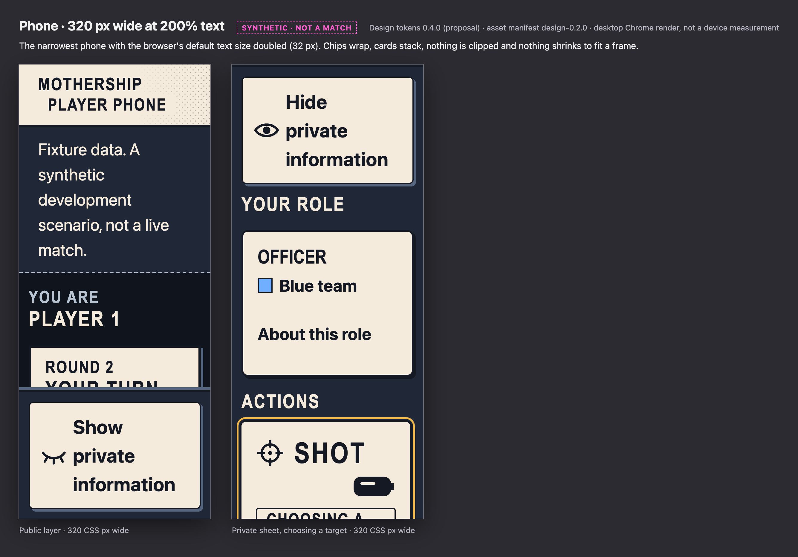

Breakpoints are written in em, so a layout answers to the reader's own text size as well as to the screen. At 320 CSS px with the browser's default text doubled: the header wraps, chips wrap, panels give their inner margins back to the words, and the dock is its control and nothing else. Body copy and instructions never shrink. Headings and the wordmark, which are labels, give way to the screen's width rather than run off it. Decorative pictures keep their size or step aside.

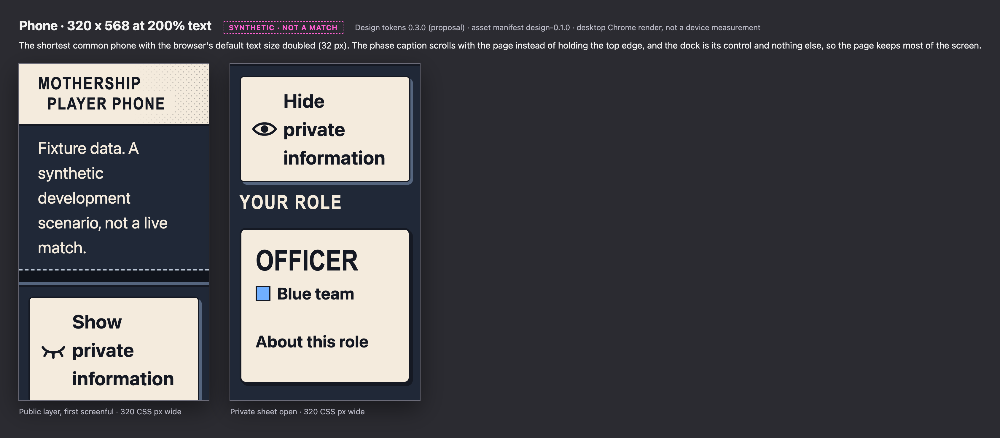

Where the screen is short for that text, under 30em tall, the phase caption scrolls with the page instead of holding the top edge: a caption that has wrapped to several lines would otherwise take the screen. An open sheet may then cover it. At 320 by 568 with doubled text the dock is 216 px tall in desktop Chrome, because the three words of its control wrap to three lines; the layout check holds that the page keeps at least half of the screen with the sheet closed, and measured 62% there. That is the tightest case in the matrix and it is tight.

### 3.4 Player on a wider screen (from 600 CSS px)

The same facts side by side: location and roster on the left, the private sheet as a column on the right, still closed by default. A wider screen grants no extra information.

### 3.5 Table display

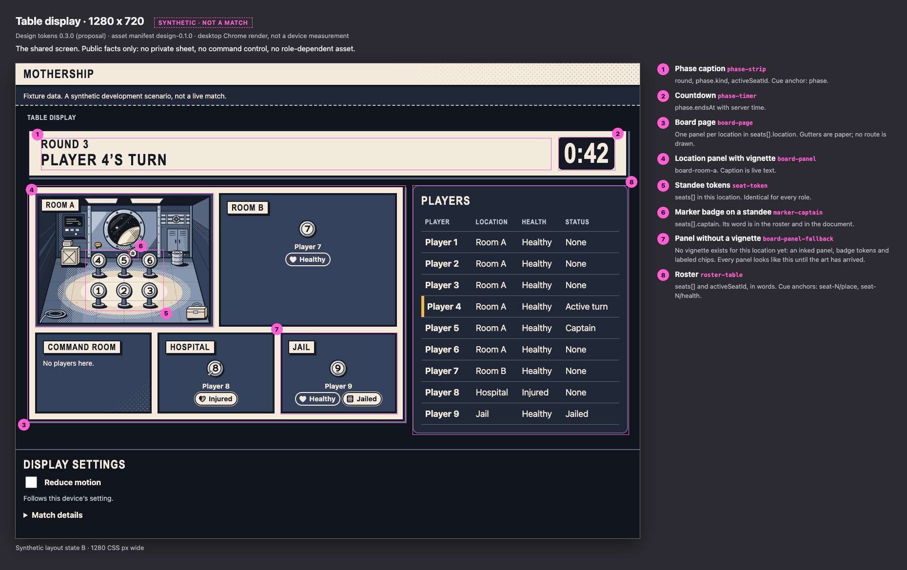

The phase caption and countdown across the top. Under it the board, drawn as a comic page: a sheet of paper with one inked panel per location and paper gutters between them. Room A and Room B share the top row; the Command Room, the Hospital and the Jail the bottom row. The roster beside it says in words everything the board draws.

Each room is its own drawing, with its own silhouette, printed in its own color family: a round viewport, a flask on a bench, one long window, a monitor and a bed, a striped door that is shut. Its caption is the page's yellow, cut on a slant, with the room's icon before its name.

Pieces stand in a room in one row along its lower edge, each with its tag under it: the seat number in a chip, then the player's name. A piece is as wide as the room allows for the number standing in it, so a room of nine holds nine small pieces side by side, and from four pieces every second tag hangs a line lower. Markers ride on a piece as badges: the turn above it, Captain top right, health lower right, Jail lower left. Status words are in the roster and, hidden from sight only, in the panel itself.

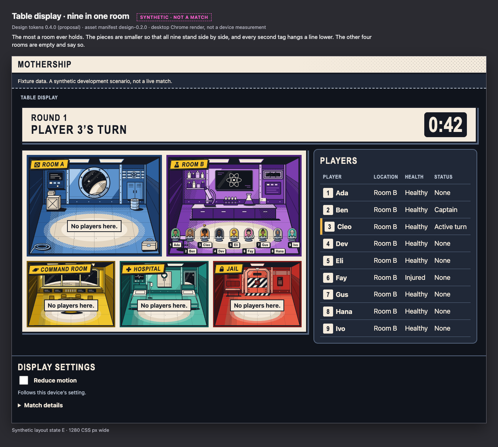

A tag may shorten a name that is wider than it, here and nowhere else, and never the seat number: the roster beside the board carries every name whole.

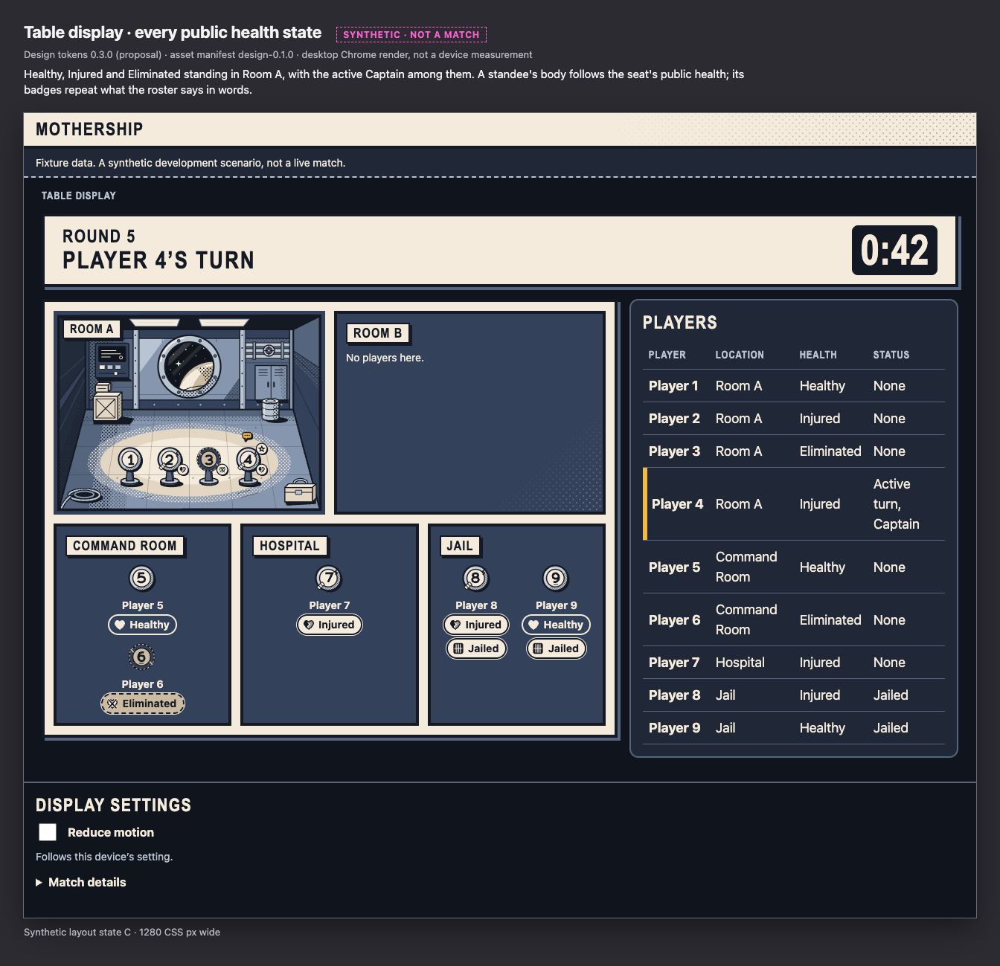

A character is not given a wound. An injured seat is told by its badge and its word; an eliminated seat's character also loses its color.

The roster goes beside the board only from 1280 CSS px. Below that its four columns do not fit beside a board still worth looking at, so it sits under the board. Its cells wrap; it never scrolls sideways.

The table display has no private sheet, no control that sends a command, and no role-dependent asset.

### 3.6 Connection lost, and no art

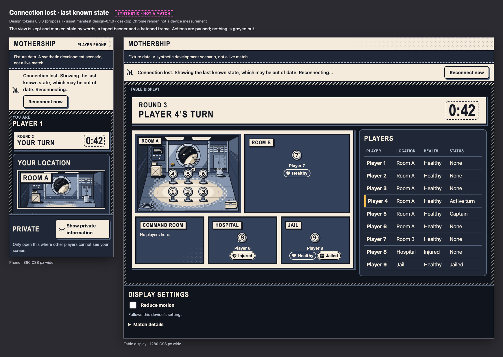

A stale view is kept, not hidden. A strip of paper tape says what happened and offers “Reconnect now”; a hatched frame runs inside the edge of the page; the countdown's last estimate sits in a dashed outline. Inside an open sheet a notice says actions are paused, and the Shot card shows its status with no control under it. Nothing is greyed below the contrast targets: the last known state stays as readable as a live one.

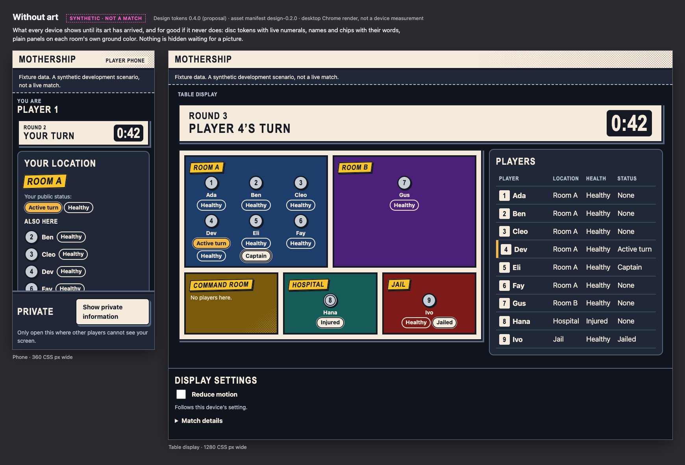

Without art, which is every device until its bundles have arrived and any device on which they never do, both shells are complete: disc tokens with live numerals, names, chips with their words, and plain panels on each room's own ground color. Forced colors keeps this skin on purpose.

### 3.7 Before a seat has a name or a character

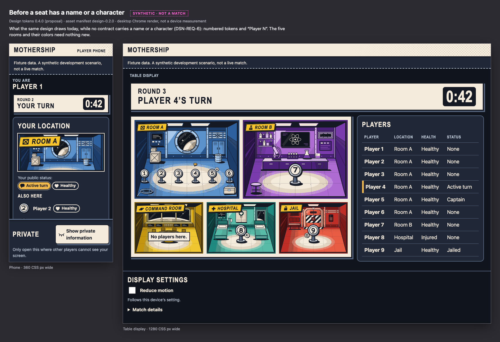

No contract carries a seat's name or character yet. Until one does, every seat is what it was in the first slice: a numbered token, and “Player N”. The five rooms, their colors, their captions and the role devices do not depend on either fact.

## 4. The comic language

Four devices carry the comic direction. Each has one job.

| Device | Where | What it says |
| --- | --- | --- |
| **Ink on paper** | Captions, cards, chips, controls | “This is something to read or to press.” Paper objects sit on an offset ink shadow; pressed, they go down onto it; lifted, they rise off it |
| **Caption boxes** | The phase caption, room names | Narration: where and when. Always live text. A room's caption is the page's yellow, cut on a slant, with the room's icon |
| **A color family for each room** | The five room panels and strips; a bar beside a room's name in a list | “This is that room.” Nothing else: not a team, a role, a player or a state |
| **Halftone** | Shading in illustrations; the far corner of a strip or of an empty panel | Depth and age. Never behind a name or a status word |
| **Hatch** | The pending band on a card; the frame of a stale view | “Waiting.” It does not move |

A status word is a small box whose outline changes with the status: solid ink, plain, double, dashed. Registered is the one that becomes a stamp, turned four degrees in a doubled outline. Two pairs of statuses share an outline, targeting with confirming and submitting with checking; their words and the card around them differ.

## 5. States

The brief asks for eight states. This is where each is drawn; every component and every state, with its source and its words, is in [component-states.md](component-states.md).

| State | Drawn as | From |
| --- | --- | --- |
| Idle | The card on its shadow, status in a solid ink box. With a control on the seat's own turn; with one line of reason and no control on another seat's | `self.shotAvailable`, a current view, `activeSeatId` |
| Selection | The card lifted, with the focus-colored outline | Local: the player picked it up |
| Targeting | Target rows: token, name, public status in words | Local, over the seats offered ([DSN-D03](README.md#open-decisions)) |
| Pending | A hatched band across the top of the lifted card | The command is on its way, or its receipt is being asked for |
| Registered | The status word as a stamp; the pip dotted; “This is not a result.” As a report with a Done control, and at rest without one | An accepted receipt, or the command in `ownPendingCommandIds` |
| Unavailable | Flat: duller paper, dashed edge, no shadow, and no reason | `self.shotAvailable` is false, or a rejection |
| Spent | **Not drawable from protocol 1.** The nearest authorized state is flat with a dashed stamp: “Was registered. It is no longer waiting to be resolved.” | This device saw its own registration leave the pending list; it lasts until Done ([DSN-D02](README.md#open-decisions)) |
| Reconnect | Tape banner, hatched frame, dashed countdown, paused notice, no control on the card | The client's own connection status |

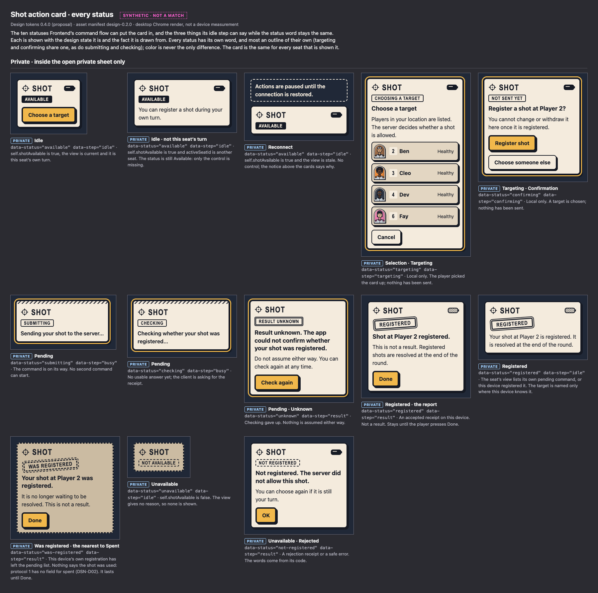

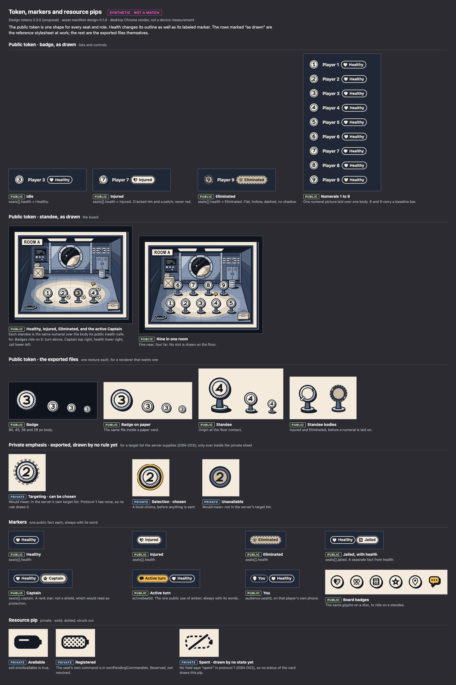

The ten statuses in the first sheet are the ones Frontend's command flow produces, and the three pictures of “Available” are the three things its idle step can say. The design gives each a look; it adds none and removes none.

Three finished pictures are drawn by no state: a ring for a seat that may be chosen, a ring for a chosen seat, and a struck-out pip. Each would claim a fact the views do not carry.

## 6. Motion

Seven cues: one for each of the five kinds the event director issues, and two that are a player's own input on their own device, picking a card up and turning the role card up. Each is a short accent and a clean settle, lasts exactly its token duration, has a reduced-motion and a reduced-effects alternative, and works without art. Storyboards and timings are in [motion-storyboards.md](motion-storyboards.md).

The one that most needed designing is the public move, and it is the one the owner approved. The piece crouches and leaves the page, is in the air for the 450 ms of a public move while its shadow crosses the page under it, and is set down in its new room, which takes the knock: 900 ms in all, the longest beat the tokens allow. It is carried over the page and not along it. No door, line or arrow is drawn, so the picture says nothing about which rooms connect; where the piece stood and where it stands are both public facts of the seat. It starts on that public fact, never on the mover's own tap, and it is the same on every screen.

The role-card turn is private and local: the card comes up face down, turns over, and the device is put into the hand of the player's own character. It is the same for all nine roles, to the millisecond, so that how a card turns says nothing about what is on it.

Nothing repeats. The approved page also has motion while nothing happens (stars, lamps, a blink); the pinned tokens say `loops: false`, the reference stylesheets hold none of it, and it is an open decision ([DSN-D16](README.md#open-decisions)).

The motion direction also names a “public resolved shot” and a “disclosed blocked outcome”. No approved fact exists for either. They are drawn as synthetic studies, kept apart from every cue and every asset, and described at the end of the storyboards.

## 7. Design tokens 0.4.0

`packages/design-tokens/src/tokens-0.4.0.json`, exported as `nextDesignTokens` beside the unchanged `proposedDesignTokens`.

**Over the pinned 0.2.0 it only adds.** Every 0.2.0 key keeps its name, shape and value, so the fields Frontend's shell reads are all still there and a consumer can switch exports without a change. A test and a check hold that. It is still a proposal for evaluation, and it does not replace the pinned 0.2.0 file: that needs a reviewed lock update ([integration-requests.md](integration-requests.md#dsn-req-2)).

**Over 0.3.0, the revision of PR #45, it changes one entry and lists it** in `revisedFrom030`: the sentence that said a location is never tinted to tell it apart. A test and a check refuse any other difference.

| Added in 0.3.0 | For |
| --- | --- |
| `color.paperShade`, `color.paperDeep` | Target rows; flat and not-active surfaces |
| `color.steel.*` (five steps) | What a room is drawn in before it is printed in its family; the crew suit; plain panels; offset shadows on dark ground |
| `type.lettering*`, `type.privateRoleNameMaxPx`, `type.tableTimerPx`, `type.tableHeadingPx` | Comic lettering from the system stack; the cap on a role name; the table display's sizes |
| `radiusPx.card`, `strokePx.inkFine`, `inkBold`, `panelBorder`, `selection` | Card, panel and selection outlines; the heavier edge of a primary control |
| `motionEasing.*` | Named curves: `impact`, `settle`, `snap`, `sweep`, `standard`, `linear` |
| `motionBeatsMs.*` | Each duration a cue uses, split into opening, accent and settle. `publicImpact` is deliberately not split: only the studies use it |
| `comic.*` | Shadow offsets, selection lift, gutter, stamp turn, halftone and hatch geometry |
| `component.*`, `layer.*` | Token, marker, dock, roster and pip sizes; stacking order |
| `interaction.breakpointsCssPx.tableRosterBesideBoard` | 1280: where the roster fits beside the board. `wideTableLayout` stays 960 |
| `privacyPolicy`, `audioPolicy`, more `motionPolicy` flags and `usageConstraints` | The rules of [section 2](#2-what-may-be-shown-where) as values a test can read |

| Added in 0.4.0 | For |
| --- | --- |
| `color.room.*` (five rooms, five tones each, named as `color.steel` is) | The color family a room is printed in. A recipe swaps steel for it tone for tone, and a check holds that swap to these values |
| `color.crew.c1` to `c9` (`field`, `accent`, `skin`), `color.crewHair.*` | The nine characters. A check refuses a character drawn in another's color |
| `color.caption` | Room captions |
| `motionMs.pieceMove` and `roleCardTurn` (900 each), `roleDeal`, `roomPick`, with their beats | The approved move and role-card turn. No 0.2.0 total changed: the 450 ms of `publicMove` is the piece's time in the air |
| `comic.captionSkewDeg`, `captionTiltDeg` | The slant of a caption |
| `component.piece`, `component.seatTag`, `component.roleCardBackPx` | The smallest and largest a piece is drawn; the size of a tag's text; the longest name |
| Four more `privacyPolicy` values and three more `usageConstraints` | A character is independent of a role; a device is drawn only inside the private sheet; a room's color is not a team's; a name is untrusted text |
| `measuredColorDistances` | How near the new public colors come to a team accent and to amber, as numbers a test recomputes |

Contrast is computed from these values for the pairs the design uses: every text pair reaches 4.5:1 and every essential mark 3:1, including ink on the caption yellow and paper on each room's ground. Amber and the focus ring do not reach 3:1 on paper, which is why a focused control on paper gets an ink ring with the focus color around it, and why a primary control has a heavier ink edge as well as amber. Those are computed numbers, not measurements of the final compositing.

**How near the new colors come to the ones that mean something.** In CIE76, from each family's nearest tone: Room A is 16 from the Blue accent, Room B 20 from the Alien accent and the Jail 18 from the Red accent; the Command Room and the Hospital are 54 and 55 from any of them. The nearest character field to a team accent is the pink of `c6`, 26 from the Red accent. The caption yellow is 16 from the amber of interaction, the Command Room's gold 15, and the yellow character `c2` 14. These are distances between numbers. Nobody has been asked what they confuse.

## 8. Assets and how they are loaded

What exists, with sizes, anchors, hashes, surfaces and rights, is in [asset-inventory.md](asset-inventory.md) and `design/exports/asset-manifest.json`.

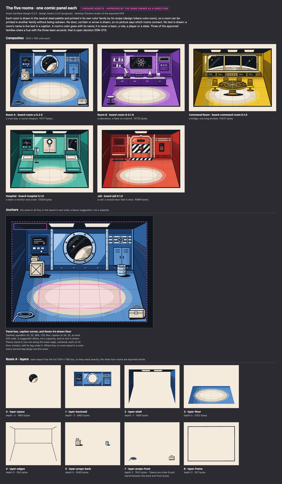

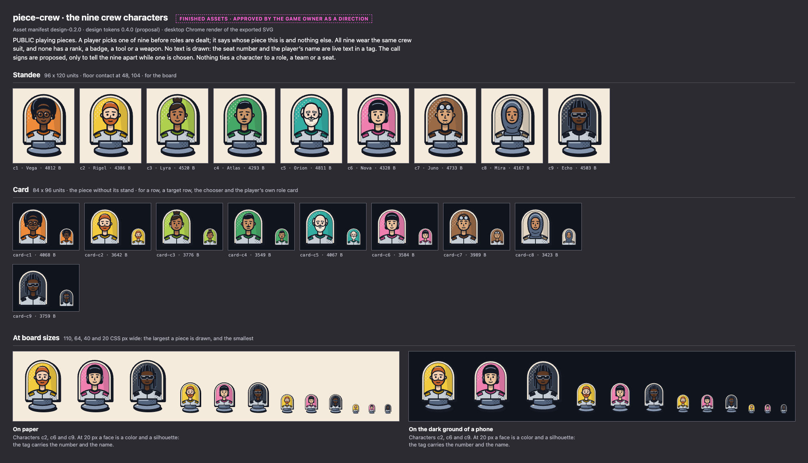

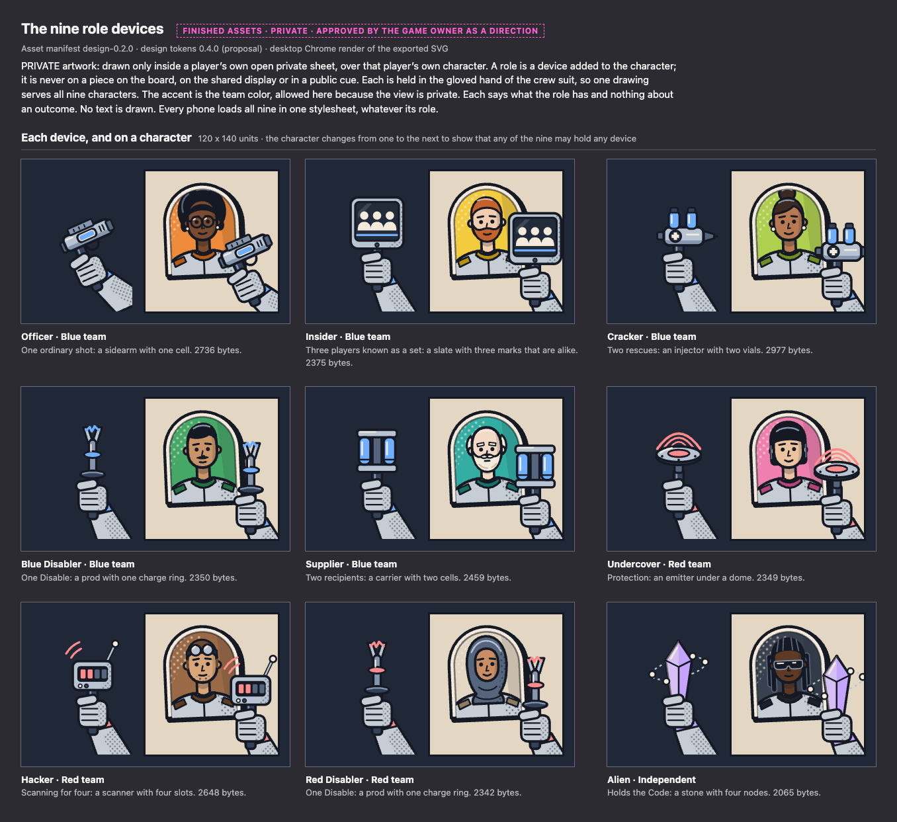

- Editable sources are layered SVG, drawn by hand, under `design/source/`. The build accepts ten kinds of element and a short list of attributes and refuses everything else, so no text, title, raster image, filter, style, link or outside reference can be in one.
- Exports are lifted out by `design/tools/build-exports.mjs` and named `<id>.<variant>.<hash>.svg`. A changed file is a new name.
- Each variant lists the surfaces it may be drawn on: the table, a phone's public layer, the inside of an open private sheet.
- A room is drawn once, in steel, and printed in its family by its recipe. The tokens are the one place a room's colors are decided.
- A character is exported twice: as a standee for the board, and as the same card without its stand for a row and for the player's own role card. A role's device is one picture, held in the crew suit's own glove, so one drawing serves all nine characters.
- Proposed scene convention for the Three.js evaluation, unmeasured: +Y up, floor on X/Z, a piece's origin at its floor contact. The Room A layers carry a stack order and a starting depth each; the other four rooms are exported whole.

**A bundle is one stylesheet.** `public-board`, `player-ui` and `roles` each export one stylesheet in which every picture of the bundle is a custom property holding the picture itself. A phone loads all three before its first match view; the table loads the first. After that nothing is fetched, whatever is drawn. This matters because the alternative leaks: a stylesheet that names a picture by address makes the browser fetch it the first time a rule needs it, so a phone would ask for the “shot available” pip only if that seat had a shot, and for the Hacker's device only if that player were the Hacker. Anyone who can see requests could read both. All nine devices travel to every phone, and all nine characters to every device, whatever is dealt and whatever is chosen.

**Art is drawn only once it has arrived.** Every rule that draws a picture is behind `[data-art~="<bundle>"]`, which the client sets on an ancestor of the shell after that bundle's stylesheet has loaded. Until then, and for good if it fails, the shell is the complete skin of [section 3.6](#36-connection-lost-and-no-art).

**Private pictures are addressed only inside the private sheet.** The role's device, the player's own character and the team swatch are three custom properties the client sets on the role card. No selector names a role, and nothing outside the sheet carries any of them.

The two synthetic studies are not assets. They have their own drawings, their own output directory and manifest, and one review page. [motion-storyboards.md](motion-storyboards.md#synthetic-studies) says what fences them and what the fence is worth.

## 9. Where this refines the art direction

The art direction is a proposal at 0.2 and is left as written: the file is pinned and Designer cannot edit it ([DSN-REQ-3](integration-requests.md#dsn-req-3)).

**Where the owner's approval of 7 October 2026 supersedes it.** For the look of the board, the pieces and the role card only. No rule and no contract is touched.

| Art direction 0.2 | Approved by the owner | What stands |
| --- | --- | --- |
| “The public palette is charcoal, paper and muted steel.” | Each room is printed in its own color family, over the ink and paper every room shares | Amber is still interaction focus. Blue, Red and Alien accents still appear only in an authorized private view or a permitted reveal |
| “No faction-coded silhouettes, uniforms, trails or location lighting on the live public board.” | Nothing here is coded by faction. But three rooms share a hue with the three team accents, which a reader may take for exactly that: open decision [DSN-D13](README.md#open-decisions) | No silhouette, uniform or trail differs by faction: all nine characters wear one suit, and a move looks the same for every seat |
| “all nine neutral tokens” | The pieces are characters, nine to choose from, with the seat number and the player's name | A piece is neutral in the sense the art direction meant: it says nothing of a role, a faction or a private choice. A seat without a character is still the numbered token |
| “Use a proposed 5:7 illustration/card frame” for a role | A role is a device added to the player's own character, on a picture of 50 : 53 | Role identity stays in a closed private place with a deliberate reveal and hide |
| “450 ms public move” | The move is 900 ms, the longest beat the direction allows, of which the piece is in the air for 450 | Durations are cosmetic. Nothing waits for one; reduced motion removes the travel |

**Where this contract refines it, as before.**

| Art direction 0.2 | This contract | Why |
| --- | --- | --- |
| “Scrollable actions; bottom action dock; separate private role drawer” | One private sheet holds the role and the actions; the bottom dock is its handle | Frontend found that in early rounds merely having an available action identifies a role to anyone who glimpses the screen. An always-visible action dock would do exactly that |
| Wide table layout from 960 CSS px | Roster beside the board from 1280; under it below | Below 1280 the roster's four columns do not fit beside the board without breaking words or shrinking the board |
| Breakpoints in CSS px | The same numbers, written in em | So a layout answers to the reader's text size |
| Token “origin at its floor contact” on a 3D board | The same, drawn as a standee: a card on a stand that faces the viewer | A piece that faces the viewer keeps its face and its numeral undistorted, in the DOM board and in a scene |
| Card hierarchy with a resource count | A pip that is solid or dotted, and no number | Protocol 1 says whether a shot is available, not how many, and not whether one is spent |
| “Blue, Red and Alien accents appear only in an authorized private view” | A role's device carries its team's accent, inside the private sheet, beside the team's word | A private card is still seen over a shoulder. The picture is a thumbnail unless the player opens it |
| Assets named by file | Assets held in one stylesheet per bundle | A file asked for by name is a fact an observer can read |

## 10. Not in this contract

The lobby and seating, with the step in which a player chooses a character and types a name; the starting-room choice; moving by pressing a room, and the comic page on a phone; host controls; voting and release; Standard Hack; the Code; role actions other than the shot; the final showdown; elimination and its faction reveal; the match result. Protocol 1 carries none of them. They are listed, with what each would be drawn from, in [asset-inventory.md](asset-inventory.md#not-produced), and each needs its own issue.

Also not here: any device measurement, any sound, any font file, and any decision that belongs to the game owner ([README.md](README.md#open-decisions)).
