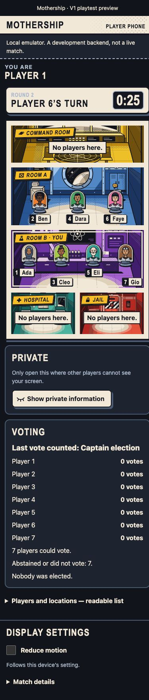

# First V1 comic test candidate

Issue [#60](https://github.com/Amirkianfar66/GameN/issues/60). This is an isolated Integration candidate on `codex/v1-comic-test`, not a main-branch merge or a claim that the updated game is deployed. The owner requested the approved comic design in the first in-person V1 test. Original Powers remain off; online V2 is outside this deliverable.

## Four-workstream review

| Role | Reviewed committed source | Integration result and limit |
| --- | --- | --- |
| Backend | [#64](https://github.com/Amirkianfar66/GameN/pull/64), `d9f49d9693f871ed3db26082be80e1d1879bf78e`; [#65](https://github.com/Amirkianfar66/GameN/pull/65), runtime `36525afeb39adb154f11d72731126bdca82f99d7` | Public lobby identities and private Supplier acknowledgments integrated. The additional metadata stream binds private results to the current seat session. Hosted rollout requires no active old-engine matches. |
| Frontend | [#58](https://github.com/Amirkianfar66/GameN/pull/58), `b31e9575dbb0ff1184465133c6fea38cf89d0bb4`; corrected [#56](https://github.com/Amirkianfar66/GameN/pull/56), `d2bf54afe8338330ed733c006d54bf535e3c83fa` | Authentication retry budget and current full-match client carried forward. Integration corrected an uncertain authorization response being treated as proof that an aborted match never started, and restored pre-start identity selection after a successful recovery whose reply was lost before reload. Claude's active worktree is untouched. |
| Visual and Motion Designer | [#59](https://github.com/Amirkianfar66/GameN/pull/59), `ecbc0d703fa5e8b6b576e0b9eff6dc972761d3ea` | Approved room/crew/device drawings, three complete hashed bundles, tokens 0.4.0 and catalog crew-0.1.0. Integration adapts the reference CSS to the actual protocol-2 phone/table markup. Designer's prototype JavaScript is excluded. |
| Game Design and Balance | Committed `7d63089497ec4b7cb84881ea3a8cd58febdb2fdf`, with the real projector adoption in [#67](https://github.com/Amirkianfar66/GameN/pull/67), `f28d3e4ed5e9a582f70f52391b5449d2f89bb02e` | Current catalogue has 522 cases. Required gate must run the actual engine, including all 17 Supplier result cases. The 33 blocked and six manual cases remain explicit; synthetic playouts establish no human social balance. Active uncommitted Balance research is excluded. |

Frontend also committed its expanded action-outcome evidence at `11c21557693895a9473558b187b35f3e67f7ac53`; it is a follow-up review input, not this candidate's browser run. Balance's later committed `32d6dbb1e68a5009632097a73543e4286030b22d` strengthens multi-phase/receipt privacy coverage; its active adapter follow-up is still uncommitted and excluded here. The #67 gate intentionally identifies the earlier immutable catalogue it verified. These newer reports must not be presented as acceptance of the comic candidate.

All implementation PRs remain independently reviewable and unmerged. The candidate records their ancestry; it does not rewrite another agent's branch. Shared contract review by the affected Claude roles remains a merge gate. The initial repository instructions/roster describe historical bootstrap status and should not be read as today's completion report.

## Actual comic consumer

- Admitted players choose a public name and one of nine unique crew characters before the host deals. The authenticated operation derives the seat. Names are escaped text and never determine roles, file paths or CSS classes. Retry sends the immutable earlier request; an unknown result is not fabricated as failure or success.
- Both the phone and public display show the same authoritative locations with the approved room illustrations and numbered name tags. A complete native readable-list disclosure remains available. Room panels do not invent movement targets; movement still uses the server's legal choices.
- The phone shows the approved large illustrated role card only inside its open private panel. Concealment removes role/device/team hooks. All phones request the same complete role bundle before sign-in, regardless of their role; the public display requests only public art.
- Supplier results appear only in the own private area, after independently fresh game view, seat-session metadata and matching-binding acknowledgment reads. Successful empty sets have explicit wording. Missing/legacy history is never inferred from ammunition. Uncertain authorization, stale data, UID change, malformed payloads and binding mismatches clear the held display data.
- Public location changes can have a 900 ms carried-piece cue. Initial/reconnected snapshots, background pages, reduced motion and more than four simultaneous moves skip it. This is an adaptation of protocol-2 public snapshot changes, not adoption or acceptance of the older protocol-1 motion director. A busy main-thread delay over one second suppresses a queued cue. The private turn cue is identical across roles. Idle motion and audio remain off.
- `design/prototypes/css/comic.css` and the generated token stylesheet were copied as documented reference styles, with additive player-board scoping. Exported source art and historical pinned files remain unchanged.

## Executed local acceptance

Pinned Node 22.21.1 / npm 10.9.4. Complete verification at clean `743fb21b1944f4e2dcbb14a911622f22556f03b9` passed 888 workspace tests with no failures/skips/todos, 70 Balance static checks, 483 ready catalogue scenarios, 4,388 negative controls and 30 synthetic playouts. The catalogue separately retains 33 reviewed-blocked and six manual cases. Both typechecks, build, production exclusion, browser dependency compatibility and standalone backend packaging passed. Designer's separate 66 tests and 15 asset checks passed.

Backend's review of that commit found one P2 in the hosted consumer: a successful lobby recovery followed by a lost reply and reload left no identity picker. The regression failed on the unchanged entry, then passed with the correction. Five focused recovery cases exercise the actual hosted recovery branch: fresh own metadata, malformed/stale/wrong-match rejection, legacy fallback, Auth identity change, transition to running, and authorization uncertainty/retry. Final follow-up commit results and CI are recorded in the PR; earlier runs are not represented as later runs.

The isolated local Auth/Firestore identity suite passed 11/11, and the combined persisted full-service/own-acknowledgment suite passed 25/25 against this combined runtime and Rules. Backend separately reports 26/26 including its additional Rules case; do not sum overlapping independent tests as distinct acceptance cases.

Browser acceptance used the actual hosted entry with only its transport provider replaced by a development-only loopback provider. The HTTP test server calls the actual service and HTTP handler with emulator Auth, and reads use the actual Firestore Rules. It does not simulate the production Functions initializer, App Check, Cloud Tasks or network conditions.

Observed in a seven-seat local match (two browser players, five service-created synthetic players, host and admitted table display):

1. Real creation/admission/start; character availability updates; successful name/character write; same selection restored after reload.
2. Started views use the real dealt role. Phone has the comic board and large private card; the public display has no role/device/team DOM hooks.
3. A legal move is confirmed by the service and changes the same player's room on phone and shared display. Reload does not re-deal.
4. Host-issued recovery preserves seat, public identity and location; the displaced browser loses access and removes its match content.
5. Private close removes all role/device/team artwork hooks. The recovered phone has no horizontal overflow at 320 × 740 or 390 × 844; the private card was inspected at 390 pixels. Desktop browser checks are not physical-phone measurements.
6. Real timer-driven progression was observed through Round 1, Jail vote and the next election/round, using the existing client deadline-repair path. Local scheduled cloud task dispatch was not tested by this harness.



The screenshot is a disposable **local emulator** match with synthetic names. It contains no role, Code, credential, recovery code or production match payload.

## Reproduce the local UI test

At this candidate's repository root, use Node 22.21.1/npm 10.9.4 and Java 21 on PATH:

```sh
npm ci
npm run build
npx --no-install firebase emulators:start --config firebase.comic-emulators.json --project demo-mothership --only auth,firestore
```

In a second terminal at the same root:

```sh
FIRESTORE_EMULATOR_HOST=127.0.0.1:8380 FIREBASE_AUTH_EMULATOR_HOST=127.0.0.1:9399 GCLOUD_PROJECT=demo-mothership node apps/game/dev/comic/server.mjs
```

In a third terminal:

```sh
npx --no-install vite --config apps/game/dev/comic/vite.config.mjs
```

Use `http://127.0.0.1:5174/?as=host`, `?as=player` and `?as=display` in separate tabs. Auth uses session persistence per tab. Create a 7/8/9-player lobby, join each player with the room code, seat them on the host, choose public identities, admit the display by its shown identifier and start. Local services bind loopback only; phones on another machine cannot reach this harness. No cloud credential is needed. The cloud bundle's source boundary rejects the local provider and every development entry.

## First in-person test and remaining gates

For a hosted test, use seven players first, each with their own phone; host from a separate tab and put the public display on a shared screen. Have every player choose a name/character and verify their starting room before Start. Privately verify the role card, movement, elections/votes, a reconnect and one host-approved seat recovery. Complete the match and record unclear rules and interface problems. Repeat separately for eight and nine players; do not assume the seven-player observations transfer.

Still unverified in this integration pass: physical iOS/Android devices, 200% text and screen-reader navigation on the adopted runtime, measured frame rate, the full hosted match/deadline/recovery flow of this new candidate, Supplier results through a live browser Round 3, and human playtests. Existing backend/presentation tests cover the result DTO/rendering, but are not those browser tests. Role-card explanatory copy and the broader motion gallery remain follow-ups for Frontend/Designer. Room/character color associations need human Balance review. The independent exception register retains the unresolved rule edges; this candidate approves none of them.

Before publication: complete clean candidate checks, affected-role review, standalone package validation, source-bound Hosting build and fresh readback that no old full-game-1.0.0 match is running. This runtime pins new games to full-game-1.0.1; no existing pin is rewritten. Then deploy the reviewed staging candidate and verify it at its actual origin. Nothing here changes the rule overlay, strict protocol-2 game projections, source precedence or Canvas snapshot.
